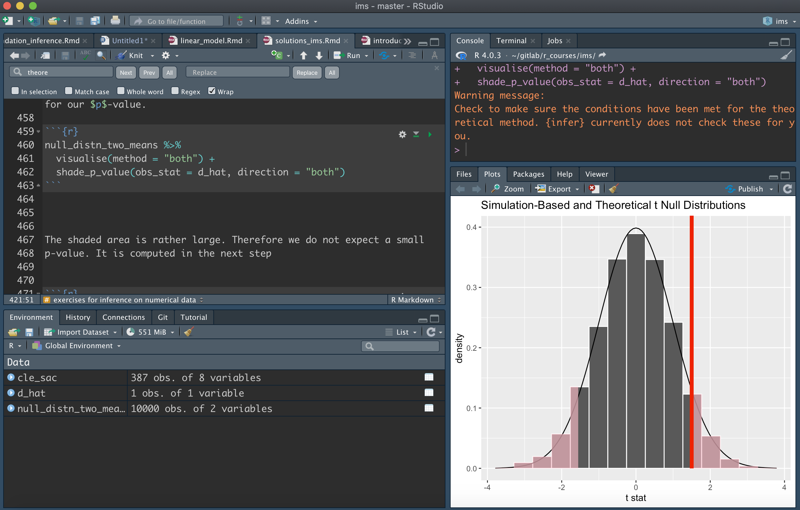

# (PART) R, wie fange ich an {-} 

# Installieren von R und RStudio {#install}

## R und RStudio

* Zuerst benötigen wir  [R, eine freie Softwareumgebung für statistische Berechnungen und Grafiken](https://www.r-project.org). Installiert daher R von [CRAN](https://cloud.r-project.org), dem Comprehensive R Archive Network. Wir empfehlen euch dringend, eine vorkompilierte Binärdistribution zu installieren - benutzt daher die Links oben auf der CRAN Seite!

* Danach könnt ihr die IDE  (steht für _integrated development environment_) von RStudio installieren. Dabei handelt es sich um eine leistungsfähige Benutzeroberfläche für R. 

  - RStudio wird mit einem __Text Editor__ geliefert, so dass es nicht unmittelbar erforderlich ist, einen separaten, eigenständigen Editor zu installieren.
  - RStudio bietet auch eine direkt  __Verbindung zu Git(Hub)__. Um die notwendige Git-Installationen müsst ihr euch aber selbst kümmern. Wir kommen aber auch [später](#version-control) auf diesen Punkt zurück.
    
Wenn ihr bereits eine vorhandene R und/oder RStudio Installation habt, empfehlen wir euch dringend, beide neu zu installieren und so aktuell wie möglich zu halten. 

Wenn ihr R aktualisiert, müssen ihr alle Pakete, die ihr installiert habt, aktualisieren. Das könnt ihr leicht mit dem unten stehenden Befehl machen. Möglicherweise müsst ihr aber auch noch weitere Argumente angeben, wenn ihr z.B. eine nicht standardmäßige Bibliothek für eure Pakete verwendet.

``` r
update.packages(ask = FALSE, checkBuilt = TRUE)
```

  __Bemerkung:__ Mit diesem Befehl wird nur nach Updates auf CRAN gesucht. Wenn ihr aber ein Paket verwenden, das z.B. __nur__ auf GitHub lebt, müsst ihr manuell aktualisieren, z.B. über `devtools::install_github()`.

## Funktioniert alles? Am besten ausprobieren

Startet RStudio auf eurem Computer. Dann solltet ihr ein Fenster ähnlich zu diesem 

```{r, echo=FALSE, out.width="100%"}

```

erhalten. Vermutlich ist euer Fenster nicht so dunkel. Aber wer es gerne dunkel mag, soll sich mal unter `Tools -> Global -> Appearance` die _Editor Themes_  anschauen.


Setzt den Cursor in das Fenster mit der Bezeichnung Console. Über die Konsole seid ihr in der Lage mit R zu interagieren. Erstellt ein einfaches Objekt mit einem Code wie 

```{r}
x <- 2 * 4
```

(gefolgt von Enter oder Return). Schaut euch dann das Objekt `x` genauer an, indem ihr `x` in der Konsole eingebt, gefolgt von Enter oder Return. Ihr sollten dann den Wert 8 auf dem Bildschirm sehen. Wenn ja, habet ihr R und RStudio erfolgreich installiert.

## Add-on packages

R ist ein erweiterbares System und viele Menschen teilen nützlichen Code, den sie als __Paket__ entwickelt haben, über CRAN, GitHub, GitLab oder ähnlichen Plattformen. Um ein Paket von CRAN zu installieren, z.B. das Paket [tidyverse] (ist genauer gesagt eine Kollektion von Paketen), kann man folgenden Befehl verwenden

```r
install.packages("tidyverse", dependencies = TRUE)
```

Mit der Option `dependencies = TRUE` achten wir darauf, dass alle für `tidyverse` notwendigen Pakete, ebenfalls installiert werden.


## RStudio Primers


Ein guter Startpunkt für verschiedene R Themen sind die __RStudio primers__, die aktuell nur als Paket zur lokallen Installation verfügbar sind. Dafür kann man folgenden Befehl verwenden, um Pakete, die nicht auf CRAN verfügbar sind, zu installieren.

```{r, eval=FALSE}
install.packages("remotes")
remotes::install_github("hgstp/idsst.rtutorials")
```

Um die Tutorials aufzurufen muss man auch das Paket "learnr" installieren.

```{r, eval=FALSE}
install.packages("lernr")
library("learnr")
```


## Aufgabe

Wir beginnen mit den Grundlagen. Hier wird unterschieden in *Programming* und *Visualization* Basics. 

__Programming Basics__ beinhaltet Grundlagen zu Objekttypen, Funktionen und deren Argumente, Listen (eigentlich sind alle Objekte Listen, nur unterschiedlich speziell) und Paketen.

__Visualization Basics__ erklärt erste Schritte in der Verwendung des `ggplot2` Pakets, mit dem wir uns später noch eingehend beschäftigen werden.

Bearbeitet eigenständig den Basics Primer. Dafür verwenden wir den Befehl
```{r, eval=FALSE}
learnr::run_tutorial("programming-basics", package = "idsst.rtutorials")
```


```{r links, child="links.md"}
```