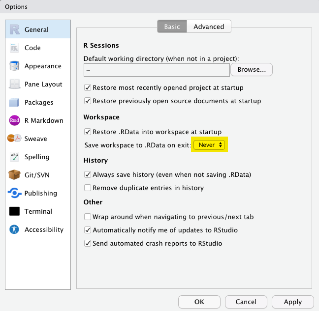
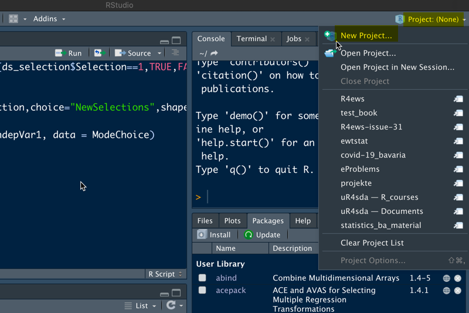
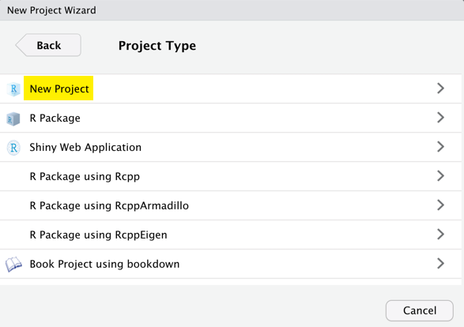

# R Basics und Arbeitsabläufe {#r-basics}

```{r include = FALSE}
source("common.R")
```


## Ein paar Grundlagen für das Arbeiten mit R


::: {.rmdnote}
**Aktueller Stand:** Ihr habt bereits den Basics Primer absolviert und nun wollt ihr anfangen mit eurer RStudio/R Installation zu arbeiten. 
:::

Es geht los indem ihr RStudio startet. Beachtet dabei die Standardfensterbereiche:

* Console (*links*)
* Environment / History (*oben rechts*)
* Files / Plots / Packages / Help (*unten rechtes*)

**Bemerkung:** Die Standardanordnung der Fenster könnt ihr neben vielen anderen Dingen nach deinen Vorstellungen ändern/anpassen: [Customizing RStudio](https://support.rstudio.com/hc/en-us/articles/200549016-Customizing-RStudio).

Geht nun in die Konsole um mit R zu interagieren. Erstellt die nachfolgende Zuordnung  und schau euch das erstellte Objekt genauer an:

```{r start_rbasics}
x <- 3 * 4
x
```

Alle R Befehle, die ein Objekte erstellen ("Zuweisungen"), haben die Form:

```{r eval = FALSE}
objectName <- value
```

Ihr werdet im weiteren Verlauf noch viele Zuweisungen vornehmen. Tatsächlich ist es etwas mühsam den Operator `<-` zu tippen. Seid aber trotzdem nicht faul und benutzt stattdessen einfach `=` - auch wenn das theoretisch funktionieren würde. Aber später kann die Verwendung von `=` für Zuweisungen zu Verwirrung führen. Verwendet   stattdessen in RStudio die Tastenkombination: `Alt` + `-` (Minuszeichen) bzw. `option` + `-`.

Beachtet, dass RStudio automatisch `<-` mit Leerzeichen umgibt, was eine nützliche Codeformatierung darstellt. Code ist selbst an einem guten Tag eher schlecht zu lesen. Gönnt daher euren Augen eine Pause und verwende (ausreichend) Leerzeichen.

RStudio bietet viele praktische [Tastaturkürzel](https://support.rstudio.com/hc/en-us/articles/200711853-Keyboard-Shortcuts) an. Eine Übersicht erhält man auch mit `Alt`+`Shift`+`K` bzw. `option`+`Shift`+`K`.


Objektnamen dürfen nicht mit einer Ziffer beginnen und bestimmte andere Zeichen wie ein Komma oder ein Leerzeichen nicht enthalten. Es ist daher ratsam, sich eine [Konvention zur Abgrenzung von Wörtern][wiki-snake-case] in Objektnamen zu überlegen.

```
i_use_snake_case
other.people.use.periods
evenOthersUseCamelCase
```

Wir werden stets die erste Variante verwenden.

Führt nun nachfolgenden Befehl aus

```{r}
this_is_a_really_long_name <- 2.5
```

In eurem Workspace ist nun das Objekt `this_is_a_really_long_name` vorhanden. Probiert mithilfe dieses Objekts die Vervollständigungsfunktion von RStudio aus: 

::: {.content-box-grey}
Gib die ersten paar Zeichen ein, drücke anschließend die TAB Taste, fügen weitere Zeichen hinzu, bis Eindeutigkeit hergestellt ist(wenn sonst wenig in deinem Workspace ist, dann ist das schnell erreicht), und drücke dann die Eingabetaste.
:::

Führt nun den Befehl 
```{r}
zwei_hoch_drei <- 2 ^ 3
```

aus, um anschließend den Inhalt des Objekts anzuzeigen.

```{r error=TRUE}
zwei.hoch.drei
zwei_Hoch_drei
```

Die Objekte `zwei.hoch.drei` und `zwei_Hoch_drei` sind natürlich nicht vorhanden und somit führen beide Befehle zu einer Fehlermeldung. Man muss also absolut exakt sein mit seinen Befehlen.


R verfügt über eine überwältigende Sammlung eingebauter Funktionen, die nach folgendem Schema aufgerufen werden:

```{r eval = FALSE, tidy = FALSE}
functionName(arg1 = val1, arg2 = val2, ...)
```

Als nächstes wollen wir die Funktion `seq()` verwenden, die reguläre Zahlensequenzen erzeugt. Dabei wollen wir noch ein weiteres hilfreiches Feature von RStudio demonstrieren.

::: {.content-box-grey}
Tippt `se` und drücke dann die TAB Taste. In einem Pop-Up Fenster werden dir mögliche Vervollständigungen angezeigt. Der Befehl `seq()` kann dann durch weiteres Tippen oder über die Auswahlmöglichkeit (Pfeiltasten nach oben/unten) festgelegt werden. Zu jeder Auswahlmöglichkeit wird auch noch eine Kurzform der entsprechenden Hilfeseite angezeigt. 
:::

Fügt man jetzt die öffnende runde Klammer hinzu, so wird die zugehörige schließende runde Klammer automatisch hinzugefügt. Tippe anschließend `1, 10` (das geschieht automatisch innerhalb der runden Klammern) und Return. RStudio beendet auch den Klammerausdruck für dich. RStudio `r emo::ji("rocket")`

```{r}
seq(1, 10)
```

Der letzte Befehl zeigt auch ganz gut, wie R Funktionsargumente auflöst. Sie können immer in der Form `Name = Wert` angeben werden. Aber der Name muss nicht angegeben werden, wie man sieht. In solchen Fällen versucht R, nach der Position aufzulösen. So wird oben angenommen, dass wir eine Sequenz  bei 1 starten wollen, also `from = 1`,  und diese bis 10 laufen soll, daher `to = 10`. Da wir keine Schrittweite angegeben haben, wird der Standardwert für `by` verwendet, der in diesem Fall gleich 1 ist.

Bei Funktionen, die man oft aufruft, kann man gut diese Auflösung nach Position für das erste und vielleicht auch das zweite Argument verwenden. Danach ist es aber ratsam immer mit `Name = Wert` zu arbeiten um falsche Zuweisungen (verschiedene Argumente können vom gleichen Typ sein, sodass eine falsche Zuweisung nicht automatisch zu einer Fehlermeldung führt) zu vermeiden.


Analog zur Unterstützung mit den runden Klammern, werden auch schließende  Anführungszeichen automatisch ergänzt, wie man in folgendem Beispiel sieht. 

```{r}
yo <- "hello world"
```

Nach einer Zuweisung wird der entsprechende Wert des Objekts nicht angezeigt. Daher ist man vielleicht dazu geneigt das Objekt gleich erneut aufzurufen

```{r}
y <- seq(1, 10)
y
```

Diese typische Aktion kann verkürzt werden, indem die Zuweisung in Klammern gesetzt wird, wodurch die Zuweisung und ein Befehl "Drucke auf den Bildschirm" erfolgen.

```{r}
(y <- seq(1, 10))
```

Nicht alle Funktionen haben (oder erfordern) Argumente:

```{r}
date()
```

Schaut euch nun euren Workspace an - unter Environment (vermutlich im Fenster rechts oben) seht ihr den Inhalt eures Workspace. Der Workspace ist der Ort, an dem sich benutzerdefinierte Objekte ansammeln. Eine Liste dieser Objekte könnt ihr auch mit diesen Befehlen erhalten:

```{r}
objects()
ls()
```

Wenn ihr nun das Objekt mit dem Namen `y` entfernen möchtet, könnt ihr das wie folgt machen:

```{r}
rm(y)
```

Alles löschen kann man mit dem Befehl

```{r}
rm(list = ls())
```

oder man klickt auf den Besen im Environment Fenster von RStudio.


## Workspace und working directory

Ziemlich schnell wird der Fall eintreten, dass ihr mit eurer R Arbeit (z.B. Bearbeitung eines Hausaufgaben Projekts) noch nicht fertig seid obwohl es Zeit die Arbeit für heute zu beenden. Natürlich will man aber zu einem späteren Zeitpunkt mit der Analyse weitermachen, wo man gerade aufgehört hat.


Etwas später wird es so ein, dass ihr zudem auch noch Daten in R einlest  und damit anschließend numerische Ergebnisse erzeugt, die ihr dann auch wieder exportieren wollt.

Und nochmal später wird es (vielleicht) so sein, dass ihr in R gleichzeitig an mehreren Analysen arbeitest, die ihr aber unbedingt getrennt halten wollt/sollt.


Um diese Situationen zu bewältigen, müsst ihr zwei Entscheidungen treffen:

* Was betrachtest du an deiner Analyse als __"Ergebnis"__, d.h. was wirst du dauerhaft speichern?

* Wo __"lebt"__ deine Analyse?

### Workspace, `.RData`

Ihr startet gerade eure R Reise `r emo::ji("airplane")`. Daher wäre es okay, wenn ihr euren Workspace als das __"Ergebnis"__ eurer Analyse betrachtet. _Ziemlich bald_, solltet ihr aber davon (vielleicht durch uns) überzeugt sein, dass eure R Skripte das Ergebnis eurer Analyse sind (in beiden Fällen hängt das Ergebnis vermutlich auch von Input Daten ab).     

Die Daten zusammen mit eurem R Code erlauben es euch jederzeit *alle* Ergebnisse zu __reproduzieren__ und das ist die entscheidende Eigenschaft.


Betrachtest man seinen Workspace als das Ergebnis der Analyse, dann muss man bei einem erneuten Analysedurchlauf (leicht veränderte Aufgabenstellung, ...) entweder erneut eine Menge Tippen (was natürlich fehleranfällig ist) oder die R _History_ nach den nötigen Befehlen durchwühlen. 
Statt ["becoming an expert on managing the R history"](https://support.rstudio.com/hc/en-us/articles/200526217-Command-History) als Ziel zu haben, solltet ihr euren R Code sauber in ein Skript speichern, sodass er für weitere Analysen zur Verfügung steht.


Der Workspace Ansatz wird allerdings "begünstigt/gefördert" durch die Tatsache, dass RStudio beim Beenden der Session automatisch wissen will ob der Workspace gespeichert werden soll. Das wollen wir mal ausprobieren.


Beendet R/RStudio, entweder über das Menü oder tippt `q()` in die Konsole. Dann erhaltet ihr eine Eingabeaufforderung wie diese:

> Save workspace image to ~/.Rdata?

_Merkt euch in welchem Verzeichnis die Datei gespeichert wird_ und dann klickt auf `Save`.

Geht in das Verzeichnis mit dem gespeicherten Workspace Image und kontrolliert ob die Datei `.RData` vorhanden ist. Ihr werdet dort auch die Datei `.Rhistory` finden, die alle Befehle eurer letzten Sitzung enthält.

Nun starte erneut RStudio. In der Konsole seht ihr einen Befehl, der ungefähr so aussieht


```
[Workspace loaded from ~/.RData]
```

und angibt, dass euer gespeicherter Workspace wiederhergestellt wurde. Unter Environment solltet  ihr die gleichen Objekte wie zuvor sehen. Im Fenster History findet ihr die gespeicherten Befehle aus der letzten Sitzung. 

Aber diese Art, analytische Arbeit zu beginnen und zu beenden, würde so nicht lange gut gehen. Daher fangen wir gleich mal damit an die automatische Nachfrage nach dem Speichern des Workspaces abzuwählen. Öffnet dazu die Global Options (unter Tools)

```{r, echo=FALSE}

```

und setzt `Save workspace to .RData on exit` auf `Never`. Nun werdet ihr __nie mehr__ gefragt ob der Workspace gespeichert werden soll. Sehr wohl werdet ihr aber weiterhin gefragt ob ungesicherte Änderungen in euren R Skript gespeichert werden sollen, sobald ihr RStudio beenden wollt.


### Working directory

Jeder Prozess, der auf einem Computer läuft, hat einen Bezug zu seinem "Arbeitsverzeichnis". In R ist dies der Ort, an dem R standardmäßig nach Dateien suchen würde oder der Ort wo alle Dateien, die ihr auf die Festplatte schreiben wollt, abgelegt werden. Möglicherweise ist euer aktuelles Arbeitsverzeichnis das Verzeichnis, das ihr gerade untersucht habt um die `.RData` Datei zu finden.

Das aktuelle Arbeitsverzeichnis könnt ihr euch anzeigen lassen mit dem Befehl

```{r eval = FALSE}
getwd()
```

Aber es wird auch oben an der RStudio Konsole direkt angezeigt.

Es wäre schon, wenn das Arbeitsverzeichnis in Abhängigkeit vom jeweils zu bearbeitenden Projekt leicht sinnvoll gesetzt werden könnte. Im nächsten Abschnitt sehen wir, dass genau das möglich ist.


## RStudio Projects {#rprojs}

Alle zu einem Projekt gehörenden Dateien - Eingabedaten, R Skripte, Analyseergebnisse, Grafiken - an einem Ort zu bündeln, ist eine so sinnvolle Praxis, dass RStudio über seine [__Projects__](https://support.rstudio.com/hc/en-us/articles/200526207-Using-Projects) genau da ermöglicht.

Lasst uns ein Projekt für den Kurs anlegen. Dazu wählen wir oben rechts im RStudio Fenster `Project: (None) -> New Project`

```{r, echo=FALSE}

```


Danach wählen wir `New Directory -> New Project` und geben abschließend einen passenden Verzeichnisnamen ein (dabei beachten wir den Speicherort des neuen Verzeichnisses)

```{r, echo=FALSE, fig.show='hold', fig.align='default', out.width="33%"}
knitr::include_graphics("img/project_2.png")

knitr::include_graphics("img/project_4.png")
```


Wir nehmen nun an, dass ihr ein RStudio Projekt angelegt und auch geöffnet habt. Als Nächstes benötigen wir nun ein wenig R Code. Dazu tippen wir den unten stehenden Code (ausnahmsweise) in die Konsole


```{r toy-line}
a <- 2
b <- -3
sig_sq <- 0.5
x <- runif(40)
y <- a + b * x + rnorm(40, sd = sqrt(sig_sq))
(x_n <- mean(x))
write(x_n, "mittelwert_x.txt")
plot(x, y)
abline(a, b, col = "purple")
dev.print(pdf, "scatterplot.pdf")
```

Jetzt nehmen wir mal an, das wäre ein guter Start einer Analyse, die wir durchführen wollen. Daher würdest ihr das Ergebnis gerne abspeichern.  Unter History könnt ihr alle obigen Befehle markieren und anschließend `To Source` klicken. Daraufhin wird sich ein neues Fenster mit einem R Skript - das natürlich die Befehle enthält - öffnen. Das Skript könnt ihn anschließend abspeichern, und standardmäßig wird es in den Projektordner gespeichert werden (aber natürlich könntest man den Speicherort an dieser Stelle auch ändern/frei wählen).

Nun beendet das Projekt (*Close Project* in der rechten oberen Ecke). Wer will, kann sich noch den Inhalt dess Projektordners anschauen, z.B. das PDF öffnen. 

Danach öffnet ihr das Projekt wieder. Euch sollte auffallen, dass alles in dem Zustand ist, wie ihr das Projekt verlassen habt, z.B. Objekte im Arbeitsbereich, die Befehlshistorie, welche Dateien zur Bearbeitung geöffnet sind, wo wir uns im Dateisystembrowser befinden, das Arbeitsverzeichnis für den R-Prozess usw. All dies sind gute Dinge `r emo::ji("grin")`.

Nun ändert ein paar Dinge an eurem Code. Sinnvoll wäre z.B. am Anfang die Stichprobenlänge `n`  zu definieren und z.B. auf `n <- 40` setzen. Dann 
sollten alle festen 40er Werte durch `n` ersetzt werden. Anschließend kann man noch ein paar andere Dinge ändern, z.B. die Steigung `b`, die Farbe der Linie ... was auch immer. Danach könnt ihr die verschiedenen Möglichkeiten ausprobieren, wie ihr den Code erneut ausführen könnt:

* Zeile für Zeile ausführen, indem ihr entweder das Tastenkürzel `Command + Enter`  oder die Maus (auf "Run" klicken in der oberen rechten Ecke des Editor-Fensters) verwendet.
  
* Das gesamte Dokument durchlaufen lassen, entweder per Tastenkürzel `Shift + Command +S` oder Maus (klicken auf "Source" in der oberen rechten Ecke des Editor-Fensters).
  
Anschließend könnt ihr euch das PDF anschauen und die Änderungen bewundern.

Irgendwann werdet ihr (vielleicht) vor der Aufgabe stehen, eine Grafik neu zu gestalten oder einfach nur verstehen zu wollen, woher sie stammt. Wenn ihr (relevante) Grafiken in einer Datei speichert (*über R Code und niemals über die Maus oder die Zwischenablage*) und dabei sinnvolle Dateinamen/Speicherorte (innerhalb des zugehörigen Projekts) benutzt, werden euch solche Aufgaben nie vor große Probleme stellen `r emo::ji("check")`.

## zu guter Letzt

Es ist üblich, R-Skripte mit einem `.R` oder `.r` Suffix zu speichern. Befolgt diese Konvention, außer ihr habt einen sehr außergewöhnlichen Grund, es nicht zu tun. 

Kommentare beginnen mit einem oder mehreren `#`-Symbolen. Verwendet Kommentare. RStudio hilft dir dabei ausgewählte Zeilen mit `Ctrl+Shift+C` (Windows und Linux) oder `command+Shif+C` (Mac) zu kommentieren oder vorhandene Kommentare wieder zu entfernen.

Dieser __Workflow__ wird dir in Zukunft gute Dienste leisten:

::: {.content-box-green}
* Erstelle ein RStudio Projekt für ein analytisches Projekt
* Speichere alle Input Dateien innerhalb des Projekts (wir werden bald über den Import sprechen)
* Bewahre alle Skripte zu diesem Projekt dort auf; bearbeite sie und führen sie dort aus
* Speichere den Output innerhalb des Projekts (wie z.B. das PDF im letzten Beispiel)
:::

Ihr solltet vermeiden die Maus für Teile des Workflows zu verwenden, wie z.B. das Laden eines Datensatzes oder das Speichern einer Grafik. Das ist sehr wichtig für die Reproduzierbarkeit und um im Nachhinein feststellen zu können, wie eine numerische Tabelle oder eine PDF-Datei tatsächlich erzeugt wurde (eine Suche auf der lokalen Festplatte nach dem entsprechenden Dateinamen unter den `.R`-Dateien führt zum entsprechenden Skript).


```{r end_rbasics, include = FALSE}
file.remove(c("mittelwert_x.txt", "scatterplot.pdf"))
```

```{r links, child="links.md"}
```