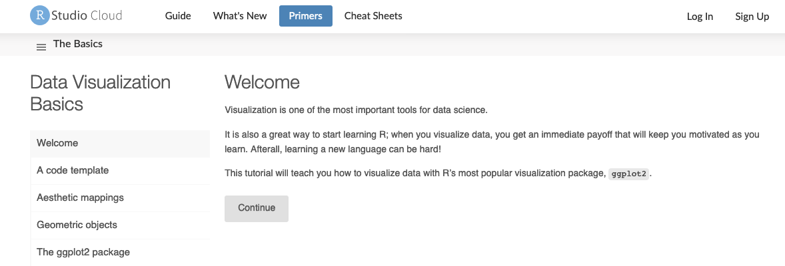

# (PART) Datenanalyse Teil 1 {-} 

# Letzte Vorbereitungen ... {#basic-data-care}

```{r include = FALSE}
source("common.R")
```


```{r start_data_analysis, echo = FALSE}
set.seed(4561)
```


Jetzt ist es an der Zeit, sich zu vergewissern in welchem Verzeichnis auf deinem Computer du dich befindest. Falls du ein  [RStudio Projekt](#rprojs) nutzt, sollte diese Frage leicht zu beantworten sein. Falls du trotzdem unsicher bist, gib `getwd()` in der Konsole ein, um das aktuelle Arbeitsverzeichnis zu sehen.

Alle nachfolgenden Code Beispiele wollen wir abspeichern in einer `.R` Datei, die wir im aktuellen Arbeitsverzeichnis abspeichern wollen. Idealerweise geben wir dieser Datei noch einen Namen, wie etwa `datenanalyse_teil_1.R`, der uns schon viel über den möglichen Inhalt erzählt.
Alternativ können wir alle Befehle natürlich auch in eine R Markdown Datei schreiben, siehe [Test drive R Markdown](#r-markdown).


Prinzipiell geht es in den folgenden Abschnitten um Datenmanagement. Es werden aber auch immer wieder ein paar Grafiken zu sehen sein. Dies ist aber kein Problem, da wir ja bereits den [Data Visualization Basics Primer](https://rstudio.cloud/learn/primers/1.1)

```{r, echo=FALSE, out.width="100%"}

```

besucht haben und so den nötigen Background haben.

## Data Frames sind fantastisch

Das Standardformat für Daten ist ein data frame. Die meisten Funktionen zur Inferenz, Modellierung und graphischen Darstellung erwarten, dass ihnen über ein `data =` Argument ein data frame übergeben wird. Dies gilt für die Basis R schon seit langem.

Die als [tidyverse] bekannte Kollektion von Paketen geht noch einen Schritt weiter und priorisiert ausdrücklich die Verarbeitung von data frames. Tatsächlich priorisiert [tidyverse] eine besondere Art von data frames, die als "tibble" bezeichnet wird.

Data frames - im Gegensatz zu allgemeinen Arrays oder speziell Matrizen in R - können Variablen unterschiedlicher Typen enthalten, wie z. B. Textdaten (Subjekt-ID oder Name), quantitative Daten (Anzahl der weißen Blutkörperchen) und kategoriale Informationen (behandelt vs. unbehandelt). Genauer gesagt können in data frames unterschiedliche Spalten aus unterschiedlichen Datentypen bestehen. Innerhalb einer Spalte müssen aber alle Einträge vom gleichen Typ sein.

Daten aus einer Datenanalyse bestehen immer aus mehr als einem Datentyp. Aus diesem Grund können Matrizen oder Arrays nicht zur Datenanalyse verwendet werden, da man sonst mit verschiedenen, unverbundenen Objekten (Matrizen, Arrays) arbeiten müsste und diese nur schwer koordinieren kann.


## Gapminder data

Wir werden mit einigen der Daten aus dem [Gapminder-Projekt] (https://www.gapminder.org) 

```{r, echo=FALSE, fig.align='center'}
knitr::include_graphics("img/gapminder.png")
```

arbeiten. Die Daten sind im [gapminder] Paket enthalten, welches wir über CRAN installieren können:

```{r eval = FALSE}
install.packages("gapminder")
```

Um die Daten zu verwenden, müssen wir das Paket natürlich auch noch laden

```{r}
library(gapminder)
```

## Die `gapminder` Daten sind ein "tibble"

Durch das Laden des `gapminder` Pakets haben wir nun Zugriff auf einen Datenobjekt mit demselben Namen. Schau dir nun mithilfe der Funktion `str()` die Struktur des Objekts an.

```{r message = FALSE, warning = FALSE}
str(gapminder)
```

`str()` liefert eine vernünftige Beschreibung von fast allem, und im schlimmsten Fall kann tatsächlich auch nichts "Schlimmes" passieren. Aus dem Output erkennen wir, dass der Datensatz `r nrow(gapminder)` Beobachtungen enthält.


Auf der anderen Seite hätten wir durch direkten Aufruf von `gapminder` den Inhalt auch direkt auf den Bildschirm schreiben können. Aber vielleicht hast du schon mal einen größeren Datensatz aufgerufen und zögerst nun etwas, da große Datensätze einfach die Konsole füllen und nur sehr wenig Einblick bieten.

Dies ist der erste große Sieg für **tibbles**. Tidyverse bietet eine spezielle data frame Variante an: ein "tibble". Dies wird auch verdeutlicht, wenn man sich z.B. die Klasse des `gapminder` Objekts anschaut


```{r}
class(gapminder)
```

Schau, es ist immer noch ein reguläres data frame, aber eben auch ein tibble.


Jetzt können wir `gapminder` einfach auf den Bildschirm anzeigen! Da es sich um ein tibble handelt, wird nur das Wichtigste angezeigt und deine Konsole läuft nicht voll.

```{r}
gapminder
```

Wenn du mit einem reinen data frame arbeitest - und dieses Feature magst - kannst du es mit `as_tibble()` in ein tibble transformieren.

```{r, message=FALSE}
library(tidyverse)
as_tibble(iris)
```

Weitere Möglichkeiten, grundlegende Informationen zu einem data frame abzufragen:

```{r}
names(gapminder)
ncol(gapminder)
length(gapminder)
dim(gapminder)
nrow(gapminder)
```

Ein bisschen deskriptive Statistik zum Inhalt eines data frames erhältst du mit `summary()`:

```{r}
summary(gapminder)
```


> **Bemerkung:** `summary()` ist eine generische Funktion. Für eine gegebene Klasse (des Inputs) bestimmt die generische Funktion die passende Methode. Die Funktion `summary()` besitzt die folgenden Methoden:
```{r}
methods(summary)
```


Obwohl wir uns formell noch nicht eingehender mit der Visualisierung beschäftigt haben, ist es wichtig ein paar Grafiken zu erzeugen um einen ersten Eindruck über den Datensatz zu bekommen. Auf der anderen Seite werden die Grafiken aber auch nicht (viel) aufwendiger als im Data Visualisation Basics Primer

```{r first-plots-base-R, tidy=FALSE}
ggplot(gapminder, mapping = aes(x = year, y = lifeExp)) +
         geom_point()
ggplot(gapminder, mapping = aes(x = gdpPercap, y = lifeExp)) +
         geom_point()
ggplot(gapminder, mapping = aes(x = log(gdpPercap), y = lifeExp)) +
         geom_point()
```


Grafiken dieser Art werden wir zu einem späteren Zeitpunkt noch genauer behandeln. Dann sprechen wir auch über deren Inhalt.


Wir schauen uns nochmal die Ausgabe von `str()` an, um darüber zu sprechen, was ein data frame genau ist.

```{r}
str(gapminder)
```

Ein data frame ist ein Sonderfall einer *Liste*, die in R verwendet wird, um so gut wie alles aufzunehmen. Data frames sind ein Spezialfall, bei dem die Länge jedes Listenelements gleich ist. 

Nehmen wir mal an, dass wir eine Beschreibung der Variablen

```{r}
names(gapminder)
```

zusammen mit den Daten abspeichern wollen. Dazu könnten wir ein tibble

```{r}
(desc <- tibble(variables = names(gapminder),
               desc = c("actor with 142 levels", "factor with 5 levels",
                        "ranges from 1952 to 2007 in increments of 5 years",
                        "life expectancy at birth, in years",
                        "population","GDP per capita (US$, inflation-adjusted)")))
```

erzeugen, das die Beschreibungen enthält. Dieses data frame hat nun die Dimension 6x2. Trotzdem können wir es mit `gapminder` kombinieren, wenn wir beide tibbles in einer Liste abspeichern

```{r}
gapminder_desc <- list(gapminder, desc)
str(gapminder_desc)
```


## Variablen in einem Data Frame

Um eine einzelne Variable aus einem data frame anzusprechen, kann man mit dem Dollarzeichen `$` arbeiten. Wir schauen uns dazu die numerische Variable `lifeExp` an.

```{r histogram-lifeExp}
head(gapminder$lifeExp)
summary(gapminder$lifeExp)
```

Zusätzlich wollen wir die noch die Verteilung von `lifeExp` visualisieren und plotten dazu ein Histogramm. Da wir dazu `ggplot()` verwenden, können wir `lifeExp` wieder direkt aufrufen.

```{r, warning=FALSE, tidy=FALSE}
ggplot(gapminder, mapping = aes(x = lifeExp)) + 
  geom_histogram()
```

Alternativ können wir die Einträge eines data frames auch über die eckigen Klammern `[]` indizieren.

```{r}
summary(gapminder[,"lifeExp"])
```

Dabei spezifiziert der Eintrag links vom Komma die Zeilen und der Wert rechts davon die Spalten. Dies ist hilfreich, wenn man auf einzelne Werte zugreifen will. Aber beim Aufruf einer kompletten Variable (Spalte) ist die `$` Notation sicherlich vorteilhaft.


Die Variable `year` ist eine ganzzahlige Variable, aber da es so wenige unterschiedliche Werte gibt, funktioniert sie auch ein wenig wie eine kategoriale Variable.

```{r}
summary(gapminder$year)
table(gapminder$year)
```

Die Variablen `country` und  `continent` enthalten rein kategorische Informationen, die in R (häufig) als *factor* gespeichert werden.

```{r}
class(gapminder$continent)
summary(gapminder$continent)
levels(gapminder$continent)
nlevels(gapminder$continent)
```

Die __Levels__ von `continent` sind "Afrika", "America" usw., und das ist es, was einem normalerweise in R angezeigt werden sollte, wenn man eine Faktorvariable aufruft. Im Allgemeinen sind die Levels von Menschen lesbare Zeichenfolgen, wie "male/female" und "control/treated". Aber vergiss *niemals*, dass R diese Information in kodierter Form speichert. Schauen dir zum Beispiel das Ergebnis von `str(gapminder$continent)` an, falls du skeptisch sein solltest.

```{r}
str(gapminder$continent)
```

Faktorvariablen haben Vor- und Nachteil. Im weiteren Verlauf zeigen wir sowohl die Vor- wie auch die Nachteile. Generell ist aber durchaus so, dass die Vorteile überwiegen.


Als Nächstes erstellen wir mit der Funktion `table()` eine Häufigkeitstabelle für die Variable `count`. Dieser Inhalt wird anschließend visualisiert über die Funktion `geom_bar()`. Die entsprechende Berechnung der Häufigkeitstabelle wird dabei aber sowohl von `table()` wie auch von `geom_bar()` (über die statistische Transformation `stat_count()`) durchgeführt, oder anders gesagt, wir können an `geom_bar()` den Datensatz (hier `gapminder`) anstatt von vorab berechneten Werten übergeben.


```{r tabulate-continent}
table(gapminder$continent)
ggplot(gapminder, aes(x = continent)) + geom_bar()
```

In den folgenden Abbildungen sehen wir, wie Faktoren in Zahlen umgesetzt werden können. Der `continent`-Faktor lässt sich durch das [ggplot2]-Paket leicht in "Facetten" oder Farben und eine Legende abbilden. 

*Die Erstellung von Grafiken mit ggplot2 werden wir noch genauer besprechen. Daher kannst du dich also ruhig zurücklehnen und die Plots genießen oder blind kopieren/einfügen.*

```{r factors-nice-for-plots, fig.show = 'hold', out.width = '49%',tidy=FALSE}
# wir initialisieren ein grafik (ohne inhalt)
p <- ggplot(filter(gapminder, continent != "Oceania"),
            aes(x = gdpPercap, y = lifeExp))  
p <- p + scale_x_log10() # auf der x-achse soll eine log skala verwendet werden
p + geom_point() # ein scatterplot
p + geom_point(aes(color = continent)) # für verschiedene kontinente werden verschiedene farben verwendet
p + geom_point(alpha = (1/3), size = 3) + # punkte mit transparenz
  geom_smooth(lwd = 3, se = FALSE) # geglätter zusammenhang
p + geom_point(alpha = (1/3), size = 3) + 
  facet_wrap(~ continent) + # für jeden kontinent wird eine eigener
  # plot (innerhalb einer grafik) erzeugt
  geom_smooth(lwd = 1.5, se = FALSE)
```


## Recap

* Benutze data frames!!!

* Benutze [tidyverse]!!! Dadurch wird eine spezielle Art von data frames, ein "tibble", bereitgestellt, die neben anderen Vorteilen ein nettes Standarddruckverhalten aufweist.

* Im Zweifelsfall kannst du dir immer Inhalte anzeigen lassen über `str()` oder im Fall eines tibbles, einfach das tibble selbst aufrufen.

* Sei dir immer über die Anzahl an  Zeilen und Spalten deiner data frames bewusst.

* Sei dir im Klaren welche Art (numerisch, kategorial,  ...) von Variablen in deinen data frames enthalten sind.

* Benutze factors!!! Aber mach das bewusst und mit Vorsicht.

* Führe für jede Variable eine grundlegende statistische und visuelle Überprüfung durch.

* Ruf Variablen mit ihrem Namen auf, z.B. `gapminder$lifeExp`, nicht mit der Spaltennummer. Dein Code wird dadurch robuster und lesbarer sein.


```{r links, child="links.md"}
```