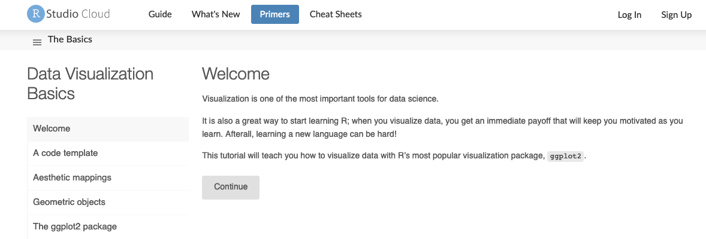

# (PART) Datenanalyse Intro {-} 

# Letzte Vorbereitungen ... {#data-intro}

```{r include = FALSE}
source("common.R")
```


```{r start_data_analysis, echo = FALSE}
set.seed(4561)
```


Jetzt ist es an der Zeit, sich zu vergewissern in welchem Verzeichnis ihr auf eurem Computer ihr euch befindet. Falls ihr ein  [RStudio Projekt](#rprojs) nutzt, sollte diese Frage leicht zu beantworten sein. Falls ihr trotzdem unsicher seid, gebt `getwd()` in der Konsole ein, um das aktuelle Arbeitsverzeichnis zu sehen.

Alle nachfolgenden Code Beispiele wollen wir in einer `.R` Datei abspeichern, die dann im aktuellen Arbeitsverzeichnis gespeichert werden soll. Idealerweise geben wir dieser Datei noch einen Namen, wie etwa `datenanalyse_teil_1.R`, der uns schon viel über den möglichen Inhalt erzählt.
Alternativ können wir alle Befehle natürlich auch in eine R Markdown Datei schreiben, siehe [Test drive R Markdown](#r-markdown).


Prinzipiell geht es in den folgenden Abschnitten um Datenmanagement. Es werden aber auch immer wieder ein paar Grafiken zu sehen sein. Dies ist aber kein Problem, da ihr ja bereits den Data Visualization Basics Primer.

```{r, echo=FALSE, out.width="100%"}

```

besucht habt und somit den nötigen Background besitzt.

## Data frames sind fantastisch

Das Standardformat für Daten ist ein data frame. Die meisten Funktionen zur Inferenz, Modellierung und graphischen Darstellung erwarten, dass ihnen über ein `data =` Argument ein data frame übergeben wird. Dies gilt für Funktion aus der R Basisdistribution schon seit langem.

Die als [tidyverse] bekannte Kollektion von Paketen geht noch einen Schritt weiter und priorisiert ausdrücklich die Verarbeitung von data frames. Tatsächlich priorisiert [tidyverse] eine besondere Art von data frames, die als "tibble" bezeichnet wird.

Data frames - im Gegensatz zu allgemeinen Arrays oder speziell Matrizen  - können Variablen unterschiedlicher Typen enthalten, wie z.B. Textdaten (Subjekt-ID oder Name), quantitative Daten (Anzahl der weißen Blutkörperchen) und qualitative/kategoriale Informationen (behandelt vs. unbehandelt). Genauer gesagt können in data frames unterschiedliche Spalten aus unterschiedlichen Datentypen bestehen. Innerhalb einer Spalte müssen aber alle Einträge vom gleichen Typ sein.

Daten aus einer Datenanalyse bestehen immer aus mehr als einem Datentyp. Aus diesem Grund eigenen sich Matrizen oder Arrays nicht zur Datenanalyse, da man sonst mit verschiedenen, unverbundenen Objekten (Matrizen, Arrays) arbeiten müsste und diese nur schwer koordinieren kann.


## Gapminder data

Wir werden mit einem Teil der Daten aus dem [Gapminder-Projekt](https://www.gapminder.org) 

```{r, echo=FALSE, fig.align='center'}
knitr::include_graphics("img/gapminder.png")
```

arbeiten. Die Daten sind im [gapminder] Paket enthalten, welches wir über CRAN installieren können:

```{r eval = FALSE}
install.packages("gapminder")
```

Um die Daten zu verwenden, müssen wir das Paket natürlich auch noch laden

```{r}
library(gapminder)
```


::: {.content-box-black}
Gapminder wurde von Hans, Anna und Ola Rosling gegründet. Auf der Webseite des Projekts findet man nicht nur viel Informatives, sondern auch sehr Unterhaltsames


```{r, echo=FALSE}
knitr::include_url("https://www.youtube.com/embed/Sm5xF-UYgdg")
```


Leider ist Hans Rosling bereits 2017 verstorben.


:::


## Die `gapminder` Daten sind ein "tibble"

Durch das Laden des `gapminder` Pakets haben wir nun Zugriff auf einen Datenobjekt mit demselben Namen. Schauen wir uns mithilfe der Funktion `str()` mal die Struktur dieses Objekts an.

```{r message = FALSE, warning = FALSE}
str(gapminder)
```

`str()` liefert eine vernünftige Beschreibung von fast allem, und im schlimmsten Fall kann tatsächlich auch nichts "Schlimmes" passieren. Aus dem Output erkennen wir, dass der Datensatz `r nrow(gapminder)` Beobachtungen enthält.


Auf der anderen Seite hätten wir durch direkten Aufruf von `gapminder` den Inhalt auch direkt auf den Bildschirm schreiben können. Aber vielleicht habt ihr schon mal einen größeren Datensatz aufgerufen und zögert nun etwas, da große Datensätze tendenziell einfach die Konsole füllen und nur sehr wenig Einblick bieten.

Tidyverse bietet eine spezielle data frame Variante an: ein __tibble__. `gapminder` ist ein tibble. Das sieht man auch, wenn man sich die Klasse dieses Objekts anzeigen lässt


```{r}
class(gapminder)
```

Es ist immer noch ein reguläres data frame, aber zusätzlich eben auch ein tibble.


Wenn wir nun `gapminder` einfach auf den Bildschirm ausgeben, sehen wir, dass die Konsole nicht voll läuft.

```{r}
gapminder
```

Dies ist der erste große Vorteil eines **tibbles** gegenüber einem data frame.


Wenn ihr mit einem reinen data frame arbeitet - und dieses Feature gefällt euch - so könnt ihr es mit `as_tibble()` in ein tibble transformieren.

```{r, message=FALSE}
library(tidyverse)
as_tibble(iris)
```

Weitere Möglichkeiten, grundlegende Informationen zu einem data frame abzufragen:

```{r}
names(gapminder)
ncol(gapminder)
length(gapminder)
dim(gapminder)
nrow(gapminder)
```

Ein bisschen _deskriptive Statistik_ zum Inhalt eines data frames erhält man mit der `summary()` Funktion:

```{r}
summary(gapminder)
```


::: {.content-box-yellow}
**Bemerkung:** `summary()` ist eine generische Funktion. Für eine gegebene Klasse (des Inputs) bestimmt die generische Funktion die passende Methode. Die Funktion `summary()` besitzt z.B. die folgenden Methoden:
```{r}
methods(summary)
```
:::

Obwohl wir uns formell noch nicht eingehender mit der Visualisierung beschäftigt haben, ist es wichtig ein paar Grafiken zu erzeugen um einen ersten Eindruck über den Datensatz zu bekommen. Auf der anderen Seite werden die Grafiken aber auch nicht (viel) aufwendiger als die Beispiele im [Visualisation Basics Primer](https://rstudio.cloud/learn/primers/1.1).

Interessant ist z.B. der zeitliche Verlauf der Lebenserwartung

```{r, tidy=FALSE}
ggplot(gapminder, mapping = aes(x = year, y = lifeExp)) +
         geom_point()
```

oder der Zusammenhang zwischen dem GDP ([gross domestic product](https://de.wikipedia.org/wiki/Bruttoinlandsprodukt)) und der Lebenserwartung


```{r, tidy=FALSE}
ggplot(gapminder, mapping = aes(x = gdpPercap, y = lifeExp)) +
  geom_point()
ggplot(gapminder, mapping = aes(x = log(gdpPercap), y = lifeExp)) +
  geom_point()
```


Grafiken dieser Art werden wir zu einem späteren Zeitpunkt noch genauer behandeln. Dann sprechen wir natürlich auch intensiv über deren Inhalt.


<br>

Wir schauen uns nochmal die Ausgabe von `str()` an, um darüber zu sprechen, was ein data frame genau ist.

```{r}
str(gapminder)
```

Ein data frame ist ein Sonderfall einer __Liste__. R verwendet Listen um so gut wie alles in ein Objekt aufnehmen zu können. Data frames sind nun ein Spezialfall einer Liste, bei dem die Länge jedes Listenelements gleich ist. 

Nehmen wir mal an, dass wir eine Beschreibung der Variablen

```{r}
names(gapminder)
```

zusammen mit den Daten abspeichern wollen. Dazu könnten wir ein tibble

```{r}
(desc <- tibble(variables = names(gapminder),
               desc = c("factor with 142 levels", "factor with 5 levels",
                        "ranges from 1952 to 2007 in increments of 5 years",
                        "life expectancy at birth, in years",
                        "population","GDP per capita (US$, inflation-adjusted)")))
```

erzeugen, das die Beschreibungen enthält. Dieses data frame hat nun 6 Zeilen und 2 Spalten. Trotzdem können wir es mit `gapminder` kombinieren, wenn wir beide tibbles in einer Liste abspeichern

```{r}
gapminder_desc <- list(gapminder, desc)
str(gapminder_desc)
```


## Variablen in einem data frame

Einzelne Variable in einem data frame kann man mit dem Dollarzeichen `$` ansprechen. Als Beispiel schauen wir uns die numerische Variable `lifeExp` genauer an.

```{r histogram-lifeExp}
head(gapminder$lifeExp)
summary(gapminder$lifeExp)
```

Die `summary()` Funktion berechnet, neben dem empirischen Mittel, das [Five-number summary](https://en.wikipedia.org/wiki/Five-number_summary), bestehend aus

1. dem Minimum

2. dem unteren Quartil (das empirische [0.25 Quantil](https://de.wikipedia.org/wiki/Empirisches_Quantil#Quartil))

3. dem [Median](https://de.wikipedia.org/wiki/Median)

4. dem oberen Quartil (das empirische [0.75 Quantil](https://de.wikipedia.org/wiki/Empirisches_Quantil#Quartil))

5. dem Maximum


Zusätzlich wollen wir noch die Verteilung von `lifeExp` visualisieren und plotten dazu ein Histogramm. Dazu verwenden wir wieder `ggplot()`. 

Beachtet, dass ihr innerhalb der `ggplot2` Funktionen Variablen eines data frames direkt ansprechen könnt. Es ist hier also nicht nötig mit dem `$` Operator zu arbeiten.

```{r, warning=FALSE, tidy=FALSE}
ggplot(gapminder, mapping = aes(x = lifeExp)) + 
  geom_histogram()
```


Alternativ können wir die Einträge eines data frames aber auch über die eckigen Klammern `[]` indizieren.

```{r}
summary(gapminder[,"lifeExp"])
```

Dabei spezifiziert der Eintrag links vom Komma die Zeilen und der Wert rechts davon die Spalten. Dies ist hilfreich, wenn man auf einzelne Werte zugreifen will. Aber beim Aufruf nur einer Variable (Spalte), ist die `$` Notation sicherlich vorteilhafter.


Die Variable `year` ist eine ganzzahlige Variable, aber da es so wenige unterschiedliche Werte gibt, funktioniert sie auch ein wenig wie eine kategoriale Variable und es macht Sinn die Häufigkeit der einzelnen Ausprägungen zu zählen.

```{r}
summary(gapminder$year)
table(gapminder$year)
```

Wir erkennen, dass in jedem Jahr die gleiche Anzahl an Beobachtungen vorhanden ist. Es handelt sich dabei stets um Beobachtungen aus den gleichen 142 Ländern. Dies erkennt man aus dieser Ausgabe aber natürlich noch nicht.


Die Variablen `country` und  `continent` enthalten rein kategorische Informationen, die in R (häufig) als *factor* gespeichert werden.

```{r}
class(gapminder$continent)
summary(gapminder$continent)
levels(gapminder$continent)
nlevels(gapminder$continent)
```

Die __Levels__ von `continent` sind `"Afrika"`, `"America"` usw., also Beschreibungen, die man gut lesen und verstehen kann. So sollte es sein, wenn man in R eine Faktorvariable aufruft. Im Allgemeinen sind die Levels von Menschen lesbare Zeichenfolgen, wie `"male/female"` oder `"control/treated"`. 

Euch sollte aber auch klar sein, dass R diese Information in kodierter Form speichert. Als Beispiel könnt ihr euch das Ergebnis von `str(gapminder$continent)` anschauen


```{r}
str(gapminder$continent)
```

Faktorvariablen haben Vor- und Nachteil. Im weiteren Verlauf zeigen wir sowohl die Vor- wie auch die Nachteile. Generell ist aber durchaus so, dass die Vorteile überwiegen.


Als Nächstes erstellen wir mit der Funktion `table()` eine Häufigkeitstabelle für die Variable `count`. Die berechneten Werte wollen wir anschließend noch mithilfe der Funktion `geom_bar()` visualisieren. Die zu plottenden Häufigkeiten müssen dabei aber nicht an die Funktion `geom_bar()` übergeben werden. Die Funktion berechnet selbst (über die statistische Transformation `stat_count()`) die entsprechenden Werte.


```{r tabulate-continent}
table(gapminder$continent)
ggplot(gapminder, aes(x = continent)) + geom_bar()
```

In den folgenden Abbildungen sehen wir, wie die kodierten Zahlenwerte einer Faktor Variable genutzt werden können. Der `continent`-Faktor lässt sich im  [ggplot2]-Paket leicht in "Facetten" oder Farben abbilden. 


::: {.content-box-orange}
Die Erstellung von Grafiken mit ggplot2 werden wir noch genauer besprechen. Daher könnt ihr euch also ruhig zurücklehnen und die Plots einfach genießen oder blind kopieren/einfügen.

:::

Zunächst initialisieren wir eine Grafik ohne Inhalt, da nicht gesagt wird, wie die Daten geplottet werden sollen.
```{r}
p <- ggplot(filter(gapminder, 
                   continent != "Oceania"), # Daten aus Oceania werden "herausgefiltert"
            aes(x = gdpPercap, y = lifeExp))  

```

Für die x-Achse wählen wir im nächsten Schritt eine log Skala (zur Basis 10).

```{r}
p <- p + scale_x_log10() 
```

Zum Grafikobjekt `p` werden nun weitere Komponenten hinzugefügt und dann jeweils geplottet

```{r factors-nice-for-plots, fig.show = 'hold', out.width = '49%', fig.align='default', tidy=FALSE}
# einen scatterplot
p + geom_point() 
# mit verschiedenen farben für die verschiedenen kontinente
p + geom_point(aes(color = continent))  
# punkte mit transparenz
p + geom_point(alpha = (1/3), size = 3) + 
  geom_smooth(lwd = 3, se = FALSE) # einen geglätteten zusammenhang
# für jeden kontinent einen eigenen plot (innerhalb einer grafik) erzeugen
p + geom_point(alpha = (1/3), size = 3) + 
  facet_wrap(~ continent) + 
  geom_smooth(lwd = 1.5, se = FALSE)
```


## Aufgabe

Im nächsten Abschnitt starten wir mit dem `dplyr` Paket. Bearbeitet daher zur Vorbereitung die ersten beiden Abschnitte des _Work with Data_


_Working with Tibbbles_ zeigt die Verwendung von Tibbles sowie die Verwaltung von `tidyverse`-Paketen. 

```{r, eval=FALSE}
learnr::run_tutorial("tibbles", package = "idsst.rtutorials")
```

_Isolating Data with dplyr_ zeigt wie ihr Variablen auswählt, Beobachtungen filtert und Werte neu anordnet. Zudem wird der Pipe-Operator von R, ` |> `, eingeführt.

```{r, eval=FALSE}
learnr::run_tutorial("isolating", package = "idsst.rtutorials")
```


```{r links, child="links.md"}
```
