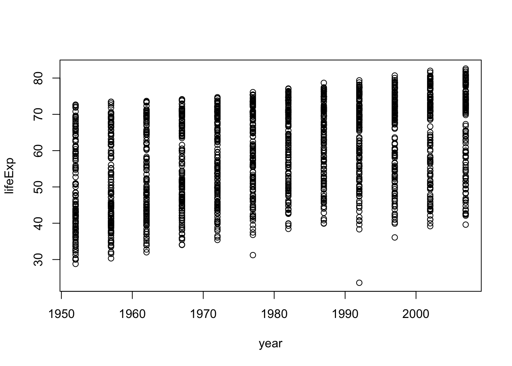
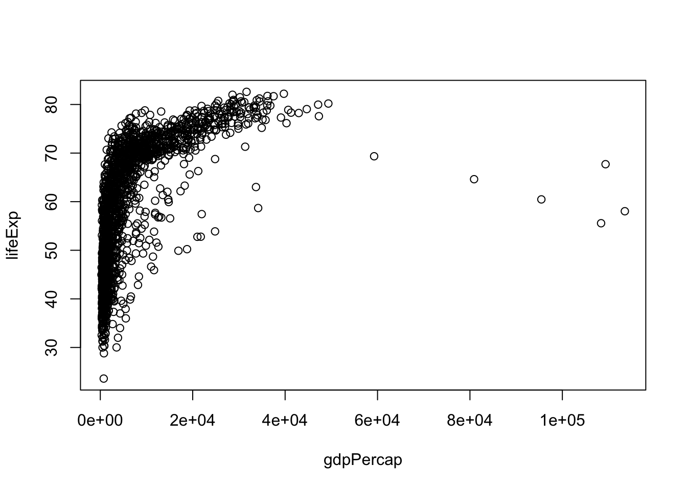
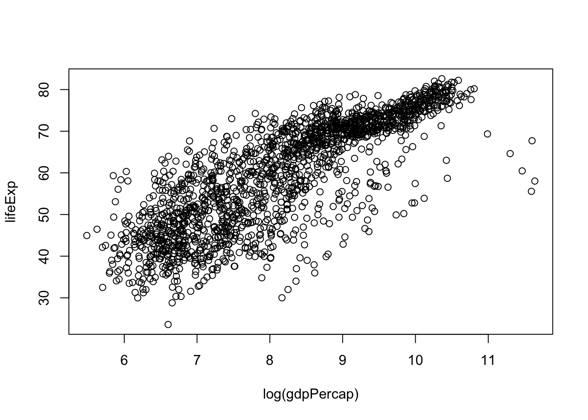
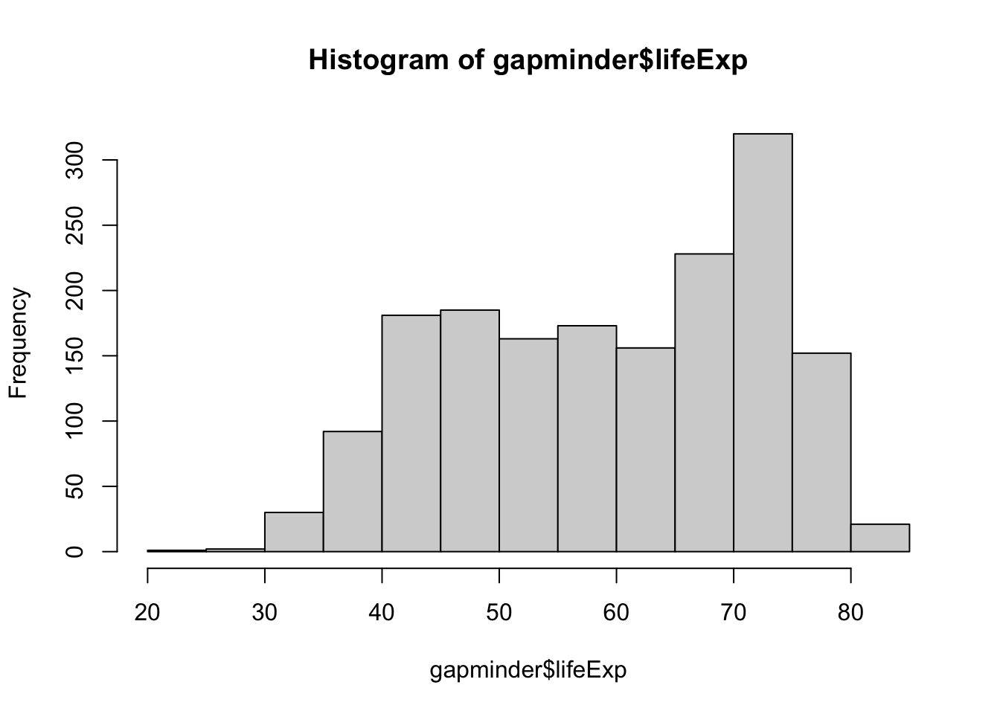
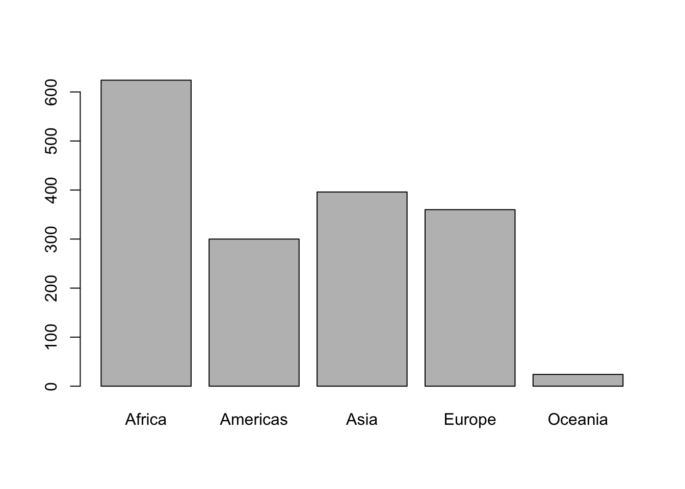
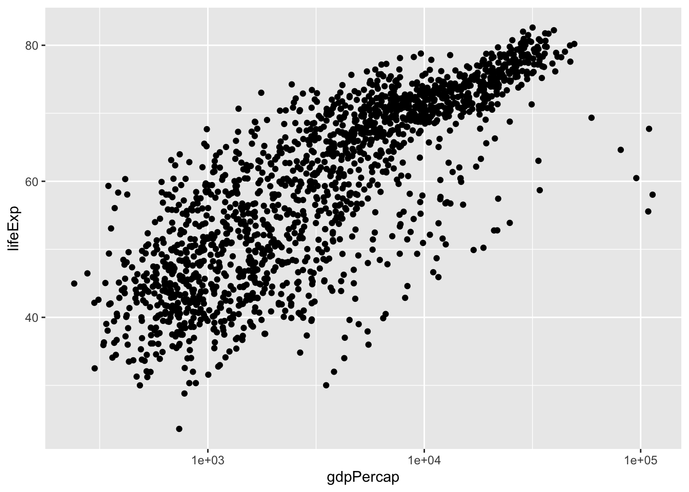
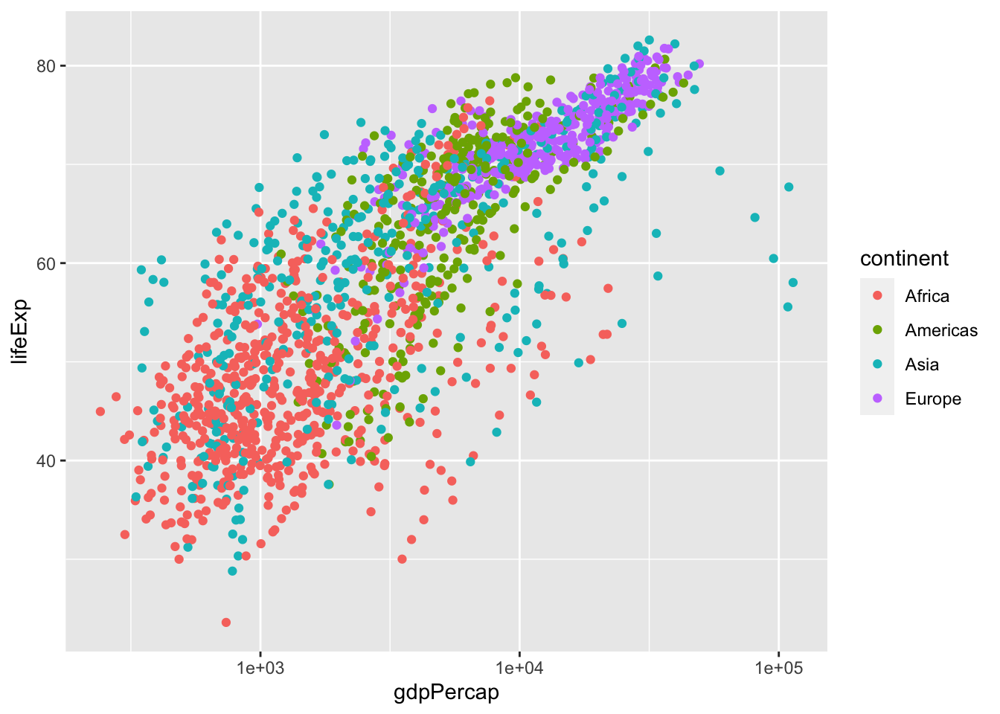
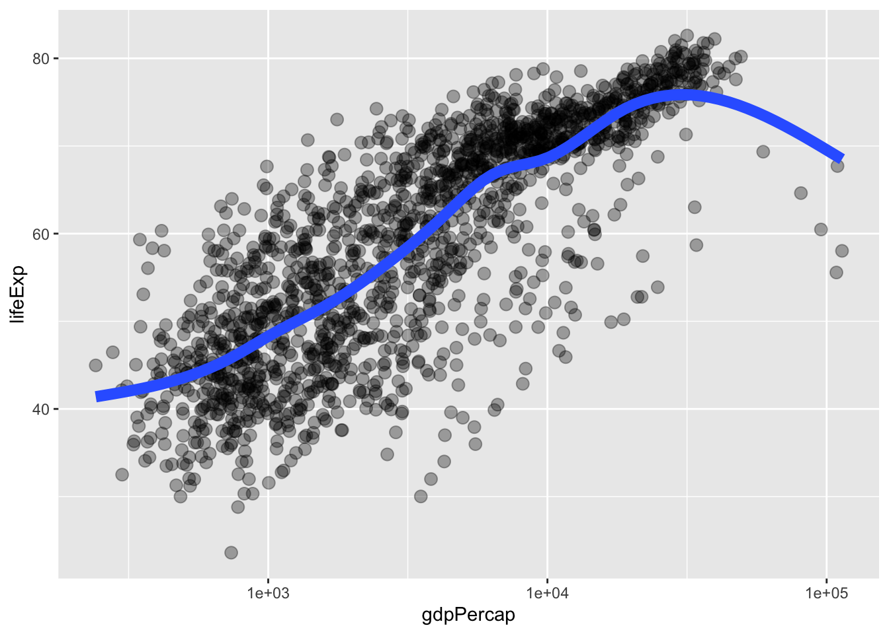
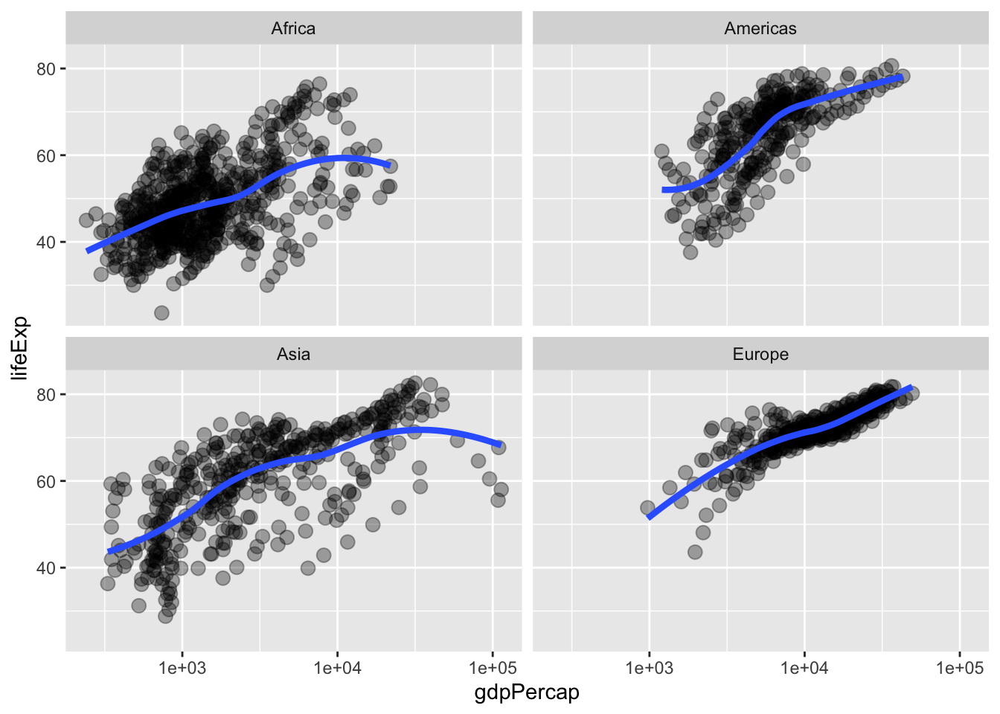

# (PART) Data analysis 1 {-} 

# Basic care and feeding of data in R {#basic-data-care}


<!--Original content: https://stat545.com/block006_care-feeding-data.html-->


## Buckle your seatbelt

*Ignore if you don't need this bit of support.*

Now is the time to make sure you are working in an appropriate directory on your computer, probably through the use of an [RStudio project](#rprojs). Enter `getwd()` in the Console to see current working directory or, in RStudio, this is displayed in the bar at the top of Console.

You should clean out your workspace. In RStudio, click on the "Clear" broom icon from the Environment tab or use *Session > Clear Workspace*. You can also enter `rm(list = ls())` in the Console to accomplish same.

Now restart R. This will ensure you don't have any packages loaded from previous calls to `library()`. In RStudio, use *Session > Restart R*. Otherwise, quit R with `q()` and re-launch it.

Why do we do this? So that the code you write is complete and re-runnable. If you return to a clean slate often, you will root out hidden dependencies where one snippet of code only works because it relies on objects created by code saved elsewhere or, much worse, never saved at all. Similarly, an aggressive clean slate approach will expose any usage of packages that have not been explicitly loaded. 

Finally, open a new R script and develop and run your code from there. In RStudio, use *File > New File > R Script*. Save this script with a name ending in `.r` or `.R`, containing no spaces or other funny stuff, and that evokes whatever it is we're doing today. Example: `cm004_data-care-feeding.r`.

Another great idea is to do this in an R Markdown document. See [Test drive R Markdown](#r-markdown) for a refresher.

## Data frames are awesome

Whenever you have rectangular, spreadsheet-y data, your default data receptacle in R is a data frame. Do not depart from this without good reason. Data frames are awesome because...

* Data frames package related variables neatly together,
  - keeping them in sync vis-a-vis row order
  - applying any filtering of observations uniformly
* Most functions for inference, modelling, and graphing are happy to be passed a data frame via a `data =` argument. This has been true in base R for a long time.
* The set of packages known as the [tidyverse] takes this one step further and explicitly prioritizes the processing of data frames. This includes popular packages like [dplyr] and [ggplot2]. In fact the tidyverse prioritizes a special flavor of data frame, called a "tibble".

Data frames -- unlike general arrays or, specifically, matrices in R -- can hold variables of different flavors, such as character data (subject ID or name), quantitative data (white blood cell count), and categorical information (treated vs. untreated). If you use homogeneous structures, like matrices, for data analysis, you  are likely to make the terrible mistake of spreading a dataset out over multiple, unlinked objects. Why? Because you can't put character data, such as subject name, into the numeric matrix that holds white blood cell count. This fragmentation is a Bad Idea.

## Get the Gapminder data

We will work with some of the data from the [Gapminder project](https://www.gapminder.org). I've released this as an R package called [gapminder], so we can install it from CRAN like so:


```r
install.packages("gapminder")
```

Now load the package:


```r
library(gapminder)
```

## Meet the `gapminder` data frame or "tibble"

By loading the gapminder package, we now have access to a data frame by the same name. Get an overview of this with `str()`, which displays the structure of an object.


```r
str(gapminder)
#> tibble [1,704 × 6] (S3: tbl_df/tbl/data.frame)
#>  $ country  : Factor w/ 142 levels "Afghanistan",..: 1 1 1 1 1 1 1 1 1 1 ...
#>  $ continent: Factor w/ 5 levels "Africa","Americas",..: 3 3 3 3 3 3 3 3 3 3 ...
#>  $ year     : int [1:1704] 1952 1957 1962 1967 1972 1977 1982 1987 1992 1997 ...
#>  $ lifeExp  : num [1:1704] 28.8 30.3 32 34 36.1 ...
#>  $ pop      : int [1:1704] 8425333 9240934 10267083 11537966 13079460 14880372..
#>  $ gdpPercap: num [1:1704] 779 821 853 836 740 ...
```

`str()` will provide a sensible description of almost anything and, worst case, nothing bad can actually happen. When in doubt, just `str()` some of the recently created objects to get some ideas about what to do next.

We could print the `gapminder` object itself to screen. However, if you've used R before, you might be reluctant to do this, because large datasets just fill up your Console and provide very little insight.

This is the first big win for **tibbles**. The tidyverse offers a special case of R's default data frame: the "tibble", which is a nod to the actual class of these objects, `tbl_df`.

If you have not already done so, install the tidyverse meta-package now:


```r
install.packages("tidyverse")
```

Now load it:


```r
library(tidyverse)
#> ── Attaching packages ──────────────────────────────────────── tidyverse 1.3.0 ──
#> ✓ ggplot2 3.3.2     ✓ purrr   0.3.4
#> ✓ tibble  3.0.3     ✓ dplyr   1.0.2
#> ✓ tidyr   1.1.2     ✓ stringr 1.4.0
#> ✓ readr   1.3.1     ✓ forcats 0.5.0
#> ── Conflicts ─────────────────────────────────────────── tidyverse_conflicts() ──
#> x dplyr::filter() masks stats::filter()
#> x dplyr::lag()    masks stats::lag()
```

Now we can boldly print `gapminder` to screen! It is a tibble (and also a regular data frame) and the tidyverse provides a nice print method that shows the most important stuff and doesn't fill up your Console.


```r
## see? it's still a regular data frame, but also a tibble
class(gapminder)
#> [1] "tbl_df"     "tbl"        "data.frame"
gapminder
#> # A tibble: 1,704 x 6
#>    country     continent  year lifeExp      pop gdpPercap
#>    <fct>       <fct>     <int>   <dbl>    <int>     <dbl>
#>  1 Afghanistan Asia       1952    28.8  8425333      779.
#>  2 Afghanistan Asia       1957    30.3  9240934      821.
#>  3 Afghanistan Asia       1962    32.0 10267083      853.
#>  4 Afghanistan Asia       1967    34.0 11537966      836.
#>  5 Afghanistan Asia       1972    36.1 13079460      740.
#>  6 Afghanistan Asia       1977    38.4 14880372      786.
#>  7 Afghanistan Asia       1982    39.9 12881816      978.
#>  8 Afghanistan Asia       1987    40.8 13867957      852.
#>  9 Afghanistan Asia       1992    41.7 16317921      649.
#> 10 Afghanistan Asia       1997    41.8 22227415      635.
#> # … with 1,694 more rows
```

If you are dealing with plain vanilla data frames, you can rein in data frame printing explicitly with `head()` and `tail()`. Or turn it into a tibble with `as_tibble()`!


```r
head(gapminder)
#> # A tibble: 6 x 6
#>   country     continent  year lifeExp      pop gdpPercap
#>   <fct>       <fct>     <int>   <dbl>    <int>     <dbl>
#> 1 Afghanistan Asia       1952    28.8  8425333      779.
#> 2 Afghanistan Asia       1957    30.3  9240934      821.
#> 3 Afghanistan Asia       1962    32.0 10267083      853.
#> 4 Afghanistan Asia       1967    34.0 11537966      836.
#> 5 Afghanistan Asia       1972    36.1 13079460      740.
#> 6 Afghanistan Asia       1977    38.4 14880372      786.
tail(gapminder)
#> # A tibble: 6 x 6
#>   country  continent  year lifeExp      pop gdpPercap
#>   <fct>    <fct>     <int>   <dbl>    <int>     <dbl>
#> 1 Zimbabwe Africa     1982    60.4  7636524      789.
#> 2 Zimbabwe Africa     1987    62.4  9216418      706.
#> 3 Zimbabwe Africa     1992    60.4 10704340      693.
#> 4 Zimbabwe Africa     1997    46.8 11404948      792.
#> 5 Zimbabwe Africa     2002    40.0 11926563      672.
#> 6 Zimbabwe Africa     2007    43.5 12311143      470.
as_tibble(iris)
#> # A tibble: 150 x 5
#>    Sepal.Length Sepal.Width Petal.Length Petal.Width Species
#>           <dbl>       <dbl>        <dbl>       <dbl> <fct>  
#>  1          5.1         3.5          1.4         0.2 setosa 
#>  2          4.9         3            1.4         0.2 setosa 
#>  3          4.7         3.2          1.3         0.2 setosa 
#>  4          4.6         3.1          1.5         0.2 setosa 
#>  5          5           3.6          1.4         0.2 setosa 
#>  6          5.4         3.9          1.7         0.4 setosa 
#>  7          4.6         3.4          1.4         0.3 setosa 
#>  8          5           3.4          1.5         0.2 setosa 
#>  9          4.4         2.9          1.4         0.2 setosa 
#> 10          4.9         3.1          1.5         0.1 setosa 
#> # … with 140 more rows
```

More ways to query basic info on a data frame:


```r
names(gapminder)
#> [1] "country"   "continent" "year"      "lifeExp"   "pop"       "gdpPercap"
ncol(gapminder)
#> [1] 6
length(gapminder)
#> [1] 6
dim(gapminder)
#> [1] 1704    6
nrow(gapminder)
#> [1] 1704
```

A statistical overview can be obtained with `summary()`:


```r
summary(gapminder)
#>         country        continent        year         lifeExp    
#>  Afghanistan:  12   Africa  :624   Min.   :1952   Min.   :23.6  
#>  Albania    :  12   Americas:300   1st Qu.:1966   1st Qu.:48.2  
#>  Algeria    :  12   Asia    :396   Median :1980   Median :60.7  
#>  Angola     :  12   Europe  :360   Mean   :1980   Mean   :59.5  
#>  Argentina  :  12   Oceania : 24   3rd Qu.:1993   3rd Qu.:70.8  
#>  Australia  :  12                  Max.   :2007   Max.   :82.6  
#>  (Other)    :1632                                               
#>       pop             gdpPercap     
#>  Min.   :6.00e+04   Min.   :   241  
#>  1st Qu.:2.79e+06   1st Qu.:  1202  
#>  Median :7.02e+06   Median :  3532  
#>  Mean   :2.96e+07   Mean   :  7215  
#>  3rd Qu.:1.96e+07   3rd Qu.:  9325  
#>  Max.   :1.32e+09   Max.   :113523  
#> 
```

Although we haven't begun our formal coverage of visualization yet, it's so important for smell-testing dataset that we will make a few figures anyway. Here we use only base R graphics, which are very basic.


```r
plot(lifeExp ~ year, gapminder)
```



```r
plot(lifeExp ~ gdpPercap, gapminder)
```



```r
plot(lifeExp ~ log(gdpPercap), gapminder)
```



<!--JB: This is a non-sequitur here ... where came from originally?
> Sidebar on equals: A single equal sign `=` is most commonly used to specify values of arguments when calling functions in R, e.g. `group = continent`. It can be used for assignment but we advise against that, in favor of `<-`. A double equal sign `==` is a binary comparison operator, akin to less than `<` or greater than `>`, returning the logical value `TRUE` in the case of equality and `FALSE` otherwise. Although you may not yet understand exactly why, `subset = country == "Colombia"` restricts operation -- scatterplotting, in above examples -- to observations where the country is Colombia.
-->

Let's go back to the result of `str()` to talk about what a data frame is.


```r
str(gapminder)
#> tibble [1,704 × 6] (S3: tbl_df/tbl/data.frame)
#>  $ country  : Factor w/ 142 levels "Afghanistan",..: 1 1 1 1 1 1 1 1 1 1 ...
#>  $ continent: Factor w/ 5 levels "Africa","Americas",..: 3 3 3 3 3 3 3 3 3 3 ...
#>  $ year     : int [1:1704] 1952 1957 1962 1967 1972 1977 1982 1987 1992 1997 ...
#>  $ lifeExp  : num [1:1704] 28.8 30.3 32 34 36.1 ...
#>  $ pop      : int [1:1704] 8425333 9240934 10267083 11537966 13079460 14880372..
#>  $ gdpPercap: num [1:1704] 779 821 853 836 740 ...
```

A data frame is a special case of a *list*, which is used in R to hold just about anything. Data frames are a special case where the length of each list component is the same. Data frames are superior to matrices in R because they can hold vectors of different flavors, e.g. numeric, character, and categorical data can be stored together. This comes up a lot!

## Look at the variables inside a data frame

To specify a single variable from a data frame, use the dollar sign `$`. Let's explore the numeric variable for life expectancy.


```r
head(gapminder$lifeExp)
#> [1] 28.8 30.3 32.0 34.0 36.1 38.4
summary(gapminder$lifeExp)
#>    Min. 1st Qu.  Median    Mean 3rd Qu.    Max. 
#>    23.6    48.2    60.7    59.5    70.8    82.6
hist(gapminder$lifeExp)
```



The year variable is an integer variable, but since there are so few unique values it also functions a bit like a categorical variable.


```r
summary(gapminder$year)
#>    Min. 1st Qu.  Median    Mean 3rd Qu.    Max. 
#>    1952    1966    1980    1980    1993    2007
table(gapminder$year)
#> 
#> 1952 1957 1962 1967 1972 1977 1982 1987 1992 1997 2002 2007 
#>  142  142  142  142  142  142  142  142  142  142  142  142
```

The variables for country and continent hold truly categorical information, which is stored as a *factor* in R.


```r
class(gapminder$continent)
#> [1] "factor"
summary(gapminder$continent)
#>   Africa Americas     Asia   Europe  Oceania 
#>      624      300      396      360       24
levels(gapminder$continent)
#> [1] "Africa"   "Americas" "Asia"     "Europe"   "Oceania"
nlevels(gapminder$continent)
#> [1] 5
```

The __levels__ of the factor `continent` are "Africa", "Americas", etc. and this is what's usually presented to your eyeballs by R. In general, the levels are friendly human-readable character strings, like "male/female" and "control/treated". But *never ever ever* forget that, under the hood, R is really storing integer codes 1, 2, 3, etc. Look at the result from `str(gapminder$continent)` if you are skeptical.


```r
str(gapminder$continent)
#>  Factor w/ 5 levels "Africa","Americas",..: 3 3 3 3 3 3 3 3 3 3 ...
```

This [Janus]-like nature of factors means they are rich with booby traps for the unsuspecting but they are a necessary evil. I recommend you resolve to learn how to [properly care and feed for factors](#factors-boss). The pros far outweigh the cons. Specifically in modelling and figure-making, factors are anticipated and accommodated by the functions and packages you will want to exploit.

Here we count how many observations are associated with each continent and, as usual, try to portray that info visually. This makes it much easier to quickly see that African countries are well represented in this dataset.

```r
table(gapminder$continent)
#> 
#>   Africa Americas     Asia   Europe  Oceania 
#>      624      300      396      360       24
barplot(table(gapminder$continent))
```



In the figures below, we see how factors can be put to work in figures. The `continent` factor is easily mapped into "facets" or colors and a legend by the [ggplot2] package. *Making figures with ggplot2 is covered in Chapter \@ref(ggplot2-tutorial) so feel free to just sit back and enjoy these plots or blindly copy/paste.*


```r
## we exploit the fact that ggplot2 was installed and loaded via the tidyverse
p <- ggplot(filter(gapminder, continent != "Oceania"),
            aes(x = gdpPercap, y = lifeExp)) # just initializes
p <- p + scale_x_log10() # log the x axis the right way
p + geom_point() # scatterplot
p + geom_point(aes(color = continent)) # map continent to color
p + geom_point(alpha = (1/3), size = 3) + geom_smooth(lwd = 3, se = FALSE)
#> `geom_smooth()` using method = 'gam' and formula 'y ~ s(x, bs = "cs")'
p + geom_point(alpha = (1/3), size = 3) + facet_wrap(~ continent) +
  geom_smooth(lwd = 1.5, se = FALSE)
#> `geom_smooth()` using method = 'loess' and formula 'y ~ x'
```



<!---JB:
EXERCISES I have used and let languish.
Let's get the data for just 2007.
How many rows?
How many observations per continent?
Scatterplot life expectancy against GDP per capita.
Variants of that: indicate continent by color, do for just one continent, do for multiple continents at once but in separate plots

```r
hDat <- subset(gapminder, subset = year == 2007)
str(hDat)
#> tibble [142 × 6] (S3: tbl_df/tbl/data.frame)
#>  $ country  : Factor w/ 142 levels "Afghanistan",..: 1 2 3 4 5 6 7 8 9 10 ...
#>  $ continent: Factor w/ 5 levels "Africa","Americas",..: 3 4 1 1 2 5 4 3 3 4 ...
#>  $ year     : int [1:142] 2007 2007 2007 2007 2007 2007 2007 2007 2007 2007 ...
#>  $ lifeExp  : num [1:142] 43.8 76.4 72.3 42.7 75.3 ...
#>  $ pop      : int [1:142] 31889923 3600523 33333216 12420476 40301927 20434176..
#>  $ gdpPercap: num [1:142] 975 5937 6223 4797 12779 ...
table(hDat$continent)
#> 
#>   Africa Americas     Asia   Europe  Oceania 
#>       52       25       33       30        2
#xyplot(lifeExp ~ gdpPercap, hDat)
#xyplot(lifeExp ~ gdpPercap, hDat, group = continent, auto.key = TRUE)
#xyplot(lifeExp ~ gdpPercap | continent, hDat)
```
## if you want just some rows and/or just some variables, for inspection or to
## assign as a new object, use subset()
subset(gapminder, subset = country == "Cambodia")
subset(gapminder, subset = country %in% c("Japan", "Belgium"))
subset(gapminder, subset = year == 1952)
subset(gapminder, subset = country == "Uruguay", select = c(country, year, lifeExp))

plot(lifeExp ~ year, gapminder, subset = country == "Zimbabwe")
plot(lifeExp ~ log(gdpPercap), gapminder, subset = year == 2007)

## exercise:
## get data for which life expectancy is less than 32 years
## assign to an object
## how many rows? how many observations per continent?
--->

## Recap

* Use data frames!!!

* Use the [tidyverse]!!! This will provide a special type of data frame called a "tibble" that has nice default printing behavior, among other benefits.

* When in doubt, `str()` something or print something.

* Always understand the basic extent of your data frames: number of rows and columns.

* Understand what flavor the variables are.

* Use factors!!! But with intention and care.

* Do basic statistical and visual sanity checking of each variable.

* Refer to variables by name, e.g., `gapminder$lifeExp`, not by column number. Your code will be more robust and readable.


<!--STAT 545 external resources/content-->
[useR-2014-dropbox]: https://www.dropbox.com/sh/i8qnluwmuieicxc/AAAgt9tIKoIm7WZKIyK25lh6a
[Tidy data using Lord of the Rings]: https://github.com/jennybc/lotr-tidy#readme
[ggplot2 tutorial]: https://github.com/jennybc/ggplot2-tutorial
[R Graph Catalog]: https://github.com/jennybc/r-graph-catalog

<!--Packages: main link-->
[dplyr]: https://dplyr.tidyverse.org
[tidyr]: https://tidyr.tidyverse.org
[ggplot2]: https://ggplot2.tidyverse.org
[tidyverse]: https://tidyverse.tidyverse.org
[stringr]: https://stringr.tidyverse.org
[forcats]: https://forcats.tidyverse.org
[purrr]: https://purrr.tidyverse.org
[readr]: https://readr.tidyverse.org
[fs]: https://fs.r-lib.org/index.html
[glue]: https://glue.tidyverse.org
[testthat]: https://testthat.r-lib.org
[ellipsis]: https://ellipsis.r-lib.org
[lubridate]: https://lubridate.tidyverse.org
[devtools]: https://devtools.r-lib.org
[roxygen2]: https://roxygen2.r-lib.org
[knitr]: https://github.com/yihui/knitr
[usethis]: https://usethis.r-lib.org
[xml2]: https://xml2.r-lib.org
[httr]: https://httr.r-lib.org
[rvest]: https://rvest.tidyverse.org
[Shiny]: https://shiny.rstudio.com
[gh]: https://github.com/r-lib/gh
[plyr]: http://plyr.had.co.nz
[magrittr]: https://magrittr.tidyverse.org
[googlesheets]: https://github.com/jennybc/googlesheets
[gapminder]: https://github.com/jennybc/gapminder
[stringi]: http://www.gagolewski.com/software/stringi/
[rex]: https://github.com/kevinushey/rex
[lattice]: http://lattice.r-forge.r-project.org
[RColorBrewer]: https://cloud.r-project.org/package=RColorBrewer
[gridExtra]: https://cloud.r-project.org/package=gridExtra
[rebird]: https://docs.ropensci.org/rebird/
[geonames]: https://docs.ropensci.org/geonames/
[rplos]: https://docs.ropensci.org/rplos/
[gender]: https://docs.ropensci.org/gender/
[genderdata]: https://docs.ropensci.org/genderdata/
[curl]: https://jeroen.cran.dev/curl
[jsonlite]: https://github.com/jeroen/jsonlite
[shinythemes]: https://rstudio.github.io/shinythemes/
[shinyjs]: https://deanattali.com/shinyjs/
[leaflet]: https://rstudio.github.io/leaflet/
[ggvis]: https://ggvis.rstudio.com
[shinydashboard]: https://rstudio.github.io/shinydashboard/

<!--Packages: vignettes & CRAN/GitHub links-->
[Introduction to dplyr]: https://dplyr.tidyverse.org/articles/dplyr.html
[Window functions]: https://dplyr.tidyverse.org/articles/window-functions.html
[Two-table verbs]: https://dplyr.tidyverse.org/articles/two-table.html
[Do more with dates and times in R]: https://lubridate.tidyverse.org/articles/lubridate.html
[dplyr-cran]: https://cloud.r-project.org/package=dplyr
[dplyr-github]: https://github.com/hadley/dplyr

<!--Bookdowns: main link-->
[Happy Git and GitHub for the useR]: https://happygitwithr.com
[R for Data Science]: https://r4ds.had.co.nz
[The tidyverse style guide]: https://style.tidyverse.org
[Advanced R]: http://adv-r.had.co.nz
[Tidyverse design principles]: https://principles.tidyverse.org
[R Packages]: https://r-pkgs.org/index.html
[R Graphics Cookbook]: http://shop.oreilly.com/product/0636920023135.do
[Cookbook for R]: http://www.cookbook-r.com 
[ggplot2: Elegant Graphics for Data Analysis]: https://ggplot2-book.org/index.html

<!--Bookdowns: specific chapters-->
[adv-r-fxn-args]: http://adv-r.had.co.nz/Functions.html#function-arguments
[r4ds-transform]: https://r4ds.had.co.nz/transform.html
[r4ds-readr-strings]: https://r4ds.had.co.nz/data-import.html#readr-strings

<!--RStudio Cheat Sheets--> 
[RStudio Data Transformation Cheat Sheet]: https://github.com/rstudio/cheatsheets/raw/master/data-transformation.pdf
[Regular Expressions in R Cheat Sheet]: https://github.com/rstudio/cheatsheets/raw/master/regex.pdf
[Shiny Cheat Sheet]: https://shiny.rstudio.com/articles/cheatsheet.html

<!--Blog posts, slides, & papers-->
["minimal make: a minimal tutorial on make"]: https://kbroman.org/minimal_make/
["Let the Data Flow: Pipelines in R with dplyr and magrittr"]: https://github.com/tjmahr/MadR_Pipelines
["Hands-on dplyr tutorial for faster data manipulation in R"]: https://www.dataschool.io/dplyr-tutorial-for-faster-data-manipulation-in-r/
["Writing R Extensions"]: https://cloud.r-project.org/doc/manuals/r-release/R-exts.html
["The Absolute Minimum Every Software Developer Absolutely, Positively Must Know About Unicode and Character Sets (No Excuses!)"]: https://www.joelonsoftware.com/2003/10/08/the-absolute-minimum-every-software-developer-absolutely-positively-must-know-about-unicode-and-character-sets-no-excuses/
["What Every Programmer Absolutely, Positively Needs To Know About Encodings And Character Sets To Work With Text"]: http://kunststube.net/encoding/
["3 Steps to Fix Encoding Problems in Ruby"]: https://www.justinweiss.com/articles/3-steps-to-fix-encoding-problems-in-ruby/
["My favorite RGB color"]: https://manyworldstheory.com/2013/01/15/my-favorite-rgb-color/

<!--Papers/Books Cited-->
["Dates and Times Made Easy with lubridate"]: https://www.jstatsoft.org/article/view/v040i03
["testthat: Get Started with Testing"]: https://journal.r-project.org/archive/2011-1/RJournal_2011-1_Wickham.pdf
["Let's Practice What We Preach"]: https://www.jstor.org/stable/3087382?seq=1#page_scan_tab_contents
[Creating More Effective Graphs]: https://www.amazon.com/Creating-Effective-Graphs-Naomi-Robbins/dp/0985911123
["Escaping RGBland: Selecting Colors for Statistical Graphs"]: https://eeecon.uibk.ac.at/~zeileis/papers/Zeileis+Hornik+Murrell-2009.pdf
["A layered grammar of graphics"]: https://vita.had.co.nz/papers/layered-grammar.html
[Managing Projects with GNU Make, 3rd Edition]: http://shop.oreilly.com/product/9780596006105.do
["Why Should Engineers and Scientists Be Worried About Color?"]: https://www.google.com/url?sa=t&rct=j&q=&esrc=s&source=web&cd=2&cad=rja&uact=8&ved=2ahUKEwi0xYqJ8JbjAhWNvp4KHViYDxsQFjABegQIABAC&url=https%3A%2F%2Fwww.researchgate.net%2Fprofile%2FAhmed_Elhattab2%2Fpost%2FPlease_suggest_some_good_3D_plot_tool_Software_for_surface_plot%2Fattachment%2F5c05ba35cfe4a7645506948e%2FAS%253A699894335557644%25401543879221725%2Fdownload%2FWhy%2BShould%2BEngineers%2Band%2BScientists%2BBe%2BWorried%2BAbout%2BColor_.pdf&usg=AOvVaw1qwjjGMd7h_z6TLUjzu7Nb

<!--Misc.-->
[rOpenSci]: https://ropensci.org
[wiki-snake-case]: https://en.wikipedia.org/wiki/Snake_case
[Janus]: https://en.wikipedia.org/wiki/Janus
