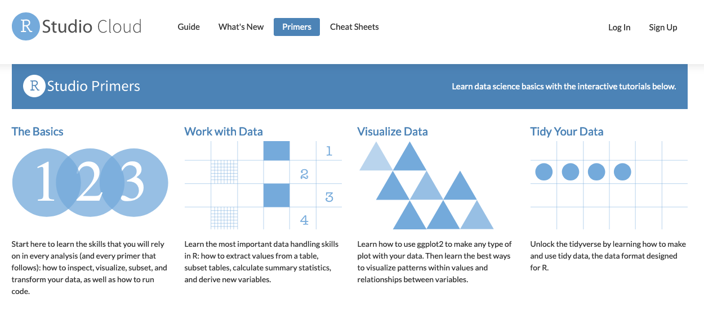

# (PART) R, wie fange ich an {-} 

# Installieren von R und RStudio {#install}

## R und RStudio

* Zuerst benötigen wir  [R, eine freie Softwareumgebung für statistische Berechnungen und Grafiken](https://www.r-project.org). Installiert daher R von [CRAN](https://cloud.r-project.org), dem Comprehensive R Archive Network. Wir empfehlen euch dringend, eine vorkompilierte Binärdistribution zu installieren - benutzt daher die Links oben auf der CRAN Seite!

* Danach könnt ihr die IDE  (steht für _integrated development environment_) von RStudio installieren. Dabei handelt es sich um eine leistungsfähige Benutzeroberfläche für R. 

  - RStudio wird mit einem __Text Editor__ geliefert, so dass es nicht unmittelbar erforderlich ist, einen separaten, eigenständigen Editor zu installieren.
  - RStudio bietet auch eine direkt  __Verbindung zu Git(Hub)__. Um die notwendige Git-Installationen müsst ihr euch aber selbst kümmern. Wir kommen aber auch [später](#version-control) auf diesen Punkt zurück.
    
Wenn ihr bereits eine vorhandene R und/oder RStudio Installation habt, empfehlen wir euch dringend, beide neu zu installieren und so aktuell wie möglich zu halten. 

Wenn ihr R aktualisiert, müssen ihr alle Pakete, die ihr installiert habt, aktualisieren. Das könnt ihr leicht mit dem unten stehenden Befehl machen. Möglicherweise müsst ihr aber auch noch weitere Argumente angeben, wenn ihr z.B. eine nicht standardmäßige Bibliothek für eure Pakete verwendet.

``` r
update.packages(ask = FALSE, checkBuilt = TRUE)
```

  __Bemerkung:__ Mit diesem Befehl wird nur nach Updates auf CRAN gesucht. Wenn ihr aber ein Paket verwenden, das z.B. __nur__ auf GitHub lebt, müsst ihr manuell aktualisieren, z.B. über `devtools::install_github()`.

## Funktioniert alles? Am besten ausprobieren

Startet RStudio auf eurem Computer. Dann solltet ihr ein Fenster ähnlich zu diesem 


erhalten. Vermutlich ist euer Fenster nicht so dunkel. Aber wer es gerne dunkel mag, soll sich mal unter `Tools -> Global -> Appearance` die _Editor Themes_  anschauen.


Setzt den Cursor in das Fenster mit der Bezeichnung Console. Über die Konsole seid ihr in der Lage mit R zu interagieren. Erstellt ein einfaches Objekt mit einem Code wie 


```r
x <- 2 * 4
```

(gefolgt von Enter oder Return). Schaut euch dann das Objekt `x` genauer an, indem ihr `x` in der Konsole eingebt, gefolgt von Enter oder Return. Ihr sollten dann den Wert 8 auf dem Bildschirm sehen. Wenn ja, habet ihr R und RStudio erfolgreich installiert.

## Add-on packages

R ist ein erweiterbares System und viele Menschen teilen nützlichen Code, den sie als __Paket__ entwickelt haben, über CRAN, GitHub, GitLab oder ähnlichen Plattformen. Um ein Paket von CRAN zu installieren, z.B. das Paket [tidyverse] (ist genauer gesagt eine Kollektion von Paketen), kann man folgenden Befehl verwenden

```r
install.packages("tidyverse", dependencies = TRUE)
```

Mit der Option `dependencies = TRUE` achten wir darauf, dass alle für `tidyverse` notwendigen Pakete, ebenfalls installiert werden.


## RStudio Primers


Ein guter Startpunkt für verschiedene R Themen sind die [RStudio primers](https://rstudio.cloud/learn/primers).





Im Laufe des Kurses werdet ihr die Primers

- [The Basics](https://rstudio.cloud/learn/primers/1)
- [Work with Data](https://rstudio.cloud/learn/primers/2)
- [Visualize Data](https://rstudio.cloud/learn/primers/3)

durcharbeiten.


## Aufgabe

Wir beginnen mit [The Basics](https://rstudio.cloud/learn/primers/1). Hier wird unterschieden in *Programming* und *Visualization* Basics. 

[Programming Basics](https://rstudio.cloud/learn/primers/1.2) beinhaltet Grundlagen zu Objekttypen, Funktionen und deren Argumente, Listen (eigentlich sind alle Objekte Listen, nur unterschiedlich speziell) und Paketen.

[Visualization Basics](https://rstudio.cloud/learn/primers/1.1) erklärt erste Schritte in der Verwendung des `ggplot2` Pakets, mit dem wir uns später noch eingehend beschäftigen werden.

Bearbeitet eigenständig den Basics Primer.


<!--Packages: main link-->
[dplyr]: https://dplyr.tidyverse.org
[tidyr]: https://tidyr.tidyverse.org
[ggplot2]: https://ggplot2.tidyverse.org
[tidyverse]: https://tidyverse.tidyverse.org
[stringr]: https://stringr.tidyverse.org
[forcats]: https://forcats.tidyverse.org
[purrr]: https://purrr.tidyverse.org
[readr]: https://readr.tidyverse.org
[fs]: https://fs.r-lib.org/index.html
[glue]: https://glue.tidyverse.org
[testthat]: https://testthat.r-lib.org
[ellipsis]: https://ellipsis.r-lib.org
[lubridate]: https://lubridate.tidyverse.org
[devtools]: https://devtools.r-lib.org
[roxygen2]: https://roxygen2.r-lib.org
[knitr]: https://github.com/yihui/knitr
[rmarkdown]: https://rmarkdown.rstudio.com/
[usethis]: https://usethis.r-lib.org
[xml2]: https://xml2.r-lib.org
[httr]: https://httr.r-lib.org
[rvest]: https://rvest.tidyverse.org
[Shiny]: https://shiny.rstudio.com
[gh]: https://github.com/r-lib/gh
[plyr]: http://plyr.had.co.nz
[magrittr]: https://magrittr.tidyverse.org
[googlesheets]: https://github.com/jennybc/googlesheets
[gapminder]: https://github.com/jennybc/gapminder
[stringi]: http://www.gagolewski.com/software/stringi/
[rex]: https://github.com/kevinushey/rex
[lattice]: http://lattice.r-forge.r-project.org
[RColorBrewer]: https://cloud.r-project.org/package=RColorBrewer
[gridExtra]: https://cloud.r-project.org/package=gridExtra
[rebird]: https://docs.ropensci.org/rebird/
[geonames]: https://docs.ropensci.org/geonames/
[rplos]: https://docs.ropensci.org/rplos/
[gender]: https://docs.ropensci.org/gender/
[genderdata]: https://docs.ropensci.org/genderdata/
[curl]: https://jeroen.cran.dev/curl
[jsonlite]: https://github.com/jeroen/jsonlite
[shinythemes]: https://rstudio.github.io/shinythemes/
[shinyjs]: https://deanattali.com/shinyjs/
[leaflet]: https://rstudio.github.io/leaflet/
[ggvis]: https://ggvis.rstudio.com
[shinydashboard]: https://rstudio.github.io/shinydashboard/

<!--Packages: vignettes & CRAN/GitHub links-->
[Introduction to dplyr]: https://dplyr.tidyverse.org/articles/dplyr.html
[Window functions]: https://dplyr.tidyverse.org/articles/window-functions.html
[Two-table verbs]: https://dplyr.tidyverse.org/articles/two-table.html
[Do more with dates and times in R]: https://lubridate.tidyverse.org/articles/lubridate.html
[dplyr-cran]: https://cloud.r-project.org/package=dplyr
[dplyr-github]: https://github.com/hadley/dplyr

<!--Bookdowns: main link-->
[Happy Git and GitHub for the useR]: https://happygitwithr.com
[R for Data Science]: https://r4ds.had.co.nz
[The tidyverse style guide]: https://style.tidyverse.org
[Advanced R]: https://adv-r.hadley.nz/
[Tidyverse design principles]: https://principles.tidyverse.org
[R Packages]: https://r-pkgs.org/index.html
[R Graphics Cookbook]: http://shop.oreilly.com/product/0636920023135.do
[Cookbook for R]: http://www.cookbook-r.com 
[ggplot2: Elegant Graphics for Data Analysis]: https://ggplot2-book.org/index.html
[Statistical Inference via Data Science]: https://moderndive.com/index.html

<!--Bookdowns: specific chapters-->
[adv-r-fxn-args]: http://adv-r.had.co.nz/Functions.html#function-arguments
[r4ds-transform]: https://r4ds.had.co.nz/transform.html
[r4ds-readr-strings]: https://r4ds.had.co.nz/data-import.html#readr-strings

<!--RStudio Cheat Sheets--> 
[RStudio Data Transformation Cheat Sheet]: https://github.com/rstudio/cheatsheets/raw/master/data-transformation.pdf
[Regular Expressions in R Cheat Sheet]: https://github.com/rstudio/cheatsheets/raw/master/regex.pdf
[Shiny Cheat Sheet]: https://shiny.rstudio.com/articles/cheatsheet.html

<!--Blog posts, slides, & papers-->
["minimal make: a minimal tutorial on make"]: https://kbroman.org/minimal_make/
["Let the Data Flow: Pipelines in R with dplyr and magrittr"]: https://github.com/tjmahr/MadR_Pipelines
["Hands-on dplyr tutorial for faster data manipulation in R"]: https://www.dataschool.io/dplyr-tutorial-for-faster-data-manipulation-in-r/
["Writing R Extensions"]: https://cloud.r-project.org/doc/manuals/r-release/R-exts.html
["The Absolute Minimum Every Software Developer Absolutely, Positively Must Know About Unicode and Character Sets (No Excuses!)"]: https://www.joelonsoftware.com/2003/10/08/the-absolute-minimum-every-software-developer-absolutely-positively-must-know-about-unicode-and-character-sets-no-excuses/
["What Every Programmer Absolutely, Positively Needs To Know About Encodings And Character Sets To Work With Text"]: http://kunststube.net/encoding/
["3 Steps to Fix Encoding Problems in Ruby"]: https://www.justinweiss.com/articles/3-steps-to-fix-encoding-problems-in-ruby/
["My favorite RGB color"]: https://manyworldstheory.com/2013/01/15/my-favorite-rgb-color/

<!--Papers/Books Cited-->
["Dates and Times Made Easy with lubridate"]: https://www.jstatsoft.org/article/view/v040i03
["testthat: Get Started with Testing"]: https://journal.r-project.org/archive/2011-1/RJournal_2011-1_Wickham.pdf
["Let's Practice What We Preach"]: https://www.jstor.org/stable/3087382?seq=1#page_scan_tab_contents
[Creating More Effective Graphs]: https://www.amazon.com/Creating-Effective-Graphs-Naomi-Robbins/dp/0985911123
["Escaping RGBland: Selecting Colors for Statistical Graphs"]: https://eeecon.uibk.ac.at/~zeileis/papers/Zeileis+Hornik+Murrell-2009.pdf
["A layered grammar of graphics"]: https://vita.had.co.nz/papers/layered-grammar.html
[Managing Projects with GNU Make, 3rd Edition]: http://shop.oreilly.com/product/9780596006105.do
["Why Should Engineers and Scientists Be Worried About Color?"]: https://www.google.com/url?sa=t&rct=j&q=&esrc=s&source=web&cd=2&cad=rja&uact=8&ved=2ahUKEwi0xYqJ8JbjAhWNvp4KHViYDxsQFjABegQIABAC&url=https%3A%2F%2Fwww.researchgate.net%2Fprofile%2FAhmed_Elhattab2%2Fpost%2FPlease_suggest_some_good_3D_plot_tool_Software_for_surface_plot%2Fattachment%2F5c05ba35cfe4a7645506948e%2FAS%253A699894335557644%25401543879221725%2Fdownload%2FWhy%2BShould%2BEngineers%2Band%2BScientists%2BBe%2BWorried%2BAbout%2BColor_.pdf&usg=AOvVaw1qwjjGMd7h_z6TLUjzu7Nb

<!--Misc.-->
[rOpenSci]: https://ropensci.org

[wiki-snake-case]: https://en.wikipedia.org/wiki/Snake_case
