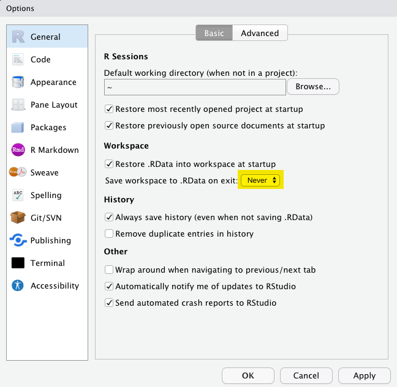

# R Basics und Arbeitsabläufe {#r-basics}


<!--Original content: https://stat545.com/block002_hello-r-workspace-wd-project.html-->

## Ein paar Grundlagen für das Arbeiten mit R


> **Aktueller Stand:** Du hast bereits den Programming Basics Primer absolviert und nun willst du anfangen mit deiner RStudio/R Installation zu arbeiten arbeiten. 


Es geht los indem du RStudio startest. Beachte dabei die Standardfensterbereiche:

* Console (*links*)
* Environment / History (*oben rechts*)
* Files / Plots / Packages / Help (*unten rechtes*)

**Bemerkung:** Die Standardanordnung der Fenster kannst du neben vielen anderen Dingen nach deinen Vorstellungen ändern/anpassen: [Customizing RStudio](https://support.rstudio.com/hc/en-us/articles/200549016-Customizing-RStudio).

Gehen nun in die Konsole um mit R zu interagieren. Erstelle die nachfolgende Zuordnung  und schau dir das erstellte Objekt genauer an:


```r
x <- 3 * 4
x
#> [1] 12
```

Alle R Befehle, die ein Objekte erstellen ("Zuweisungen"), haben die Form:


```r
objectName <- value
```

Du wirst im weiteren Verlauf noch viele Zuweisungen vornehmen, und es ist tatsächlich etwas mühsam den Operator `<-` zu tippen. Sei aber trotzdem nicht faul und benutze  `=` stattdessen - auch wenn es theoretisch funktionieren würde. Aber später kann die Verwendung von `=` für Zuweisungen zu Verwirrung führen. Verwende  stattdessen in RStudio die Tastenkombination: `Alt` + `-` (Minuszeichen).

Beachte, dass RStudio automatisch `<-` mit Leerzeichen umgibt, was eine nützliche Codeformatierung demonstriert. Code ist selbst an einem guten Tag eher schlecht zu lesen. Gönne daher deinen Augen eine Pause und verwende (ausreichend) Leerzeichen.

RStudio bietet viele praktische [Tastaturkürzel](https://support.rstudio.com/hc/en-us/articles/200711853-Keyboard-Shortcuts) an. Eine Übersicht erhält man auch mit `Alt`+`Shift`+`K`.


Objektnamen dürfen nicht mit einer Ziffer beginnen und bestimmte andere Zeichen wie ein Komma oder ein Leerzeichen nicht enthalten. Es ist daher ratsam, sich eine [Konvention zur Abgrenzung von Wörtern][wiki-snake-case] in Objektnamen zu überlegen.

```
i_use_snake_case
other.people.use.periods
evenOthersUseCamelCase
```

Wir werden stets die erste Variante verwenden.

Führe nun nachfolgenden Befehl aus


```r
this_is_a_really_long_name <- 2.5
```

In deinem Workspace ist nun das Objekt `this_is_a_really_long_name` vorhanden. Probiere mithilfe dieses Objekts die Vervollständigungsfunktion von RStudio aus: *Gib die ersten paar Zeichen ein, drücke anschließend die TAB Taste, fügen weitere Zeichen hinzu, bis Eindeutigkeit hergestellt ist(wenn sonst wenig in deinem Workspace ist, dann ist das schnell erreicht), und drücke dann die Eingabetaste*.


Führe nun den Befehl 

```r
jenny_rocks <- 2 ^ 3
```

aus, um anschließend den Inhalt des Objekts anzuzeigen.

```r
jennyrocks
#> Error in eval(expr, envir, enclos): object 'jennyrocks' not found
jeny_rocks
#> Error in eval(expr, envir, enclos): object 'jeny_rocks' not found
```

Die Objekte `jennyrocks` und `jeny_rocks` sind natürlich nicht vorhanden und somit führen beide Befehle zu einer Fehlermeldung. Man muss also absolut exakt sein mit seinen Befehlen.


R verfügt über eine überwältigende Sammlung eingebauter Funktionen, die nach folgendem Schema aufgerufen werden:


```r
functionName(arg1 = val1, arg2 = val2, and so on)
```

Als nächstes wollen wir die Funktion `seq()` verwenden, die reguläre Zahlensequenzen erzeugt. Dabei wollen wir noch ein weiteres hilfreiches Feature von RStudio demonstrieren.

Tippe `se` und drücke dann die TAB Taste. In einem Pop-Up Fenster werden dir mögliche Vervollständigungen angezeigt. Der Befehl `seq()` kann dann durch weiteres Tippen oder über die Auswahlmöglichkeit (Pfeiltasten nach oben/unten) festgelegt werden. Zu jeder Auswahlmöglichkeit wird auch noch eine Kurzform der entsprechenden Hilfeseite angezeigt. Fügt man jetzt die öffnende runde Klammer hinzu, so wird die zugehörige schließende runde Klammer automatisch hinzugefügt. Tippe anschließend `1, 10` (das geschieht automatisch innerhalb der runden Klammern) und Return. RStudio beendet auch den Klammerausdruck für dich.  IDEs sind großartig.


```r
seq(1, 10)
#>  [1]  1  2  3  4  5  6  7  8  9 10
```

Der letzte Befehl zeigt auch ganz gut, wie R Funktionsargumente auflöst. Sie können immer in der Form `Name = Wert` angeben werden. Aber der Name muss nicht angegeben werden, wie man sieht. In solchen Fällen versucht R, nach der Position aufzulösen. So wird oben angenommen, dass wir eine Sequenz  bei 1 starten wollen, also `from = 1`,  und diese bis 10 laufen soll, daher `to = 10`. Da wir keine Schrittweite angegeben haben, wird der Standardwert für `by` verwendet, der in diesem Fall gleich 1 ist.

Bei Funktionen, die man oft aufruft, kann man gut diese Auflösung nach Position für das erste und vielleicht auch das zweite Argument verwenden. Danach ist es aber ratsam immer mit `Name = Wert` zu arbeiten um falsche Zuweisungen (verschiedene Argumente können vom gleichen Typ sein, sodass eine falsche Zuweisung nicht automatisch zu einer Fehlermeldung führt) zu vermeiden.


Analog zur Unterstützung mit den runden Klammern, werden auch schließende  Anführungszeichen automatisch ergänzt, wie man in folgendem Beispiel sieht. 


```r
yo <- "hello world"
```

Nach einer Zuweisung wird der entsprechende Wert des Objekts nicht angezeigt. Daher ist man vielleicht dazu geneigt das Objekt gleich erneut aufzurufen


```r
y <- seq(1, 10)
y
#>  [1]  1  2  3  4  5  6  7  8  9 10
```

Diese typische Aktion kann verkürzt werden, indem die Zuweisung in Klammern gesetzt wird, wodurch die Zuweisung und ein Befehl "Drucke auf den Bildschirm" erfolgen.


```r
(y <- seq(1, 10))
#>  [1]  1  2  3  4  5  6  7  8  9 10
```

Nicht alle Funktionen haben (oder erfordern) Argumente:


```r
date()
#> [1] "Mon Jul 19 17:43:02 2021"
```

Schau dir nun deinen Workspace an - im oberen rechten Fensterbereich (bei Standardeinstellung) siehst du unter Environment den Inhalt deines Workspaces. Der Workspace ist der Ort, an dem sich benutzerdefinierte Objekte ansammeln. Eine Liste dieser Objekte kannst du auch mit diesen Befehlen erhalten:


```r
objects()
#> [1] "check_quietly"              "install_quietly"           
#> [3] "jenny_rocks"                "pretty_install"            
#> [5] "shhh_check"                 "this_is_a_really_long_name"
#> [7] "x"                          "y"                         
#> [9] "yo"
ls()
#> [1] "check_quietly"              "install_quietly"           
#> [3] "jenny_rocks"                "pretty_install"            
#> [5] "shhh_check"                 "this_is_a_really_long_name"
#> [7] "x"                          "y"                         
#> [9] "yo"
```

Wenn du nun das Objekt mit dem Namen `y` entfernen möchtest, kannst du dies wie folgt machen:


```r
rm(y)
```

Alles löschen kannst du mit dem Befehl


```r
rm(list = ls())
```

oder du klickst auf den Besen im Environment Fenster von RStudio.

## Workspace und working directory

Ziemlich schnell wird der Fall eintreten, dass du mit deiner R Arbeit (z.B. Bearbeitung eines Hausaufgaben Projekts) noch nicht fertig bist obwohl es Zeit wird R zu beenden. Natürlich willst du aber zu einem späteren Zeitpunkt mit der Analyse weitermachen wo du aufgehört hast.

Etwas später wird es so ein, dass du Daten in R einlesen  und anschließend numerische Ergebnisse erzeugen willst, die du dann schließlich auch wieder exportieren willst.


Und nochmal später wird es (vielleicht) so sein, dass du in R gleichzeitig an mehreren Analysen arbeitest, die du aber unbedingt getrennt halten willst/sollst.


Um diese Situationen zu bewältigen, musst du zwei Entscheidungen treffen:

* Was betrachtest du an deiner Analyse als "*Ergebnis*", d.h. was wirst du dauerhaft speichern?

* Wo "*lebt*" deine Analyse?

### Workspace, `.RData`

Du startest gerade deine R Reise. Daher wäre es Okay, wenn du deinen Workspace als die "*Ergebnis*" deiner Analyse betrachtest. *Ziemlich bald*, solltest du aber davon (vielleicht durch uns) überzeugt sein, dass deine R Skripte das Ergebnis deiner Analyse sind (in beiden Fällen hängt das Ergebnis möglicherweise natürlich auch von Input Daten ab).     
Die Daten zusammen mit deinem R Code erlauben es dir jederzeit *alle* Ergebnisse zu reproduzieren und das ist die entscheidende Eigenschaft.


Betrachtest du deinen Workspace als das Ergebnis deiner Analyse, dann musst du bei einem erneuten Analysedurchlauf (leicht veränderte Aufgabenstellung, ...) entweder erneut eine Menge Tippen (was natürlich fehleranfällig ist) oder deine R History nach den nötigen Befehlen durchwühlen. Anstatt ["becoming an expert on managing the R history"](https://support.rstudio.com/hc/en-us/articles/200526217-Command-History), solltest du deinen R Code sauber in ein Skript speichern, sodass er dir für weitere Analysen zur Verfügung steht.


Der Workspace Ansatz wird "begünstigt" durch die Tatsache, dass RStudio beim Beenden der Session automatisch wissen will ob der Workspace gespeichert werden soll. Das wollen wir mal ausprobieren.


Beende R/RStudio, entweder über das Menü oder du tippst `q()` in die Konsole. Dann erhältst du eine Eingabeaufforderung wie diese:

> Save workspace image to ~/.Rdata?

_Merke dir in welchem Verzeichnis die Datei gespeichert wird_ und dann klick auf `Save`.

Gehe in das Verzeichnis mit dem gespeicherten Workspace Image und kontrolliere ob die Datei `.RData` vorhanden ist. Du wirst dort auch die Datei `.Rhistory` finden, die alle Befehle deiner letzten Sitzung enthält.

Nun starte erneut RStudio. In der Konsole siehst du einen Befehl, der ungefähr so aussieht

```
[Workspace loaded from ~/.RData]
```

und angibt, dass dein gespeicherter Workspace wiederhergestellt wurde. Unter Environment solltest du die gleichen Objekte wie zuvor sehen. History enthält die gespeicherten Befehle aus der letzten Sitzung. Aber diese Art, analytische Arbeit zu beginnen und zu beenden, würde so nicht lange gut gehen. Daher fangen wir gleich mal damit an die automatische Nachfrage nach dem Speichern des Workspaces abzuwählen. Öffne dazu die Global Options (unter Tools)



und setze `Save workspace to .RData on exit` auf `Never`. Nun wirst du *nie mehr* gefragt ob du deinen Workspace speichern willst. Sehr wohl wirst du aber weiterhin gefragt ob du ungesicherte Änderungen in deinem R Skript speichern willst, sobald du RStudio beenden willst.


### Working directory

Jeder Prozess, der auf deinem Computer läuft, hat einen Bezug zu seinem "Arbeitsverzeichnis". In R ist dies der Ort, an dem R standardmäßig nach Dateien suchen würde oder der Ort wo alle Dateien, die du auf die Festplatte schreiben willst, abgelegt werden. Möglicherweise ist dein aktuelles Arbeitsverzeichnis das Verzeichnis, das du oben gerade untersucht hast um die `.RData` Datei zu finden.

Du kannst dir dein aktuelles Arbeitsverzeichnis anzeigen lassen mit dem Befehl


```r
getwd()
```

Aber es wird auch oben an der RStudio Konsole direkt angezeigt.

Es wäre schon, wenn das Arbeitsverzeichnis in Abhängigkeit vom jeweils zu bearbeitenden Projekt leicht sinnvoll gesetzt werden könnte. Im nächsten Abschnitt sehen wir, dass genau das möglich ist.


## RStudio Projects {#rprojs}

Alle zu einem Projekt gehörenden Dateien - Eingabedaten, R Skripte, Analyseergebnisse, Grafiken - an einem Ort zu bündeln, ist eine so weise und gängige Praxis, dass RStudio über seine [_Projects_](https://support.rstudio.com/hc/en-us/articles/200526207-Using-Projects) genau da ermöglicht.

Lass uns ein Projekt für den Kurs anlegen. Dazu wählen wir oben rechts im RStudio Fenster *Project: (None) -> New Project*


Danach wählen wir *New Directory -> New Project* und geben abschließend einen passenden Verzeichnisnamen ein (dabei beachten wir den Speicherort des neuen Verzeichnisses)


Wir nehmen nun an, dass du ein RStudio Projekt angelegt und dieses auch geöffnet hast. Dann benötigen wir als Nächstes ein wenig R Code. Dazu tippen wir den unten stehenden Code (ausnahmsweise) in die Konsole


```r
a <- 2
b <- -3
sig_sq <- 0.5
x <- runif(40)
y <- a + b * x + rnorm(40, sd = sqrt(sig_sq))
(x_n <- mean(x))
#> [1] 0.503
write(x_n, "data/mittelwert_x.txt")
plot(x, y)
abline(a, b, col = "purple")
```


```r
dev.print(pdf, "img/scatterplot.pdf")
#> quartz_off_screen 
#>                 2
```

Jetzt nehmen wir mal an das wäre ein guter Start einer Analyse, die wir durchführen wollen. Daher würdest du das Ergebnis gerne abspeichern.  Unter History kannst du alle obigen Befehle markieren und anschließend "To Source" klicken. Daraufhin wird sich ein neues Fenster mit einem R Skript - das natürlich die Befehle enthält - öffnen. Das Skript kannst du abspeichern und standardmäßig wird es in deinen Projektordner gespeichert werden (aber natürlich könntest man den Speicherort an dieser Stelle auch ändern/frei wählen).

Nun beende das Projekt (*Close Project* in der rechten oberen Ecke). Wenn du willst, kannst du dir auch den Inhalt deines Projektordners anschauen, z.B. das PDF öffnen. 

Danach öffnest du das Projekt wieder. Dir wird auffallen, dass alles in dem Zustand ist, wie du das Projekt verlassen hast, z.B. Objekte im Arbeitsbereich, die Befehlshistorie, welche Dateien zur Bearbeitung geöffnet sind, wo wir uns im Dateisystembrowser befinden, das Arbeitsverzeichnis für den R-Prozess usw. All dies sind gute Dinge.

Nun ändern ein paar Dinge an deinem Code. Sinnvoll wäre z.B. am Anfang die Stichprobenlänge `n`  zu definieren und z.B. auf `n <- 40` setzen. Dann 
sollten alle festen 40er Werte durch `n` ersetzt werden. Anschließend kannst
du noch ein paar andere Dinge ändern, z.B. die Steigung `b`, die Farbe der Linie ... was auch immer. Übe nun die verschiedenen Möglichkeiten, den Code erneut auszuführen:

* Führe Zeile für Zeile aus indem du entweder das Tastenkürzel *Command + Enter*  oder die Maus (auf "Run" klicken in der oberen rechten Ecke des Editor-Fensters) verwendest.
  
* Das gesamte Dokument durchlaufen lassen per Tastenkürzel *Shift + Command +S* oder Maus (klicken auf "Source" in der oberen rechten Ecke des Editor-Fensters)
  
Anschließend kannst du dir das PDF anschauen und die Änderungen bewundern.

Eines Tages wirst du vor der Aufgabe stehen eine Grafik neu zu gestalten oder einfach nur verstehen wollen, woher sie stammt. Wenn du (relevante) Grafiken in einer Datei (**mit R Code und niemals über die Maus oder die Zwischenablage**) speicherst und dabei sinnvolle Dateinamen/Speicherorte (innerhalb des zugehörigen Projekts) benutzt, werden dich solche Aufgaben nie vor große Probleme stellen.

## Zuletzt noch 

Es ist üblich, R-Skripte mit einem `.R` oder `.r` Suffix zu speichern. Befolge diese Konvention, außer du hast einen sehr außergewöhnlichen Grund, es nicht zu tun. 

Kommentare beginnen mit einem oder mehreren `#`-Symbolen. Verwende Kommentare.. RStudio hilft dir dabei ausgewählte Zeilen mit Ctrl+Shift+C (Windows und Linux) oder Command+Shif+C (Mac) zu kommentieren oder vorhandene Kommentare wieder zu entfernen.

Dieser Workflow wird dir in Zukunft gute Dienste leisten:

* Erstelle ein RStudio Projekt für ein analytisches Projekt
* Speichere alle Input Dateien innerhalb des Projekts (wir werden bald über den Import sprechen)
* Bewahre deine Skripte dort auf; bearbeite sie und führen sie dort aus
* Speichere den Output innerhalb des Projekts (wie z.B. das PDF im letzten Beispiel)

Du solltest es vermeiden die Maus für Teile deines Workflows zu verwenden, wie z.B. das Laden eines Datensatzes oder das Speichern einer Grafik. Das ist sehr wichtig für die Reproduzierbarkeit und um im Nachhinein feststellen zu können, wie eine numerische Tabelle oder eine PDF-Datei tatsächlich erzeugt wurde (eine Suche auf der lokalen Festplatte nach dem entsprechenden Dateinamen unter den `.R`-Dateien führt zum entsprechenden Skript).


<!--Packages: main link-->
[dplyr]: https://dplyr.tidyverse.org
[tidyr]: https://tidyr.tidyverse.org
[ggplot2]: https://ggplot2.tidyverse.org
[tidyverse]: https://tidyverse.tidyverse.org
[stringr]: https://stringr.tidyverse.org
[forcats]: https://forcats.tidyverse.org
[purrr]: https://purrr.tidyverse.org
[readr]: https://readr.tidyverse.org
[fs]: https://fs.r-lib.org/index.html
[glue]: https://glue.tidyverse.org
[testthat]: https://testthat.r-lib.org
[ellipsis]: https://ellipsis.r-lib.org
[lubridate]: https://lubridate.tidyverse.org
[devtools]: https://devtools.r-lib.org
[roxygen2]: https://roxygen2.r-lib.org
[knitr]: https://github.com/yihui/knitr
[rmarkdown]: https://rmarkdown.rstudio.com/
[usethis]: https://usethis.r-lib.org
[xml2]: https://xml2.r-lib.org
[httr]: https://httr.r-lib.org
[rvest]: https://rvest.tidyverse.org
[Shiny]: https://shiny.rstudio.com
[gh]: https://github.com/r-lib/gh
[plyr]: http://plyr.had.co.nz
[magrittr]: https://magrittr.tidyverse.org
[googlesheets]: https://github.com/jennybc/googlesheets
[gapminder]: https://github.com/jennybc/gapminder
[stringi]: http://www.gagolewski.com/software/stringi/
[rex]: https://github.com/kevinushey/rex
[lattice]: http://lattice.r-forge.r-project.org
[RColorBrewer]: https://cloud.r-project.org/package=RColorBrewer
[gridExtra]: https://cloud.r-project.org/package=gridExtra
[rebird]: https://docs.ropensci.org/rebird/
[geonames]: https://docs.ropensci.org/geonames/
[rplos]: https://docs.ropensci.org/rplos/
[gender]: https://docs.ropensci.org/gender/
[genderdata]: https://docs.ropensci.org/genderdata/
[curl]: https://jeroen.cran.dev/curl
[jsonlite]: https://github.com/jeroen/jsonlite
[shinythemes]: https://rstudio.github.io/shinythemes/
[shinyjs]: https://deanattali.com/shinyjs/
[leaflet]: https://rstudio.github.io/leaflet/
[ggvis]: https://ggvis.rstudio.com
[shinydashboard]: https://rstudio.github.io/shinydashboard/

<!--Packages: vignettes & CRAN/GitHub links-->
[Introduction to dplyr]: https://dplyr.tidyverse.org/articles/dplyr.html
[Window functions]: https://dplyr.tidyverse.org/articles/window-functions.html
[Two-table verbs]: https://dplyr.tidyverse.org/articles/two-table.html
[Do more with dates and times in R]: https://lubridate.tidyverse.org/articles/lubridate.html
[dplyr-cran]: https://cloud.r-project.org/package=dplyr
[dplyr-github]: https://github.com/hadley/dplyr

<!--Bookdowns: main link-->
[Happy Git and GitHub for the useR]: https://happygitwithr.com
[R for Data Science]: https://r4ds.had.co.nz
[The tidyverse style guide]: https://style.tidyverse.org
[Advanced R]: http://adv-r.had.co.nz
[Tidyverse design principles]: https://principles.tidyverse.org
[R Packages]: https://r-pkgs.org/index.html
[R Graphics Cookbook]: http://shop.oreilly.com/product/0636920023135.do
[Cookbook for R]: http://www.cookbook-r.com 
[ggplot2: Elegant Graphics for Data Analysis]: https://ggplot2-book.org/index.html

<!--Bookdowns: specific chapters-->
[adv-r-fxn-args]: http://adv-r.had.co.nz/Functions.html#function-arguments
[r4ds-transform]: https://r4ds.had.co.nz/transform.html
[r4ds-readr-strings]: https://r4ds.had.co.nz/data-import.html#readr-strings

<!--RStudio Cheat Sheets--> 
[RStudio Data Transformation Cheat Sheet]: https://github.com/rstudio/cheatsheets/raw/master/data-transformation.pdf
[Regular Expressions in R Cheat Sheet]: https://github.com/rstudio/cheatsheets/raw/master/regex.pdf
[Shiny Cheat Sheet]: https://shiny.rstudio.com/articles/cheatsheet.html

<!--Blog posts, slides, & papers-->
["minimal make: a minimal tutorial on make"]: https://kbroman.org/minimal_make/
["Let the Data Flow: Pipelines in R with dplyr and magrittr"]: https://github.com/tjmahr/MadR_Pipelines
["Hands-on dplyr tutorial for faster data manipulation in R"]: https://www.dataschool.io/dplyr-tutorial-for-faster-data-manipulation-in-r/
["Writing R Extensions"]: https://cloud.r-project.org/doc/manuals/r-release/R-exts.html
["The Absolute Minimum Every Software Developer Absolutely, Positively Must Know About Unicode and Character Sets (No Excuses!)"]: https://www.joelonsoftware.com/2003/10/08/the-absolute-minimum-every-software-developer-absolutely-positively-must-know-about-unicode-and-character-sets-no-excuses/
["What Every Programmer Absolutely, Positively Needs To Know About Encodings And Character Sets To Work With Text"]: http://kunststube.net/encoding/
["3 Steps to Fix Encoding Problems in Ruby"]: https://www.justinweiss.com/articles/3-steps-to-fix-encoding-problems-in-ruby/
["My favorite RGB color"]: https://manyworldstheory.com/2013/01/15/my-favorite-rgb-color/

<!--Papers/Books Cited-->
["Dates and Times Made Easy with lubridate"]: https://www.jstatsoft.org/article/view/v040i03
["testthat: Get Started with Testing"]: https://journal.r-project.org/archive/2011-1/RJournal_2011-1_Wickham.pdf
["Let's Practice What We Preach"]: https://www.jstor.org/stable/3087382?seq=1#page_scan_tab_contents
[Creating More Effective Graphs]: https://www.amazon.com/Creating-Effective-Graphs-Naomi-Robbins/dp/0985911123
["Escaping RGBland: Selecting Colors for Statistical Graphs"]: https://eeecon.uibk.ac.at/~zeileis/papers/Zeileis+Hornik+Murrell-2009.pdf
["A layered grammar of graphics"]: https://vita.had.co.nz/papers/layered-grammar.html
[Managing Projects with GNU Make, 3rd Edition]: http://shop.oreilly.com/product/9780596006105.do
["Why Should Engineers and Scientists Be Worried About Color?"]: https://www.google.com/url?sa=t&rct=j&q=&esrc=s&source=web&cd=2&cad=rja&uact=8&ved=2ahUKEwi0xYqJ8JbjAhWNvp4KHViYDxsQFjABegQIABAC&url=https%3A%2F%2Fwww.researchgate.net%2Fprofile%2FAhmed_Elhattab2%2Fpost%2FPlease_suggest_some_good_3D_plot_tool_Software_for_surface_plot%2Fattachment%2F5c05ba35cfe4a7645506948e%2FAS%253A699894335557644%25401543879221725%2Fdownload%2FWhy%2BShould%2BEngineers%2Band%2BScientists%2BBe%2BWorried%2BAbout%2BColor_.pdf&usg=AOvVaw1qwjjGMd7h_z6TLUjzu7Nb

<!--Misc.-->
[rOpenSci]: https://ropensci.org
[wiki-snake-case]: https://en.wikipedia.org/wiki/Snake_case
