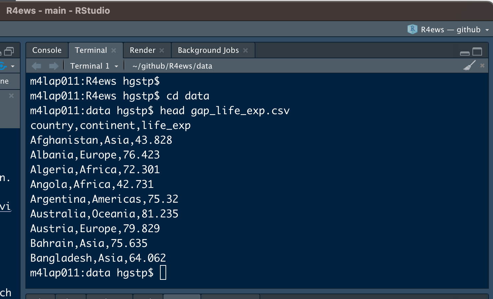

# Daten I/O {#import-export}


## Überblick

Im letzten Abschnitt haben wir die Gapminder-Daten als tibble aus dem [gapminder] Paket geladen. Dabei haben wir dann weder Daten, noch abgeleitete Ergebnisse, explizit in eine Datei geschrieben. Im wirklichen Leben werdet ihr aber ständig Daten, die in Tabellenform vorliegen, in R ein- und auslesen. Manchmal muss das sogar für Daten geschehen, die nicht in Tabellenform vorliegen.

> Wie macht man das? Worauf muss man aufpassen?

### Daten Import

Für das Importieren von Daten gibt es im Allgemeinen zwei Szenarien:

* *"Überrasche mich!"* Diese Haltung müsst ihr einnehmen, wenn ihr einen Datensatz erhaltet und zum ersten Mal versucht diesen einzulesen. Man muss froh sein, wenn man die Daten ohne Fehlermeldung importieren kann. Im nächsten Schritt schaut man sich  das Ergebnis an und  entdeckt vermutlich Fehler in den Daten und/oder beim Import. Anschließend behebt man die Fehler und beginnt nochmal von vorne.

* *"Ein weiterer Tag im Paradies. "* Das wird vermutlich euer Gefühl sein, wenn ihr versucht einen [aufgeräumten Datensatz](#tidy) einzulesen (den jemand vorher in einem oder mehreren "Reinigungsskripten"  aufgeräumt hat). Beim Einlesen solcher Daten sollte es keine Überraschungen geben. 

  
Im zweiten Fall, und im weiteren Verlauf des ersten Falles, lernt ihr tatsächlich eine Menge darüber, wie die Daten strukturiert sind/sein sollten. 

:::: {.content-box-orange}
__Ein wichtiger Import-Ratschlag:__ _Verwende die Argumente der Importfunktion, um so weit wie möglich und so schnell wie möglich zu kommen_. Macht man dies nicht, so sind oft nach dem Einlesen der Daten noch eine Reihe von weiteren Schritten nötig, bevor man mit der eigentlichen Analyse beginnen kann. Daher lest die Hilfe zu den Importfunktionen und nutzt die Argumente maximal aus, um den Import zu steuern.
::::

### Daten Export

Es wird viele Gelegenheiten geben, bei denen ihr Daten aus R exportieren wollt. Zwei wichtige Beispiele:

* einen gesäuberten Datensatz, der bereit ist, analysiert zu werden

* ein numerisches Ergebnis aus einer Datenaggregation oder Modellierung oder einer statistischen Schlussfolgerung 


:::: {.content-box-gray}
__Erster Tipp:__  _Der Output von heute ist der Input von morgen_. Denkt an all die Schmerzen zurück, die ihr selbst beim Import von fremden Daten  erlitten habt, und fügt euch nicht selbst solche Schmerzen zu!

__Zweiter Tipp:__ Seid nicht zu clever. Eine einfache Textdatei, die von einem Menschen in einem Texteditor lesbar ist, sollte euer _Standard_ sein, bis es _einen guten Grund_ dafür gibt, dass dies nicht ausreichend ist. Das Lesen und Schreiben in exotische Formate wird das Erste sein, was möglicherweise in Zukunft oder auf einem anderen Computer nicht mehr funktioniert. Zudem schafft es Barrieren für jeden, der ein anderes Toolkit hat als ihr. 
::::

Wie passt das zu unserer Betonung der dynamischen Berichterstattung über R Markdown? Es gibt für alles eine Zeit und einen Ort. Es gibt Projekte und Dokumente, bei denen ihr euch intensiv mit [knitr] und [rmarkdown]  beschäftigen könnt/wollt/müsst. Aber es gibt viele gute Gründe, warum (Teile) einer Analyse nicht (nur) in einen dynamischen Bericht eingebettet werden sollten. Vielleicht wollt ihr Daten bereinigen, um einen Datensatz für eine nachfolgende Analyse zu erzeugen. Vielleicht leistet ihr einen kleinen, aber entscheidenden Beitrag zu einem gigantischen Multi-Autoren-Papier, usw. .... 

Denkt zudem daran, dass es natürlich auch noch andere Werkzeuge und Arbeitsabläufe gibt, um etwas reproduzierbar zu machen: z.B. [make]["minimal make: a minimal tutorial on make"].

## `readr`

Zur Einlesen und Ausgeben von Datensätzen verwenden wir das [readr] Paket, welches Alternativen zu den Standardfunktionen `read.table()` und `write.table()` bietet. `readr` ist Teil des [tidyverse] und daher führen wir standardmäßig einfach wieder 


``` r
library(tidyverse)
## ── Attaching core tidyverse packages ──────────────────────── tidyverse 2.0.0 ──
## ✔ dplyr     1.1.4     ✔ readr     2.1.5
## ✔ forcats   1.0.0     ✔ stringr   1.5.1
## ✔ ggplot2   3.5.1     ✔ tibble    3.2.1
## ✔ lubridate 1.9.3     ✔ tidyr     1.3.1
## ✔ purrr     1.0.2     
## ── Conflicts ────────────────────────────────────────── tidyverse_conflicts() ──
## ✖ dplyr::filter() masks stats::filter()
## ✖ dplyr::lag()    masks stats::lag()
## ℹ Use the conflicted package (<http://conflicted.r-lib.org/>) to force all conflicts to become errors
```

aus.

__Einlesen der Gapminder Daten__

Die Gapminder Daten könnten wir natürlich wie zuvor über das Laden des `gapminder` Pakets verfügbar machen. Da es in diesem Abschnitt aber um das Einlesen von Daten geht, versuchen wir die Daten als `.tsv` Datei (Tab getrennte Werte - so sind die Daten im Paket gespeichert) einzulesen. Aber dies bedeutet natürlich, dass wir die entsprechende `.tsv` Datei erst mal finden müssen. Dabei hilft uns glücklicherweise das [fs] Paket.


``` r
library(fs)
(gap_tsv <- path_package("gapminder", "extdata", "gapminder.tsv"))
## /Library/Frameworks/R.framework/Versions/4.4-arm64/Resources/library/gapminder/extdata/gapminder.tsv
```

Nachdem wir jetzt den Speicherort der Datei kennen, können wir versuchen sie einzulesen.


## Einlesen von Daten in Tabellenform

Die Haupt-Funktion zum Einlesen von Daten in readr ist `read_delim()`. Hier verwenden wir eine Variante, `read_tsv()`, für Tab getrennte Daten:


``` r
gapminder <- read_tsv(gap_tsv)
## Rows: 1704 Columns: 6
## ── Column specification ────────────────────────────────────────────────────────
## Delimiter: "\t"
## chr (2): country, continent
## dbl (4): year, lifeExp, pop, gdpPercap
## 
## ℹ Use `spec()` to retrieve the full column specification for this data.
## ℹ Specify the column types or set `show_col_types = FALSE` to quiet this message.
gapminder
## # A tibble: 1,704 × 6
##    country     continent  year lifeExp      pop gdpPercap
##    <chr>       <chr>     <dbl>   <dbl>    <dbl>     <dbl>
##  1 Afghanistan Asia       1952    28.8  8425333      779.
##  2 Afghanistan Asia       1957    30.3  9240934      821.
##  3 Afghanistan Asia       1962    32.0 10267083      853.
##  4 Afghanistan Asia       1967    34.0 11537966      836.
##  5 Afghanistan Asia       1972    36.1 13079460      740.
##  6 Afghanistan Asia       1977    38.4 14880372      786.
##  7 Afghanistan Asia       1982    39.9 12881816      978.
##  8 Afghanistan Asia       1987    40.8 13867957      852.
##  9 Afghanistan Asia       1992    41.7 16317921      649.
## 10 Afghanistan Asia       1997    41.8 22227415      635.
## # ℹ 1,694 more rows
```


Wie wir sehen, wurde standardmäßig der komplette Datensatz eingelesen. Sind aber nur Teile eines Datensatzes relevant für die angestrebte Analyse, so besteht auch keine Notwendigkeit den kompletten Datensatz zu laden. In solchen Fällen kann man mit dem `col_types` Argument arbeiten


``` r
gapminder_short <- read_tsv(gap_tsv, col_types = cols_only(
  country = col_character(),
  continent = col_factor(),
  year = col_double(),
  lifeExp = col_double()
))
gapminder_short
## # A tibble: 1,704 × 4
##    country     continent  year lifeExp
##    <chr>       <fct>     <dbl>   <dbl>
##  1 Afghanistan Asia       1952    28.8
##  2 Afghanistan Asia       1957    30.3
##  3 Afghanistan Asia       1962    32.0
##  4 Afghanistan Asia       1967    34.0
##  5 Afghanistan Asia       1972    36.1
##  6 Afghanistan Asia       1977    38.4
##  7 Afghanistan Asia       1982    39.9
##  8 Afghanistan Asia       1987    40.8
##  9 Afghanistan Asia       1992    41.7
## 10 Afghanistan Asia       1997    41.8
## # ℹ 1,694 more rows
```

Zur Auswahl eines Teils der Variablen haben wir `cols_only()` verwendet. Diese Funktion erwartet bei der Auswahl der Variablen die Definition des Typs. In diesem Beispiel haben wir `continten` (anders als im Standardfall) zu einer [Faktorvariable](https://r4ds.had.co.nz/factors.html) transformiert. Dadurch enthält die Variable zusätzlich die Information über die verschiedenen Ausprägungen der Variable


``` r
levels(gapminder_short$continent)
## [1] "Asia"     "Europe"   "Africa"   "Americas" "Oceania"
```


Über den Tabulator Spalten in einer Datentabelle zu trennen, ist natürlich nur eine Möglichkeit von vielen. Weitere Alternativen sind: 

+ Komma: `read_csv()`

+ Strichpunkt: `read_csv2()`

+ Leerzeichen: `read_table()`

+ ...


Für volle Flexibilität bei der Angabe des Trennzeichens kann aber jederzeit direkt `read_delim()` verwendet werden.


Der auffälligste Unterschied zwischen den [readr]-Funktionen und der Standardfunktion `read.table()`ist, dass [readr] immer ein Tibble erzeugt statt eines Data Frames. Da wir Tibbles bevorzugen ist unser 


> Fazit: Benutzt `readr::read_delim()` und "Freunde".


Die Gapminder-Daten sind zu sauber und einfach, um die großartigen Funktionen von readr zur Geltung zu bringen. Ein Blick in [Introduction to readr](https://cloud.r-project.org/web/packages/readr/vignettes/readr.html) zeigt aber noch viele weitere Anpassungsmöglichkeiten der readr Funktionen.

## Daten exportieren 

Bevor wir etwas exportieren können, müssen wir natürlich (was so sicher nicht richtig ist - niemand zwingt uns dazu 😉) etwas berechnen, das es wert ist,  exportiert zu werden. Lasst uns daher eine Zusammenfassung der maximalen Lebenserwartung auf Länderebene erstellen.


``` r
gap_life_exp <- gapminder |>  
  group_by(country, continent) |> 
  summarise(life_exp = max(lifeExp)) |> 
  ungroup()
## `summarise()` has grouped output by 'country'. You can override using the
## `.groups` argument.
gap_life_exp
## # A tibble: 142 × 3
##    country     continent life_exp
##    <chr>       <chr>        <dbl>
##  1 Afghanistan Asia          43.8
##  2 Albania     Europe        76.4
##  3 Algeria     Africa        72.3
##  4 Angola      Africa        42.7
##  5 Argentina   Americas      75.3
##  6 Australia   Oceania       81.2
##  7 Austria     Europe        79.8
##  8 Bahrain     Asia          75.6
##  9 Bangladesh  Asia          64.1
## 10 Belgium     Europe        79.4
## # ℹ 132 more rows
```

Das Objekt `gap_life_exp` betrachten wir nun als Zwischenergebnis, das wir für die Zukunft und für nachgelagerte Analysen oder Visualisierungen speichern wollen.

Die Haupt-Exportfunktion in [readr] ist `write_delim()`. Für verschiedene Dateiformate gibt es auch hier wieder verschiedene Komfortfunktionen. Mithilfe von `write_csv()` können wir den Inhalt von `gap_life_exp` in einer kommagetrennten Datei abspeichern.


``` r
write_csv(gap_life_exp, "data/gap_life_exp.csv")
```

Schauen wir uns die ersten paar Zeilen von `gap_life_exp.csv` an. Dazu können wir entweder die Datei öffnen oder z.B. im Terminal  `head` verwenden




Das sieht recht ordentlich aus, obwohl es keine sichtbare Ausrichtung oder Trennung in Spalten gibt. Hätten wir die Basisfunktion `read.csv()` benutzt, würden wir Zeilennamen und viele Anführungszeichen sehen, es sei denn, wir hätten diese Features explizit abgeschaltet. Das schönere Standardverhalten ist daher der Hauptgrund, warum wir `readr::write_csv()` gegenüber `write.csv()` bevorzugen.

:::: {.content-box-grey}
__Bemerkung:__ Es ist auch nicht wirklich fair, sich über den Mangel an sichtbarer Ausrichtung zu beklagen. Schließlich erzeugen wir Dateien, die der Computer lesen soll. Falls ihr aber wirklich in der Datei "herumstöbern" wollt, benutzt  `View()` in RStudio. Oder öffnet die Datei mit einem Spreadsheet Programm (!). Aber erliegt __NIE__ der Versuchung, dort Datenmanipulationen vorzunehmen ... kehrt zurück zu R und schreibt dort die entsprechenden Befehle, die ihr die nächsten 15 Mal (oder so oft wie nötig) ausführen könnt, wenn ihr diesen Datensatz (oder Datensätze derselben Form) importieren/bereinigen/aggregieren/exportieren wollt. 
::::


## Daten über eine API

APIs (Application Programming Interface) sind eine sehr nützliche Methode, um auf interessante Daten zuzugreifen, die online zur Verfügung gestellt werden.

Anstatt einen Datensatz herunterladen zu müssen, ermöglichen APIs Daten direkt von bestimmten Webseiten über eine Schnittstelle anzufordern. Viele große Webseiten wie [Twitter](https://www.earthdatascience.org/courses/earth-analytics/get-data-using-apis/intro-to-social-media-text-mining-r/) und Facebook ermöglichen über APIs den Zugriff auf Teile ihrer Daten.

Wir werden die Grundlagen des Zugriffs auf eine API besprechen. Dazu benötigt ihr aber kein Vorwissen bzgl. APIs.

### Einführung

API ist ein allgemeiner Begriff für den Ort, an dem ein Computerprogramm mit einem anderen oder mit sich selbst interagiert. Wir sprechen über Web-APIs, bei denen zwei verschiedene Computer - ein Client und ein Server - miteinander interagieren, um Daten anzufordern bzw. bereitzustellen.

APIs bieten eine ausgefeilte Möglichkeit Daten von einer Webseite anzufordern. Wenn eine Webseite wie Twitter eine API einrichtet, richten sie im Wesentlichen einen Computer ein, der auf Datenanfragen wartet.

Sobald dieser Computer eine Datenabfrage empfängt, verarbeitet er die Daten selbst und sendet sie an den Computer, der sie angefordert hat. Unsere Aufgabe wird es sein R Code zu schreiben, der die Anfrage erstellt und dem Computer, auf dem die API läuft, mitteilt, was wir benötigen. Dieser Computer liest dann unseren Code, verarbeitet die Anfrage und gibt schön formatierte Daten zurück, die mithilfe existierender R Pakete verarbeitet werden können.


### Erstellen von API-Abfragen in R

Um mit APIs in R zu arbeiten, müssen wir ein paar neue Pakete laden (und vorher natürlich installieren). Konkret werden wir mit den Paketen  `httr` und `jsonlite` arbeiten. Sie spielen bei der Einbindung der APIs unterschiedliche Rollen, aber beide sind unverzichtbar.

Vermutlich habt ihr die beiden Pakete bisher nicht installiert. Daher starten wir mit dem Installieren dieser beiden Pakete


``` r
install.packages(c("httr", "jsonlite"))

```

und laden sie anschließend 


``` r
library(httr)
library(jsonlite)
## 
## Attaching package: 'jsonlite'
## The following object is masked from 'package:purrr':
## 
##     flatten
```


### Unsere erste API-Anfrage stellen

Der erste Schritt, um Daten von einer API zu erhalten, ist die eigentliche Anfrage in R. Diese Anfrage wird an den Server geschickt, der über die API verfügt, und wenn alles reibungslos verläuft, wird er uns eine Antwort zurücksenden. 


Es gibt verschiedene Arten von Anfragen, die man an einen API-Server stellen kann. Diese verschiedenen Typen von Anfragen entsprechen verschiedenen Aktionen, die der Server ausführen soll.

Für unsere Zwecke fragen wir lediglich nach Daten, was einer __GET__-Anfrage entspricht. Andere Arten von Anfragen sind z.B. POST (post file) und PUT (send put request), aber diese sind für uns nicht von Interesse und werden wir daher nicht weiter besprechen.

Um eine GET-Anfrage zu erstellen, müssen wir die `GET()` Funktion aus dem `httr` Paket verwenden. Die `GET()` Funktion benötigt als Input eine URL, die die Adresse des Servers angibt, an den die Anforderung gesendet werden soll.


Als Beispiel werden wir mit der [Open Notify](http://open-notify.org/) API arbeiten, die Daten zu verschiedenen NASA-Projekten enthält. Mithilfe der Open Notify API können wir uns über den Standort der Internationalen Raumstation informieren und erfahren, wie viele Personen sich derzeit im Weltraum aufhalten.

Wir beginnen damit, dass wir unsere Anfrage mit der `GET()` Funktion stellen und die URL der API angeben:


``` r
jdata <- GET("http://api.open-notify.org/astros.json")
```

Die Ausgabe der Funktion `GET()` ist eine Liste, die alle Informationen enthält, die vom API-Server zurückgegeben werden. 


### `GET()` Ausgabe

Schauen wir uns an, wie die Variable `jdata` in der R-Konsole aussieht:


``` r
jdata
## Response [http://api.open-notify.org/astros.json]
##   Date: 2025-01-08 22:52
##   Status: 200
##   Content-Type: application/json
##   Size: 587 B
```

Als erstes fällt auf, dass die URL enthalten ist, an die die GET-Anfrage gesendet wurde. Außerdem erkennen wir das Datum und die Uhrzeit, zu der die Anfrage gestellt wurde, sowie die Größe der Antwort.

Die Information `Content-Type` gibt uns eine Vorstellung davon, welche Form die Daten haben. Diese spezielle Antwort besagt, dass die Daten ein JSON-Format annehmen, womit auch klar ist warum wir das Paket `jsonlite` geladen haben.

Der Status verdient eine besondere Aufmerksamkeit. `Status` bezieht sich auf den Erfolg oder Misserfolg der API-Anfrage, und er wird in Form einer Zahl angegeben. Die zurückgegebene Nummer gibt Auskunft darüber, ob die Anfrage erfolgreich war oder nicht. Dort können auch Gründe für einen möglichen Misserfolg enthalten sein.

Die Zahl 200 ist das, was wir sehen wollen. Sie entspricht einem erfolgreichen Antrag, und das ist es, was wir hier haben. Eine Übersicht über weitere Status Codes findet man z.B. auf dieser [Webseite](https://www.restapitutorial.com/httpstatuscodes.html).


### Handling JSON Data

[JSON](https://www.json.org/json-en.html) steht für JavaScript Object Notation. Während JavaScript eine weitere Programmiersprache ist, liegt unser Schwerpunkt bei JSON auf seiner Struktur. JSON ist nützlich, weil es von einem Computer leicht lesbar ist, und aus diesem Grund ist es zur primären Art und Weise geworden, wie Daten über APIs transportiert werden. Die meisten APIs senden ihre Antworten im JSON-Format.

JSON ist als eine Reihe von Schlüssel-Werte-Paaren formatiert, wobei ein bestimmtes Wort ("Schlüssel") mit einem bestimmten Wert assoziiert ist. Ein Beispiel für diese Schlüssel-Wert-Struktur ist unten dargestellt:

```
{
    “name”: “Jane Doe”,
    “number_of_skills”: 2
}
```

In ihrem aktuellen Zustand sind die Daten in der Variablen `jdata` nicht verwendbar. Die Daten sind als Unicode-Rohdaten in `jdata` enthalten, und müssen in das JSON-Format konvertiert werden.

Dazu müssen wir zunächst den rohen Unicode in character Daten konvertieren, die dem oben gezeigten JSON-Format ähneln. Die Funktion `rawToChar()` führt genau diese Aufgabe aus:


``` r
rawToChar(jdata$content)
## [1] "{\"people\": [{\"craft\": \"ISS\", \"name\": \"Oleg Kononenko\"}, {\"craft\": \"ISS\", \"name\": \"Nikolai Chub\"}, {\"craft\": \"ISS\", \"name\": \"Tracy Caldwell Dyson\"}, {\"craft\": \"ISS\", \"name\": \"Matthew Dominick\"}, {\"craft\": \"ISS\", \"name\": \"Michael Barratt\"}, {\"craft\": \"ISS\", \"name\": \"Jeanette Epps\"}, {\"craft\": \"ISS\", \"name\": \"Alexander Grebenkin\"}, {\"craft\": \"ISS\", \"name\": \"Butch Wilmore\"}, {\"craft\": \"ISS\", \"name\": \"Sunita Williams\"}, {\"craft\": \"Tiangong\", \"name\": \"Li Guangsu\"}, {\"craft\": \"Tiangong\", \"name\": \"Li Cong\"}, {\"craft\": \"Tiangong\", \"name\": \"Ye Guangfu\"}], \"number\": 12, \"message\": \"success\"}"
```


Die resultierende Zeichenfolge sieht zwar recht unordentlich aus, aber es liegt wirklich die JSON-Struktur vor.

Ausgehend von diesem character Vektor können wir nun mit `fromJSON()`, aus dem `jsonlite` Paket, alles in ein Listenformat transformieren.

Die `fromJSON()` Funktion benötigt einen character Vektor, der die JSON-Struktur enthält, die wir aus der Ausgabe von `rawToChar()` erhalten haben. Wenn wir also diese beiden Funktionen nacheinander anwenden, erhalten wir die gewünschten Daten in einem Format, das wir in R leicht bearbeiten können.


``` r
data <-  fromJSON(rawToChar(jdata$content))
glimpse(data)
## List of 3
##  $ people :'data.frame':	12 obs. of  2 variables:
##   ..$ craft: chr [1:12] "ISS" "ISS" "ISS" "ISS" ...
##   ..$ name : chr [1:12] "Oleg Kononenko" "Nikolai Chub" "Tracy Caldwell Dyson"..
##  $ number : int 12
##  $ message: chr "success"
```

Die Liste `data` hat drei Elemente. Uns interessiert in erster Linie das Data Frame `people`.


``` r
data$people
##       craft                 name
## 1       ISS       Oleg Kononenko
## 2       ISS         Nikolai Chub
## 3       ISS Tracy Caldwell Dyson
## 4       ISS     Matthew Dominick
## 5       ISS      Michael Barratt
## 6       ISS        Jeanette Epps
## 7       ISS  Alexander Grebenkin
## 8       ISS        Butch Wilmore
## 9       ISS      Sunita Williams
## 10 Tiangong           Li Guangsu
## 11 Tiangong              Li Cong
## 12 Tiangong           Ye Guangfu
```


Also, da haben wir unsere Antwort: Zum Zeitpunkt des letzten Updates Jan 08, 2025 von R4ews befanden sich 12 Personen im Weltraum. Aber wenn ihr den Code zu einem späteren Zeitpunkt ausprobiert, könnten es auch schon wieder andere Namen und eine andere Anzahl sein. Das ist einer der Vorteile von APIs - im Gegensatz zu Datensätzen, die man im Spreadsheet Format herunterladen kann, werden sie in der Regel in Echtzeit oder nahezu in Echtzeit aktualisiert. APIs bieten somit die Möglichkeit leicht auf sehr aktuelle Daten zuzugreifen.


In diesem Beispiel haben wir einen sehr unkomplizierten API-Workflow durchlaufen. Die meisten APIs fordern, dass man demselben allgemeinen Muster folgt, aber dabei können die jeweilgen Aufrufe/Befehle durchaus deutlich komplexer sein.

In unserem Beispiel war es ausreichend nur die URL anzugeben. Aber einige APIs verlangen mehr Informationen vom Benutzer. Darauf gehen wir aber erstmal nicht weiter ein. Stattdessen fragen wir noch nach dem Ort der ISS im Moment der Abfrage


``` r
jdata <-  GET("http://api.open-notify.org/iss-now.json",)
```


``` r
data <- fromJSON(rawToChar(jdata$content))
data$iss_position
## $latitude
## [1] "46.2802"
## 
## $longitude
## [1] "48.1053"
data$timestamp
## [1] 1736376735
```


Diese API gibt uns die Zeit in Form von [Unixzeit](https://de.wikipedia.org/wiki/Unixzeit) zurück. Unixzeit ist die Zeitspanne, die seit dem 1. Januar 1970 vergangen ist. Mithilfe der Funktion `as_datetime()` aus dem [lubridate] Paket können wir die Unixzeit aber leicht umrechnen


``` r
lubridate::as_datetime(data$timestamp)
## [1] "2025-01-08 22:52:15 UTC"
```


Damit wollen wir den Abschnitt zu APIs beenden. Macht euch bewusst, dass wir hier wirklich nur die Basics in Bezug auf APIs eingeführt haben. Aber hoffentlich hat euch diese Einführung trotzdem ausreichend Vertrauen gegeben, sich mit einigen komplexeren und leistungsfähigeren APIs auseinanderzusetzen. 


## Weiteres Material

Wer noch mehr zum Thema Daten Import lesen will, der soll einen Blick in das Kapitel [Data import](http://r4ds.had.co.nz/data-import.html) im Buch [R for Data Science] von Hadley Wickham und Garrett Grolemund [-@wickham2016] werfen.


<!--Packages: main link-->
[dplyr]: https://dplyr.tidyverse.org
[tidyr]: https://tidyr.tidyverse.org
[ggplot2]: https://ggplot2.tidyverse.org
[tidyverse]: https://tidyverse.tidyverse.org
[stringr]: https://stringr.tidyverse.org
[forcats]: https://forcats.tidyverse.org
[purrr]: https://purrr.tidyverse.org
[readr]: https://readr.tidyverse.org
[fs]: https://fs.r-lib.org/index.html
[glue]: https://glue.tidyverse.org
[testthat]: https://testthat.r-lib.org
[ellipsis]: https://ellipsis.r-lib.org
[lubridate]: https://lubridate.tidyverse.org
[devtools]: https://devtools.r-lib.org
[roxygen2]: https://roxygen2.r-lib.org
[knitr]: https://github.com/yihui/knitr
[rmarkdown]: https://rmarkdown.rstudio.com/
[usethis]: https://usethis.r-lib.org
[xml2]: https://xml2.r-lib.org
[httr]: https://httr.r-lib.org
[rvest]: https://rvest.tidyverse.org
[Shiny]: https://shiny.rstudio.com
[gh]: https://github.com/r-lib/gh
[plyr]: http://plyr.had.co.nz
[magrittr]: https://magrittr.tidyverse.org
[googlesheets]: https://github.com/jennybc/googlesheets
[gapminder]: https://github.com/jennybc/gapminder
[stringi]: http://www.gagolewski.com/software/stringi/
[rex]: https://github.com/kevinushey/rex
[lattice]: http://lattice.r-forge.r-project.org
[RColorBrewer]: https://cloud.r-project.org/package=RColorBrewer
[gridExtra]: https://cloud.r-project.org/package=gridExtra
[rebird]: https://docs.ropensci.org/rebird/
[geonames]: https://docs.ropensci.org/geonames/
[rplos]: https://docs.ropensci.org/rplos/
[gender]: https://docs.ropensci.org/gender/
[genderdata]: https://docs.ropensci.org/genderdata/
[curl]: https://jeroen.cran.dev/curl
[jsonlite]: https://github.com/jeroen/jsonlite
[shinythemes]: https://rstudio.github.io/shinythemes/
[shinyjs]: https://deanattali.com/shinyjs/
[leaflet]: https://rstudio.github.io/leaflet/
[ggvis]: https://ggvis.rstudio.com
[shinydashboard]: https://rstudio.github.io/shinydashboard/

<!--Packages: vignettes & CRAN/GitHub links-->
[Introduction to dplyr]: https://dplyr.tidyverse.org/articles/dplyr.html
[Window functions]: https://dplyr.tidyverse.org/articles/window-functions.html
[Two-table verbs]: https://dplyr.tidyverse.org/articles/two-table.html
[Do more with dates and times in R]: https://lubridate.tidyverse.org/articles/lubridate.html
[dplyr-cran]: https://cloud.r-project.org/package=dplyr
[dplyr-github]: https://github.com/hadley/dplyr

<!--Bookdowns: main link-->
[Happy Git and GitHub for the useR]: https://happygitwithr.com
[R for Data Science]: https://r4ds.had.co.nz
[The tidyverse style guide]: https://style.tidyverse.org
[Advanced R]: https://adv-r.hadley.nz/
[Tidyverse design principles]: https://principles.tidyverse.org
[R Packages]: https://r-pkgs.org/index.html
[R Graphics Cookbook]: http://shop.oreilly.com/product/0636920023135.do
[Cookbook for R]: http://www.cookbook-r.com 
[ggplot2: Elegant Graphics for Data Analysis]: https://ggplot2-book.org/index.html
[Statistical Inference via Data Science]: https://moderndive.com/index.html

<!--Bookdowns: specific chapters-->
[adv-r-fxn-args]: http://adv-r.had.co.nz/Functions.html#function-arguments
[r4ds-transform]: https://r4ds.had.co.nz/transform.html
[r4ds-readr-strings]: https://r4ds.had.co.nz/data-import.html#readr-strings

<!--RStudio Cheat Sheets--> 
[RStudio Data Transformation Cheat Sheet]: https://github.com/rstudio/cheatsheets/raw/master/data-transformation.pdf
[Regular Expressions in R Cheat Sheet]: https://github.com/rstudio/cheatsheets/raw/master/regex.pdf
[Shiny Cheat Sheet]: https://shiny.rstudio.com/articles/cheatsheet.html

<!--Blog posts, slides, & papers-->
["minimal make: a minimal tutorial on make"]: https://kbroman.org/minimal_make/
["Let the Data Flow: Pipelines in R with dplyr and magrittr"]: https://github.com/tjmahr/MadR_Pipelines
["Hands-on dplyr tutorial for faster data manipulation in R"]: https://www.dataschool.io/dplyr-tutorial-for-faster-data-manipulation-in-r/
["Writing R Extensions"]: https://cloud.r-project.org/doc/manuals/r-release/R-exts.html
["The Absolute Minimum Every Software Developer Absolutely, Positively Must Know About Unicode and Character Sets (No Excuses!)"]: https://www.joelonsoftware.com/2003/10/08/the-absolute-minimum-every-software-developer-absolutely-positively-must-know-about-unicode-and-character-sets-no-excuses/
["What Every Programmer Absolutely, Positively Needs To Know About Encodings And Character Sets To Work With Text"]: http://kunststube.net/encoding/
["3 Steps to Fix Encoding Problems in Ruby"]: https://www.justinweiss.com/articles/3-steps-to-fix-encoding-problems-in-ruby/
["My favorite RGB color"]: https://manyworldstheory.com/2013/01/15/my-favorite-rgb-color/

<!--Papers/Books Cited-->
["Dates and Times Made Easy with lubridate"]: https://www.jstatsoft.org/article/view/v040i03
["testthat: Get Started with Testing"]: https://journal.r-project.org/archive/2011-1/RJournal_2011-1_Wickham.pdf
["Let's Practice What We Preach"]: https://www.jstor.org/stable/3087382?seq=1#page_scan_tab_contents
[Creating More Effective Graphs]: https://www.amazon.com/Creating-Effective-Graphs-Naomi-Robbins/dp/0985911123
["Escaping RGBland: Selecting Colors for Statistical Graphs"]: https://eeecon.uibk.ac.at/~zeileis/papers/Zeileis+Hornik+Murrell-2009.pdf
["A layered grammar of graphics"]: https://vita.had.co.nz/papers/layered-grammar.html
[Managing Projects with GNU Make, 3rd Edition]: http://shop.oreilly.com/product/9780596006105.do
["Why Should Engineers and Scientists Be Worried About Color?"]: https://www.google.com/url?sa=t&rct=j&q=&esrc=s&source=web&cd=2&cad=rja&uact=8&ved=2ahUKEwi0xYqJ8JbjAhWNvp4KHViYDxsQFjABegQIABAC&url=https%3A%2F%2Fwww.researchgate.net%2Fprofile%2FAhmed_Elhattab2%2Fpost%2FPlease_suggest_some_good_3D_plot_tool_Software_for_surface_plot%2Fattachment%2F5c05ba35cfe4a7645506948e%2FAS%253A699894335557644%25401543879221725%2Fdownload%2FWhy%2BShould%2BEngineers%2Band%2BScientists%2BBe%2BWorried%2BAbout%2BColor_.pdf&usg=AOvVaw1qwjjGMd7h_z6TLUjzu7Nb

<!--Misc.-->
[rOpenSci]: https://ropensci.org

[wiki-snake-case]: https://en.wikipedia.org/wiki/Snake_case


