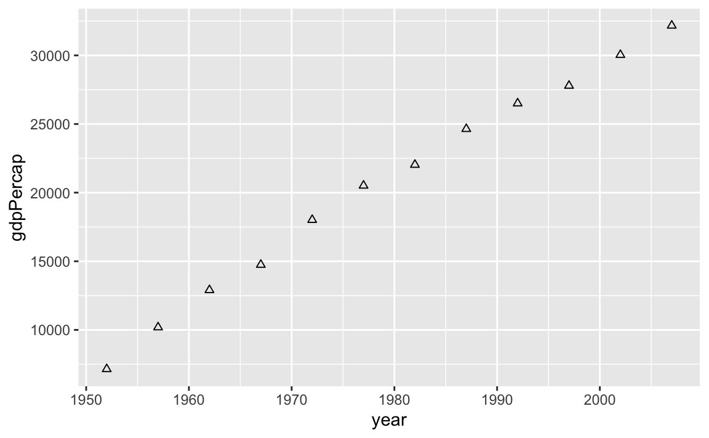

# (PART) ggplot2 Intro {-} 

# Einführung {#graphics-overview}


Das Paket `ggplot2` verwendet eine speziell Systematik beim Erzeugen von Grafiken. Diese basiert auf 

> [Wilkinson (2005): *The Grammar of Graphics*, Springer.](http://link.springer.com/book/10.1007%2F0-387-28695-0)


:::: {.content-box-green}
Kurz gesagt, ist die zugrunde liegende Idee, dass eine statistische Grafik eine Abbildung von Daten auf ästhetische Attribute (Farbe, Form, Größe) von geometrischen Objekten (Punkte, Linien, Balken) ist.
::::
Ferner kann eine Grafik auch noch statistische Transformationen der Daten enthalten. Über die Verwendung verschiedener Facetten ist es möglich dieselbe Darstellung für verschiedene Untergruppen des Datensatzes zu erzeugen. 

Am Ende ist es eine Kombination dieser unabhängigen Komponenten, die eine Grafik ausmacht.


:::: {.content-box-grey}
__Wie immer, laden wir zu Beginn__ 

::::

Man weiß ja vorher nie so genau was man alles so braucht.


```r
library(tidyverse)
## ── Attaching packages ─────────────────────────────────────── tidyverse 1.3.2 ──
## ✓ ggplot2 3.3.5     ✓ purrr   0.3.4
## ✓ tibble  3.1.6     ✓ dplyr   1.0.8
## ✓ tidyr   1.2.0     ✓ stringr 1.4.0
## ✓ readr   2.1.2     ✓ forcats 0.5.1
## ── Conflicts ────────────────────────────────────────── tidyverse_conflicts() ──
## x dplyr::filter() masks stats::filter()
## x dplyr::lag()    masks stats::lag()
```


## Idee

Die grundlegende Idee des ggplot2 Ansatzes zum Erstellen von Grafiken, besteht darin die Bausteine (verschiedene Layer) eines Plots unabhängig voneinander zu definieren und diese dann zu einer Grafik zusammenzufügen. Eine Grafik besteht immer aus:

- den __Daten__ (als `data.frame` oder `tibble`), die ihr visualisieren möchtet, und eine Reihe von Zuordnungen, die beschreiben, wie Variablen aus dem Datensatz auf ästhetische Attribute abgebildet werden

- __geometrischen Objekten__ (`geom`s), die beschreiben was man am Ende wirklich sieht, also z.B. Punkte, Linien, ...

- einem __Koordinatensystem__, das beschreibt, wie die Koordinaten der Daten auf die Ebene der Grafik abgebildet werden. Außerdem stellt es Achsen und Gitternetzlinien zur Verfügung, die das Lesen der Grafik ermöglichen. Normalerweise verwenden wir ein kartesisches Koordinatensystem, aber es gibt natürlich auch noch eine Reihe anderer Optionen.

- __Skalen__ (`scales`), die Werte der Daten abbilden auf Werte in einem ästhetischen Raum, sei es in Farbe, Größe oder Form. 


Zusätzlich kann die Grafik aber auch noch


- __statistische Transformationen__ (`stat`), die eine Zusammenfassung der Daten visualisieren,
- __Facetten__, die es ermöglichen dieselbe Darstellung für verschiedene Untergruppen des Datensatzes zu erzeugen, 

- ...

enthalten.

Die einzelnen Teile eines Plots werden dann mit dem `+` Operator zusammengefügt. Initialisiert wird ein Plot mit `ggplot()`. Ohne weitere Bestandteile wird aber nur eine leere Grafik erzeugt


```r
library(gapminder)
ggplot(gapminder) 
```


In den folgenden Abschnitten lernen wir daher wie weitere Bestandteile zum Plot hinzugefügt werden.


## Ein einfacher Scatterplot

Wir schauen uns zum Start einfach mal für Deutschland den Verlauf des `gdpPercap` über die Zeit an.


```r
gapminder %>%
  filter(country == "Germany") %>% # auswählen der Daten 
  ggplot(aes(x = year, y = gdpPercap)) +  # Plot initialisieren
  geom_point() # Punkte zum Darstellen der Daten verwenden
```


In dieser Grafik haben wir über `geom_point()` die Art des geometrischen Objekts gewählt. In diesem Fall Punkte. Wenn uns die Form (`shape`) der Punkte nicht gefällt, so können wir diese natürlich ändern, z.B. in Dreiecke


```r
gapminder %>%
  filter(country == "Germany") %>% 
  ggplot(aes(x = year, y = gdpPercap)) +  
  geom_point(shape = 2) # shape auf festen Wert 2 gesetzt
```




Aber dazu mehr im Abschnitt [Scales](#scales).

__Bemerkung:__ In diesem einfachen Beispiel haben wir bereits gesehen, dass `ggplot()` über den Pipe-Operator verknüpft werden kann.


<!--Packages: main link-->
[dplyr]: https://dplyr.tidyverse.org
[tidyr]: https://tidyr.tidyverse.org
[ggplot2]: https://ggplot2.tidyverse.org
[tidyverse]: https://tidyverse.tidyverse.org
[stringr]: https://stringr.tidyverse.org
[forcats]: https://forcats.tidyverse.org
[purrr]: https://purrr.tidyverse.org
[readr]: https://readr.tidyverse.org
[fs]: https://fs.r-lib.org/index.html
[glue]: https://glue.tidyverse.org
[testthat]: https://testthat.r-lib.org
[ellipsis]: https://ellipsis.r-lib.org
[lubridate]: https://lubridate.tidyverse.org
[devtools]: https://devtools.r-lib.org
[roxygen2]: https://roxygen2.r-lib.org
[knitr]: https://github.com/yihui/knitr
[rmarkdown]: https://rmarkdown.rstudio.com/
[usethis]: https://usethis.r-lib.org
[xml2]: https://xml2.r-lib.org
[httr]: https://httr.r-lib.org
[rvest]: https://rvest.tidyverse.org
[Shiny]: https://shiny.rstudio.com
[gh]: https://github.com/r-lib/gh
[plyr]: http://plyr.had.co.nz
[magrittr]: https://magrittr.tidyverse.org
[googlesheets]: https://github.com/jennybc/googlesheets
[gapminder]: https://github.com/jennybc/gapminder
[stringi]: http://www.gagolewski.com/software/stringi/
[rex]: https://github.com/kevinushey/rex
[lattice]: http://lattice.r-forge.r-project.org
[RColorBrewer]: https://cloud.r-project.org/package=RColorBrewer
[gridExtra]: https://cloud.r-project.org/package=gridExtra
[rebird]: https://docs.ropensci.org/rebird/
[geonames]: https://docs.ropensci.org/geonames/
[rplos]: https://docs.ropensci.org/rplos/
[gender]: https://docs.ropensci.org/gender/
[genderdata]: https://docs.ropensci.org/genderdata/
[curl]: https://jeroen.cran.dev/curl
[jsonlite]: https://github.com/jeroen/jsonlite
[shinythemes]: https://rstudio.github.io/shinythemes/
[shinyjs]: https://deanattali.com/shinyjs/
[leaflet]: https://rstudio.github.io/leaflet/
[ggvis]: https://ggvis.rstudio.com
[shinydashboard]: https://rstudio.github.io/shinydashboard/

<!--Packages: vignettes & CRAN/GitHub links-->
[Introduction to dplyr]: https://dplyr.tidyverse.org/articles/dplyr.html
[Window functions]: https://dplyr.tidyverse.org/articles/window-functions.html
[Two-table verbs]: https://dplyr.tidyverse.org/articles/two-table.html
[Do more with dates and times in R]: https://lubridate.tidyverse.org/articles/lubridate.html
[dplyr-cran]: https://cloud.r-project.org/package=dplyr
[dplyr-github]: https://github.com/hadley/dplyr

<!--Bookdowns: main link-->
[Happy Git and GitHub for the useR]: https://happygitwithr.com
[R for Data Science]: https://r4ds.had.co.nz
[The tidyverse style guide]: https://style.tidyverse.org
[Advanced R]: https://adv-r.hadley.nz/
[Tidyverse design principles]: https://principles.tidyverse.org
[R Packages]: https://r-pkgs.org/index.html
[R Graphics Cookbook]: http://shop.oreilly.com/product/0636920023135.do
[Cookbook for R]: http://www.cookbook-r.com 
[ggplot2: Elegant Graphics for Data Analysis]: https://ggplot2-book.org/index.html
[Statistical Inference via Data Science]: https://moderndive.com/index.html

<!--Bookdowns: specific chapters-->
[adv-r-fxn-args]: http://adv-r.had.co.nz/Functions.html#function-arguments
[r4ds-transform]: https://r4ds.had.co.nz/transform.html
[r4ds-readr-strings]: https://r4ds.had.co.nz/data-import.html#readr-strings

<!--RStudio Cheat Sheets--> 
[RStudio Data Transformation Cheat Sheet]: https://github.com/rstudio/cheatsheets/raw/master/data-transformation.pdf
[Regular Expressions in R Cheat Sheet]: https://github.com/rstudio/cheatsheets/raw/master/regex.pdf
[Shiny Cheat Sheet]: https://shiny.rstudio.com/articles/cheatsheet.html

<!--Blog posts, slides, & papers-->
["minimal make: a minimal tutorial on make"]: https://kbroman.org/minimal_make/
["Let the Data Flow: Pipelines in R with dplyr and magrittr"]: https://github.com/tjmahr/MadR_Pipelines
["Hands-on dplyr tutorial for faster data manipulation in R"]: https://www.dataschool.io/dplyr-tutorial-for-faster-data-manipulation-in-r/
["Writing R Extensions"]: https://cloud.r-project.org/doc/manuals/r-release/R-exts.html
["The Absolute Minimum Every Software Developer Absolutely, Positively Must Know About Unicode and Character Sets (No Excuses!)"]: https://www.joelonsoftware.com/2003/10/08/the-absolute-minimum-every-software-developer-absolutely-positively-must-know-about-unicode-and-character-sets-no-excuses/
["What Every Programmer Absolutely, Positively Needs To Know About Encodings And Character Sets To Work With Text"]: http://kunststube.net/encoding/
["3 Steps to Fix Encoding Problems in Ruby"]: https://www.justinweiss.com/articles/3-steps-to-fix-encoding-problems-in-ruby/
["My favorite RGB color"]: https://manyworldstheory.com/2013/01/15/my-favorite-rgb-color/

<!--Papers/Books Cited-->
["Dates and Times Made Easy with lubridate"]: https://www.jstatsoft.org/article/view/v040i03
["testthat: Get Started with Testing"]: https://journal.r-project.org/archive/2011-1/RJournal_2011-1_Wickham.pdf
["Let's Practice What We Preach"]: https://www.jstor.org/stable/3087382?seq=1#page_scan_tab_contents
[Creating More Effective Graphs]: https://www.amazon.com/Creating-Effective-Graphs-Naomi-Robbins/dp/0985911123
["Escaping RGBland: Selecting Colors for Statistical Graphs"]: https://eeecon.uibk.ac.at/~zeileis/papers/Zeileis+Hornik+Murrell-2009.pdf
["A layered grammar of graphics"]: https://vita.had.co.nz/papers/layered-grammar.html
[Managing Projects with GNU Make, 3rd Edition]: http://shop.oreilly.com/product/9780596006105.do
["Why Should Engineers and Scientists Be Worried About Color?"]: https://www.google.com/url?sa=t&rct=j&q=&esrc=s&source=web&cd=2&cad=rja&uact=8&ved=2ahUKEwi0xYqJ8JbjAhWNvp4KHViYDxsQFjABegQIABAC&url=https%3A%2F%2Fwww.researchgate.net%2Fprofile%2FAhmed_Elhattab2%2Fpost%2FPlease_suggest_some_good_3D_plot_tool_Software_for_surface_plot%2Fattachment%2F5c05ba35cfe4a7645506948e%2FAS%253A699894335557644%25401543879221725%2Fdownload%2FWhy%2BShould%2BEngineers%2Band%2BScientists%2BBe%2BWorried%2BAbout%2BColor_.pdf&usg=AOvVaw1qwjjGMd7h_z6TLUjzu7Nb

<!--Misc.-->
[rOpenSci]: https://ropensci.org

[wiki-snake-case]: https://en.wikipedia.org/wiki/Snake_case
