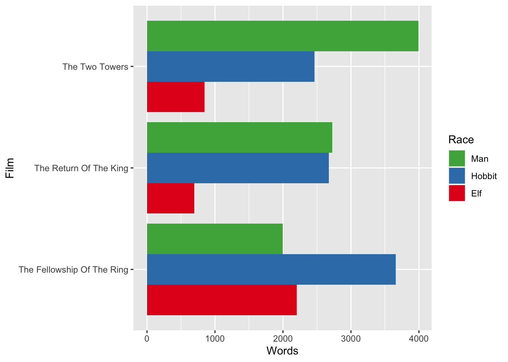

# tidy was? {#tidy}


Idealerweise liegt ein Datensatz so vor, dass er __gut__ von einem Computer gelesen werden kann. In der Regel sind die Datensätze, mit denen wir uns beschäftigen, ja umfangreich, d.h. der Mensch will den Datensatz ja gar nicht (ein-)lesen. Trotzdem sind Datensätze oft anders angelegt (der Mensch trifft die Entscheidung über das Layout).

Der Computer kann einen Datensatz gut *verarbeiten*, wenn wir den Datensatz als __tidy__ bezeichnen können. Hauptmerkmal von einem __tidy__ Datensatz:

  * Jede Spalte ist eine Variable
  * Jede Zeile ist eine Beobachtung

Untidy data mag z.B. der Grund dafür sein, dass Du mit einer Abbildung kämpfst. Daher lohnt es sich immer mal inne zu halten um zu überlegen, ob die Daten __tidy__ sind. Unordnung ist eine häufige, oft übersehene Ursache für Qualen bei der Datenanalyse und -visualisierung.

## Lord of the Rings 

Von [Jenny Byran](https://github.com/jennybc) (Autorin von STAT 545) habe ich folgenden Beispieldatensatz übernommen: [Data from the Lord of the Rings Trilogy](https://github.com/jennybc/lotr)

<table class=" lightable-material-dark" style='font-family: "Source Sans Pro", helvetica, sans-serif; margin-left: auto; margin-right: auto;'>
 <thead>
  <tr>
   <th style="text-align:left;"> Film </th>
   <th style="text-align:left;"> Race </th>
   <th style="text-align:right;"> Female </th>
   <th style="text-align:right;"> Male </th>
  </tr>
 </thead>
<tbody>
  <tr>
   <td style="text-align:left;"> The Fellowship Of The Ring </td>
   <td style="text-align:left;"> Elf </td>
   <td style="text-align:right;"> 1229 </td>
   <td style="text-align:right;"> 971 </td>
  </tr>
  <tr>
   <td style="text-align:left;"> The Fellowship Of The Ring </td>
   <td style="text-align:left;"> Hobbit </td>
   <td style="text-align:right;"> 14 </td>
   <td style="text-align:right;"> 3644 </td>
  </tr>
  <tr>
   <td style="text-align:left;"> The Fellowship Of The Ring </td>
   <td style="text-align:left;"> Man </td>
   <td style="text-align:right;"> 0 </td>
   <td style="text-align:right;"> 1995 </td>
  </tr>
</tbody>
</table>


<table class=" lightable-material-dark" style='font-family: "Source Sans Pro", helvetica, sans-serif; margin-left: auto; margin-right: auto;'>
 <thead>
  <tr>
   <th style="text-align:left;"> Film </th>
   <th style="text-align:left;"> Race </th>
   <th style="text-align:right;"> Female </th>
   <th style="text-align:right;"> Male </th>
  </tr>
 </thead>
<tbody>
  <tr>
   <td style="text-align:left;"> The Two Towers </td>
   <td style="text-align:left;"> Elf </td>
   <td style="text-align:right;"> 331 </td>
   <td style="text-align:right;"> 513 </td>
  </tr>
  <tr>
   <td style="text-align:left;"> The Two Towers </td>
   <td style="text-align:left;"> Hobbit </td>
   <td style="text-align:right;"> 0 </td>
   <td style="text-align:right;"> 2463 </td>
  </tr>
  <tr>
   <td style="text-align:left;"> The Two Towers </td>
   <td style="text-align:left;"> Man </td>
   <td style="text-align:right;"> 401 </td>
   <td style="text-align:right;"> 3589 </td>
  </tr>
</tbody>
</table>


<table class=" lightable-material-dark" style='font-family: "Source Sans Pro", helvetica, sans-serif; margin-left: auto; margin-right: auto;'>
 <thead>
  <tr>
   <th style="text-align:left;"> Film </th>
   <th style="text-align:left;"> Race </th>
   <th style="text-align:right;"> Female </th>
   <th style="text-align:right;"> Male </th>
  </tr>
 </thead>
<tbody>
  <tr>
   <td style="text-align:left;"> The Return Of The King </td>
   <td style="text-align:left;"> Elf </td>
   <td style="text-align:right;"> 183 </td>
   <td style="text-align:right;"> 510 </td>
  </tr>
  <tr>
   <td style="text-align:left;"> The Return Of The King </td>
   <td style="text-align:left;"> Hobbit </td>
   <td style="text-align:right;"> 2 </td>
   <td style="text-align:right;"> 2673 </td>
  </tr>
  <tr>
   <td style="text-align:left;"> The Return Of The King </td>
   <td style="text-align:left;"> Man </td>
   <td style="text-align:right;"> 268 </td>
   <td style="text-align:right;"> 2459 </td>
  </tr>
</tbody>
</table>


Wir haben eine Tabelle pro Film. In jeder Tabelle haben wir die Gesamtzahl der gesprochenen Wörter, von Charakteren verschiedener Kategorien und Geschlechter.

Stell dir vor, diese drei Tabellen als separate Arbeitsblätter in einer Excel-Arbeitsmappe zu finden. Oder in einigen Zellen am Rande eines Arbeitsblatts, das die zugrunde liegenden Rohdaten enthält. Oder als Tabellen auf einer Webseite oder in einem Word-Dokument.

Das Format der Tabellen macht es für einen *Menschen* einfach, die Anzahl der von weiblichen Elfen in "The Two Towers" gesprochenen Wörter nachzuschlagen. Aber dieses Format macht es für einen *Computer* ziemlich schwer, solche Zählungen herauszuziehen und, was noch wichtiger ist, damit zu rechnen oder sie grafisch darzustellen.

Diese Aufgabe ist dann wieder nicht so einfach, da die Daten __untidy__ sind: Die Inhalte der Spalte `Female` und `Male` enthalten nicht die Information über das Geschlecht. Auf der anderen Seite sind Wert der Variable (noch nicht vorhanden) `Words` auf zwei Spalten verteilt.


## Tidy Lord of the Rings data

In sauberer Form sehen die Daten folgendermaßen aus:


<table class=" lightable-material-dark" style='font-family: "Source Sans Pro", helvetica, sans-serif; margin-left: auto; margin-right: auto;'>
 <thead>
  <tr>
   <th style="text-align:left;"> Film </th>
   <th style="text-align:left;"> Race </th>
   <th style="text-align:left;"> Gender </th>
   <th style="text-align:right;"> Words </th>
  </tr>
 </thead>
<tbody>
  <tr>
   <td style="text-align:left;"> The Fellowship Of The Ring </td>
   <td style="text-align:left;"> Elf </td>
   <td style="text-align:left;"> Female </td>
   <td style="text-align:right;"> 1229 </td>
  </tr>
  <tr>
   <td style="text-align:left;"> The Fellowship Of The Ring </td>
   <td style="text-align:left;"> Elf </td>
   <td style="text-align:left;"> Male </td>
   <td style="text-align:right;"> 971 </td>
  </tr>
  <tr>
   <td style="text-align:left;"> The Fellowship Of The Ring </td>
   <td style="text-align:left;"> Hobbit </td>
   <td style="text-align:left;"> Female </td>
   <td style="text-align:right;"> 14 </td>
  </tr>
  <tr>
   <td style="text-align:left;"> The Fellowship Of The Ring </td>
   <td style="text-align:left;"> Hobbit </td>
   <td style="text-align:left;"> Male </td>
   <td style="text-align:right;"> 3644 </td>
  </tr>
  <tr>
   <td style="text-align:left;"> The Fellowship Of The Ring </td>
   <td style="text-align:left;"> Man </td>
   <td style="text-align:left;"> Female </td>
   <td style="text-align:right;"> 0 </td>
  </tr>
  <tr>
   <td style="text-align:left;"> The Fellowship Of The Ring </td>
   <td style="text-align:left;"> Man </td>
   <td style="text-align:left;"> Male </td>
   <td style="text-align:right;"> 1995 </td>
  </tr>
  <tr>
   <td style="text-align:left;"> The Two Towers </td>
   <td style="text-align:left;"> Elf </td>
   <td style="text-align:left;"> Female </td>
   <td style="text-align:right;"> 331 </td>
  </tr>
  <tr>
   <td style="text-align:left;"> The Two Towers </td>
   <td style="text-align:left;"> Elf </td>
   <td style="text-align:left;"> Male </td>
   <td style="text-align:right;"> 513 </td>
  </tr>
  <tr>
   <td style="text-align:left;"> The Two Towers </td>
   <td style="text-align:left;"> Hobbit </td>
   <td style="text-align:left;"> Female </td>
   <td style="text-align:right;"> 0 </td>
  </tr>
  <tr>
   <td style="text-align:left;"> The Two Towers </td>
   <td style="text-align:left;"> Hobbit </td>
   <td style="text-align:left;"> Male </td>
   <td style="text-align:right;"> 2463 </td>
  </tr>
  <tr>
   <td style="text-align:left;"> The Two Towers </td>
   <td style="text-align:left;"> Man </td>
   <td style="text-align:left;"> Female </td>
   <td style="text-align:right;"> 401 </td>
  </tr>
  <tr>
   <td style="text-align:left;"> The Two Towers </td>
   <td style="text-align:left;"> Man </td>
   <td style="text-align:left;"> Male </td>
   <td style="text-align:right;"> 3589 </td>
  </tr>
  <tr>
   <td style="text-align:left;"> The Return Of The King </td>
   <td style="text-align:left;"> Elf </td>
   <td style="text-align:left;"> Female </td>
   <td style="text-align:right;"> 183 </td>
  </tr>
  <tr>
   <td style="text-align:left;"> The Return Of The King </td>
   <td style="text-align:left;"> Elf </td>
   <td style="text-align:left;"> Male </td>
   <td style="text-align:right;"> 510 </td>
  </tr>
  <tr>
   <td style="text-align:left;"> The Return Of The King </td>
   <td style="text-align:left;"> Hobbit </td>
   <td style="text-align:left;"> Female </td>
   <td style="text-align:right;"> 2 </td>
  </tr>
  <tr>
   <td style="text-align:left;"> The Return Of The King </td>
   <td style="text-align:left;"> Hobbit </td>
   <td style="text-align:left;"> Male </td>
   <td style="text-align:right;"> 2673 </td>
  </tr>
  <tr>
   <td style="text-align:left;"> The Return Of The King </td>
   <td style="text-align:left;"> Man </td>
   <td style="text-align:left;"> Female </td>
   <td style="text-align:right;"> 268 </td>
  </tr>
  <tr>
   <td style="text-align:left;"> The Return Of The King </td>
   <td style="text-align:left;"> Man </td>
   <td style="text-align:left;"> Male </td>
   <td style="text-align:right;"> 2459 </td>
  </tr>
</tbody>
</table>

Beachte, dass __tidy__  data im Allgemeinen höher und schmaler sind. Bestimmte Elemente werden oft wiederholt, z. B. `Hobbit`. Aus diesen Gründen lehnen wir __tidy__ Daten oft instinktiv als ineffizient oder hässlich ab. Aber, solange du nicht das Endprodukt für eine textuelle Präsentation von Daten erstellst, solltest du diesen Instinkt ignorieren.

## Vorteile von tidy data

Wenn die Daten in ordentlicher Form vorliegen, ist es naheliegend, *einen Computer* zu holen, um weitere Zusammenfassungen zu machen oder eine Abbildung zu erstellen. 

In dieser Form können wir nun leicht folgende Fragen beantworten:


- Wie viele Wörter haben die männlichen Hobbits insgesamt gesprochen?

- Dominiert eine bestimmte `Race` einen Film? Unterscheidet sich die dominierende `Race` in den Filmen?


#### Wie viele Wörter haben die männlichen Hobbits insgesamt gesprochen?


```r
library(tidyverse)
lotr_tidy %>% 
  count(Gender, Race, wt = Words)
```

```
## # A tibble: 6 x 3
##   Gender Race       n
##   <chr>  <chr>  <dbl>
## 1 Female Elf     1743
## 2 Female Hobbit    16
## 3 Female Man      669
## 4 Male   Elf     1994
## 5 Male   Hobbit  8780
## 6 Male   Man     8043
```

Nun braucht es nur noch ein kleines bisschen Code, um die Gesamtwortzahl für beide Geschlechter aller Kategorien über alle Filme hinweg zu berechnen. Die Gesamtzahl der von männlichen Hobbits gesprochenen Wörter ist 8780. Hier war es wichtig, alle Wortzählungen in einer einzigen Variable zu haben, innerhalb eines Data Frames, der auch eine Variable für Geschlecht und Kategorie enthielt.

#### Dominiert eine bestimmte Kategorie einen Film? Unterscheidet sich die dominierende Kategorie in den Filmen?

Zunächst summieren wir über die Geschlechter hinweg, um die Wortzahlen für die verschiedenen Kategorien nach Film zu erhalten.


```r
(by_race_film <- lotr_tidy %>% 
   group_by(Film, Race) %>% 
   summarize(Words = sum(Words)))
```

```
## `summarise()` has grouped output by 'Film'. You can override using the `.groups` argument.
```

```
## # A tibble: 9 x 3
## # Groups:   Film [3]
##   Film                       Race   Words
##   <chr>                      <chr>  <dbl>
## 1 The Fellowship Of The Ring Elf     2200
## 2 The Fellowship Of The Ring Hobbit  3658
## 3 The Fellowship Of The Ring Man     1995
## 4 The Return Of The King     Elf      693
## 5 The Return Of The King     Hobbit  2675
## 6 The Return Of The King     Man     2727
## 7 The Two Towers             Elf      844
## 8 The Two Towers             Hobbit  2463
## 9 The Two Towers             Man     3990
```

Wir können ganz genau auf diese Zahlen starren, um die Frage zu beantworten. Aber noch schöner ist es, die gerade berechneten Wortzahlen in einem Balkendiagramm darzustellen. 


```r
ggplot(by_race_film, aes(x = Film, y = Words, fill = Race)) + 
  geom_bar(stat = "identity", position = "dodge") +
  coord_flip() + guides(fill = guide_legend(reverse = TRUE)) + 
  scale_fill_brewer(palette = "Set1")
```




Hobbits sind in "The Fellowhip of the Ring" stark vertreten, während die Menschen in "The Two Towers" viel mehr Leinwandzeit hatten. Ebenso prominent waren sie im letzten Film, "The Return of the King".


Auch hier war es wichtig, alle Daten in einem einzigen Data Frame zu haben, alle Wortzählungen in einer einzigen Variable und zugehörige Variablen für Film und Kategorie.


> Im nächsten Schritt schauen wir uns nun an, wie man aus den obigen drei Tabellen eine sauberen Datensatz erzeugt.


## Untidy Lord of the Rings data

Wir importieren nun die Daten, die in den drei filmspezifischen Wortzählungstabellen dargestellt wurden.


Für jede Tabelle existiert eine eigene csv Datei:


  * [The_Fellowship_Of_The_Ring.csv](https://github.com/jennybc/lotr-tidy/blob/master/data/The_Fellowship_Of_The_Ring.csv)
  * [The_Two_Towers.csv](https://github.com/jennybc/lotr-tidy/blob/master/data/The_Two_Towers.csv)
  * [The_Return_Of_The_King.csv](https://github.com/jennybc/lotr-tidy/blob/master/data/The_Return_Of_The_King.csv)


```r
fship <- read_csv(file.path("data", "The_Fellowship_Of_The_Ring.csv"))
```

```
## Rows: 3 Columns: 4
```

```
## ── Column specification ────────────────────────────────────────────────────────
## Delimiter: ","
## chr (2): Film, Race
## dbl (2): Female, Male
```

```
## 
## ℹ Use `spec()` to retrieve the full column specification for this data.
## ℹ Specify the column types or set `show_col_types = FALSE` to quiet this message.
```

```r
ttow <- read_csv(file.path("data", "The_Two_Towers.csv"))
```

```
## Rows: 3 Columns: 4
```

```
## ── Column specification ────────────────────────────────────────────────────────
## Delimiter: ","
## chr (2): Film, Race
## dbl (2): Female, Male
```

```
## 
## ℹ Use `spec()` to retrieve the full column specification for this data.
## ℹ Specify the column types or set `show_col_types = FALSE` to quiet this message.
```

```r
rking <- read_csv(file.path("data", "The_Return_Of_The_King.csv")) 
```

```
## Rows: 3 Columns: 4
```

```
## ── Column specification ────────────────────────────────────────────────────────
## Delimiter: ","
## chr (2): Film, Race
## dbl (2): Female, Male
```

```
## 
## ℹ Use `spec()` to retrieve the full column specification for this data.
## ℹ Specify the column types or set `show_col_types = FALSE` to quiet this message.
```

```r
rking
```

```
## # A tibble: 3 x 4
##   Film                   Race   Female  Male
##   <chr>                  <chr>   <dbl> <dbl>
## 1 The Return Of The King Elf       183   510
## 2 The Return Of The King Hobbit      2  2673
## 3 The Return Of The King Man       268  2459
```

## Und nun alles zusammen

Wir haben jetzt ein Data Frame pro Film, jeweils mit den vier Variablen


```r
names(rking)
```

```
## [1] "Film"   "Race"   "Female" "Male"
```

Der erste Schritt beim Aufräumen dieser Daten besteht darin, sie zu einem Data Frame zusammenzufügen, indem wir die drei Data Frames zeilenweise stapeln. Dazu können wir die Funktion `dplyr::bind_rows()` verwenden.


```r
lotr_untidy <- bind_rows(fship, ttow, rking)
lotr_untidy
```

```
## # A tibble: 9 x 4
##   Film                       Race   Female  Male
##   <chr>                      <chr>   <dbl> <dbl>
## 1 The Fellowship Of The Ring Elf      1229   971
## 2 The Fellowship Of The Ring Hobbit     14  3644
## 3 The Fellowship Of The Ring Man         0  1995
## 4 The Two Towers             Elf       331   513
## 5 The Two Towers             Hobbit      0  2463
## 6 The Two Towers             Man       401  3589
## 7 The Return Of The King     Elf       183   510
## 8 The Return Of The King     Hobbit      2  2673
## 9 The Return Of The King     Man       268  2459
```

Das Zusammensetzen eines großen Datenobjekts aus vielen kleinen ist eine relativ übliche Aufgabe bei der Datenaufbereitung. Wenn die Teile so ähnlich sind wie hier, ist es schön, sie gleich zu einem Objekt zusammenzusetzen. In anderen Szenarien müsst du  möglicherweise einige Nacharbeiten an den einzelnen Objekten vornehmen, bevor sie gut zusammengefügt werden können.

Wenn möglich, sollte man die einzelnen Stücke so früh wie möglich 
zusammensetzen, denn es ist einfacher und effizienter, ein einzelnes Objekt aufzuräumen als 20 oder 1000.

## Nun können wir aufräumen

Wir verletzen immer noch eines der Grundprinzipien von __tidy data__. Die Anzahl an gesprochenen Wörtern ist eine grundlegende Variable in unserem Datensatz und sie ist derzeit auf zwei Variablen verteilt, `Female` und `Male`. Konzeptionell müssen wir die Wortanzahl in einer einzigen Variable zusammenfassen und eine neue Variable `Gender` erstellen, um zu verfolgen, ob die jeweilige Anzahl an Worten von Frauen oder Männern gesprochen wurde. Dies Aufgabe können wir mit der Funktion `tidyr::pivot_longer()` bearbeiten.


```r
lotr_tidy <-
  pivot_longer(lotr_untidy, cols = c("Female", "Male"), names_to = 'Gender', 
               values_to = 'Words')
lotr_tidy
```

```
## # A tibble: 18 x 4
##    Film                       Race   Gender Words
##    <chr>                      <chr>  <chr>  <dbl>
##  1 The Fellowship Of The Ring Elf    Female  1229
##  2 The Fellowship Of The Ring Elf    Male     971
##  3 The Fellowship Of The Ring Hobbit Female    14
##  4 The Fellowship Of The Ring Hobbit Male    3644
##  5 The Fellowship Of The Ring Man    Female     0
##  6 The Fellowship Of The Ring Man    Male    1995
##  7 The Two Towers             Elf    Female   331
##  8 The Two Towers             Elf    Male     513
##  9 The Two Towers             Hobbit Female     0
## 10 The Two Towers             Hobbit Male    2463
## 11 The Two Towers             Man    Female   401
## 12 The Two Towers             Man    Male    3589
## 13 The Return Of The King     Elf    Female   183
## 14 The Return Of The King     Elf    Male     510
## 15 The Return Of The King     Hobbit Female     2
## 16 The Return Of The King     Hobbit Male    2673
## 17 The Return Of The King     Man    Female   268
## 18 The Return Of The King     Man    Male    2459
```


Um unseren obigen Aufruf von `pivot_longer()` zu erklären, lesen wir ihn links nach rechts: Nach der Auswahl des Datensatzes `lotr_untidy` haben wird die Spalten `Female` und `Male` genommen und ihre *Werte* in eine einzige neue Variable `Words` zusammengefasst. Dies erzwang die Erstellung einer neuen Variable `Gender`, die angibt, ob ein bestimmter Wert von `Words` von `Female` oder `Male` stammt. Alle anderen Variablen, wie `Film`, bleiben unverändert und werden einfach nach Bedarf repliziert. Die Dokumentation für `pivot_longer()` gibt weitere Beispiele und dokumentiert zusätzliche Argumente.


Wenn man sich diese Arbeit gemacht hat, dann macht es schon Sinn sich auch das Ergebnis abzuspeichern


```r
write_csv(lotr_tidy, path = file.path("data", "lotr_tidy.csv"))
```

```
## Warning: The `path` argument of `write_csv()` is deprecated as of readr 1.4.0.
## Please use the `file` argument instead.
```


Trotzdem solltet ihr auch bei/nach der Datenaufbereitung auch die Skripte zur Datenaufbereitung wie auch die Originaldaten abspeichern.


## Und jetzt noch ein bisschen "schmutzig" machen


Manchmal (aber nicht so häufig) ist es doch nötig die Daten im [Wide Format](https://de.wikipedia.org/wiki/Wide-Format_und_Long-Format) zu haben. Daher wollen wir zum Schluss die gerade gesäuberten LOTR Daten nochmal ein bisschen untidy machen. 

Dazu arbeiten wir mit den Funktion `tidyr::pivot_wider()`. Wir nehmen nun die Ausprägungen der Variable `Race` (anschließend dann `Gender`) als Variablennamen der neu zu bildenden Variablen. Die Werte dieser neuen Variablen sind durch die Variable `Words` festgelegt. 


```r
## Race
lotr_tidy %>% 
  pivot_wider(names_from = Race, values_from = Words)
```

```
## # A tibble: 6 x 5
##   Film                       Gender   Elf Hobbit   Man
##   <chr>                      <chr>  <dbl>  <dbl> <dbl>
## 1 The Fellowship Of The Ring Female  1229     14     0
## 2 The Fellowship Of The Ring Male     971   3644  1995
## 3 The Two Towers             Female   331      0   401
## 4 The Two Towers             Male     513   2463  3589
## 5 The Return Of The King     Female   183      2   268
## 6 The Return Of The King     Male     510   2673  2459
```

```r
## Gender
lotr_tidy %>% 
  pivot_wider(names_from = Gender, values_from = Words)
```

```
## # A tibble: 9 x 4
##   Film                       Race   Female  Male
##   <chr>                      <chr>   <dbl> <dbl>
## 1 The Fellowship Of The Ring Elf      1229   971
## 2 The Fellowship Of The Ring Hobbit     14  3644
## 3 The Fellowship Of The Ring Man         0  1995
## 4 The Two Towers             Elf       331   513
## 5 The Two Towers             Hobbit      0  2463
## 6 The Two Towers             Man       401  3589
## 7 The Return Of The King     Elf       183   510
## 8 The Return Of The King     Hobbit      2  2673
## 9 The Return Of The King     Man       268  2459
```


Das erste Beispiel hat immer noch 6 Beobachtungen, zwei pro Film. Nehmen wir mal an, dass wir aber nur eine Beobachtung pro Film haben wollen. Dazu müssten wir die möglichen Kombinationen aus `Race` und `Gender` in neuen/weiteren Variablen zusammenfassen. Dies können wir über die Funktion `tidyr::unite()` erreichen.


```r
lotr_tidy %>% 
  unite(Race_Gender, Race, Gender)
```

```
## # A tibble: 18 x 3
##    Film                       Race_Gender   Words
##    <chr>                      <chr>         <dbl>
##  1 The Fellowship Of The Ring Elf_Female     1229
##  2 The Fellowship Of The Ring Elf_Male        971
##  3 The Fellowship Of The Ring Hobbit_Female    14
##  4 The Fellowship Of The Ring Hobbit_Male    3644
##  5 The Fellowship Of The Ring Man_Female        0
##  6 The Fellowship Of The Ring Man_Male       1995
##  7 The Two Towers             Elf_Female      331
##  8 The Two Towers             Elf_Male        513
##  9 The Two Towers             Hobbit_Female     0
## 10 The Two Towers             Hobbit_Male    2463
## 11 The Two Towers             Man_Female      401
## 12 The Two Towers             Man_Male       3589
## 13 The Return Of The King     Elf_Female      183
## 14 The Return Of The King     Elf_Male        510
## 15 The Return Of The King     Hobbit_Female     2
## 16 The Return Of The King     Hobbit_Male    2673
## 17 The Return Of The King     Man_Female      268
## 18 The Return Of The King     Man_Male       2459
```
In Kombination mit `pivot_wider()` ergibt sich so


```r
lotr_tidy %>% 
  unite(Race_Gender, Race, Gender) %>% 
  pivot_wider(names_from = Race_Gender, values_from = Words)
```

```
## # A tibble: 3 x 7
##   Film         Elf_Female Elf_Male Hobbit_Female Hobbit_Male Man_Female Man_Male
##   <chr>             <dbl>    <dbl>         <dbl>       <dbl>      <dbl>    <dbl>
## 1 The Fellows…       1229      971            14        3644          0     1995
## 2 The Two Tow…        331      513             0        2463        401     3589
## 3 The Return …        183      510             2        2673        268     2459
```

Zum Schluss könnten wir jetzt auch noch alles zurück auf Anfang stellen und die
drei Datensätze vom Anfang wiederherstellen


```r
(sep_list <- lotr_tidy %>% 
  pivot_wider(names_from = Gender, values_from = Words) %>%
   group_split(Film))
```

```
## <list_of<
##   tbl_df<
##     Film  : character
##     Race  : character
##     Female: double
##     Male  : double
##   >
## >[3]>
## [[1]]
## # A tibble: 3 x 4
##   Film                       Race   Female  Male
##   <chr>                      <chr>   <dbl> <dbl>
## 1 The Fellowship Of The Ring Elf      1229   971
## 2 The Fellowship Of The Ring Hobbit     14  3644
## 3 The Fellowship Of The Ring Man         0  1995
## 
## [[2]]
## # A tibble: 3 x 4
##   Film                   Race   Female  Male
##   <chr>                  <chr>   <dbl> <dbl>
## 1 The Return Of The King Elf       183   510
## 2 The Return Of The King Hobbit      2  2673
## 3 The Return Of The King Man       268  2459
## 
## [[3]]
## # A tibble: 3 x 4
##   Film           Race   Female  Male
##   <chr>          <chr>   <dbl> <dbl>
## 1 The Two Towers Elf       331   513
## 2 The Two Towers Hobbit      0  2463
## 3 The Two Towers Man       401  3589
```

Wir erhalten eine Liste mit drei Elemente, die deren Inhalt den drei Tabellen vom Anfang entspricht. Die Daten zu "The Return of the King" sind beispielsweise im zweiten Element enthalten.


```r
sep_list[[2]]
```

```
## # A tibble: 3 x 4
##   Film                   Race   Female  Male
##   <chr>                  <chr>   <dbl> <dbl>
## 1 The Return Of The King Elf       183   510
## 2 The Return Of The King Hobbit      2  2673
## 3 The Return Of The King Man       268  2459
```


## Literatur


  * [Tidy data](http://r4ds.had.co.nz/tidy-data.html) Kapitel in R for Data Science, by Garrett Grolemund and Hadley Wickham
    - [tidyr](https://tidyr.tidyverse.org/) Paket
  * [Bad Data Handbook](http://shop.oreilly.com/product/0636920024422.do) by By Q. Ethan McCallum, published by O'Reilly.
    - Chapter 3: Data Intended for Human Consumption, Not Machine Consumption by Paul Murrell.
  * Tidy data by Hadley Wickham. Journal of Statistical Software. Vol. 59, Issue 10, Sep 2014. <http://www.jstatsoft.org/v59/i10>
