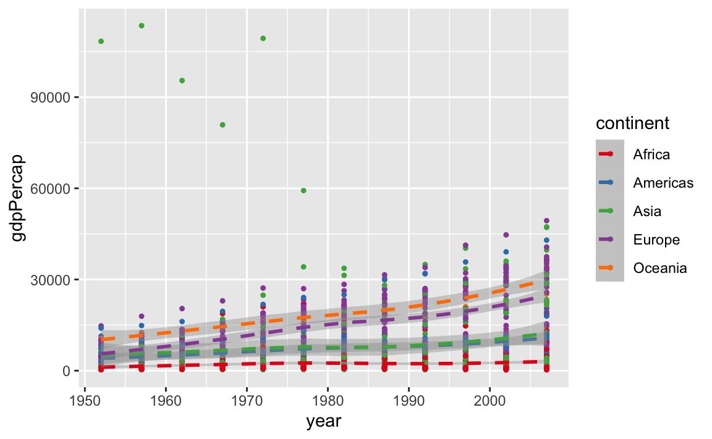
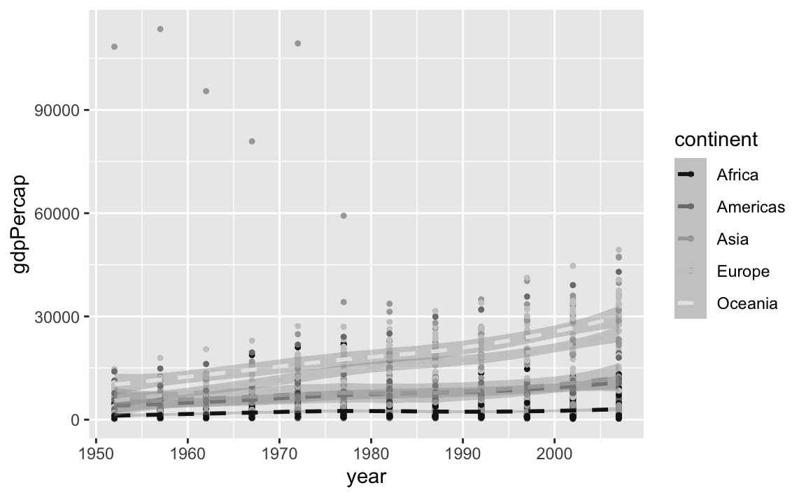
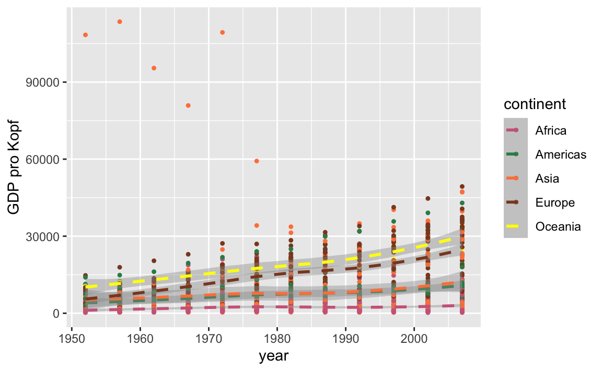
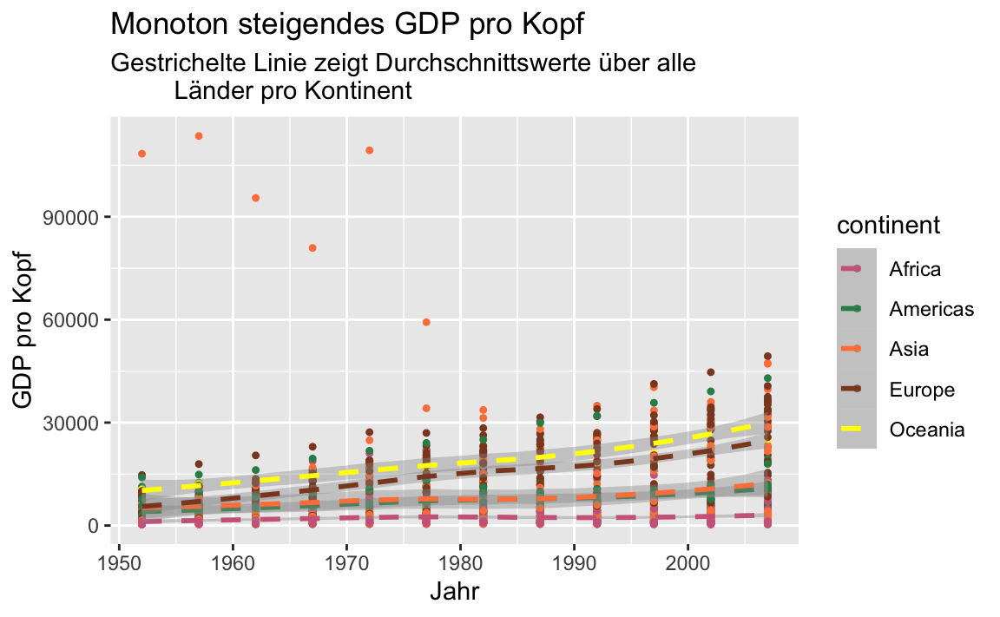
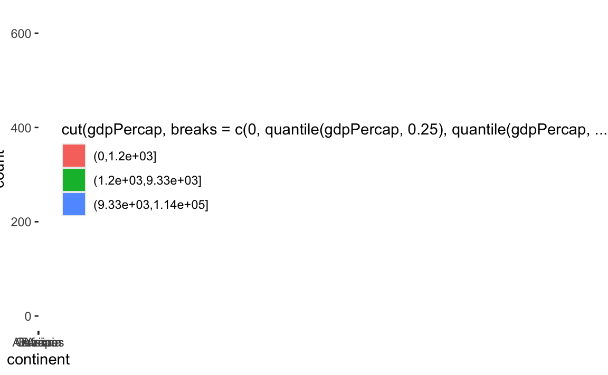
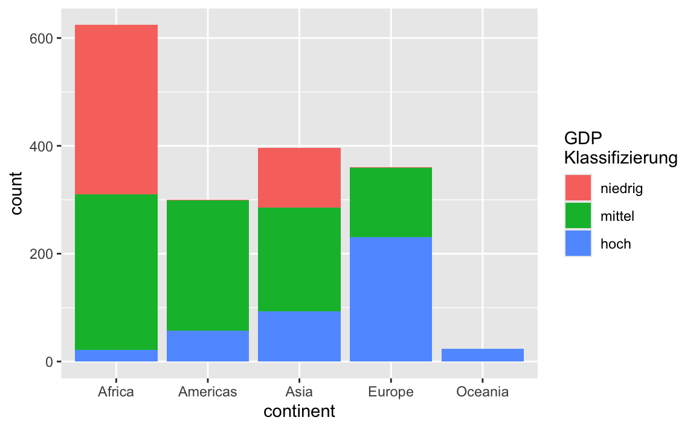
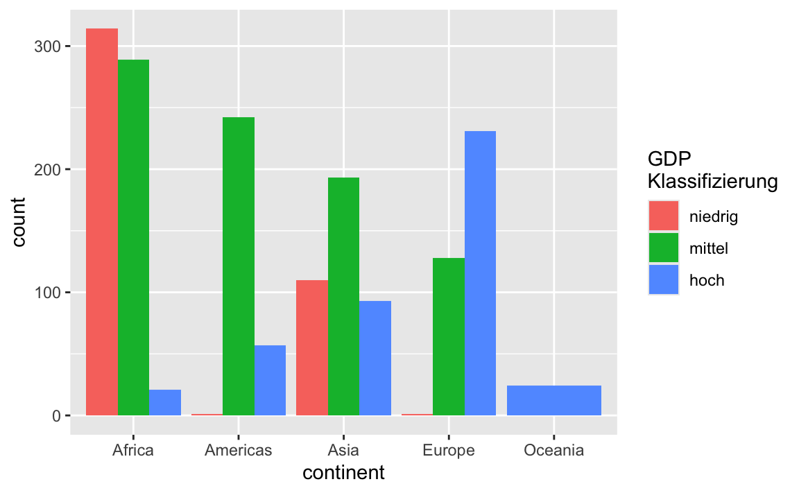

# Bausteine


##  Aesthetics {#aes}

Mit der Funktion `aes()` lässt sich das **Aussehen** der Grafik regeln (nicht der Inhalt). Wir können z.B.

- die Position: `x` und `y`
- die Farbe: `color` und `fill`
- die Form: `shape`
- den Linientyp: `linetype`
- die Größe der Symbol: `size`

festlegen. Nicht jedes aesthetic kann allerdings mit allen verfügbaren geoms kombiniert werden. So macht z.B. der `linetype` ja wenig Sinn in `geom_point()`. Ein Übersicht der möglichen aesthetics findet man in der Hilfe jeder geom-Funktion

```
geom_point {ggplot2}	R Documentation
Points
Description
The point geom is used to create scatterplots. The scatterplot is most useful for displaying the relationship between two continuous variables. It can be used to compare one continuous and one categorical variable, or two categorical variables, but a variation like geom_jitter(), geom_count(), or geom_bin2d() is usually more appropriate. A bubblechart is a scatterplot with a third variable mapped to the size of points.

Usage
geom_point(
  mapping = NULL,
  data = NULL,
  stat = "identity",
  position = "identity",
  ...,
  na.rm = FALSE,
  show.legend = NA,
  inherit.aes = TRUE
)

...

Aesthetics
geom_point() understands the following aesthetics (required aesthetics are in bold):

x

y

alpha

colour

fill

group

shape

size

stroke

Learn more about setting these aesthetics in vignette("ggplot2-specs").

```

In der `aes()` Funktion sollten die Daten den Wert der Argumente bestimmen. Werden Argumente auf fixe Werte gesetzt, so sind sie außerhalb der `aes()` Funktion zu setzen. 


In einem Plot der `gdpPercap` Daten für Deutschland und Frankreich wollen wir anhand von unterschiedlichen Farben die Daten der beiden Länder unterscheiden. Dazu müssen wir nur `colour` innerhalb von `aes()` den Wert `country` zuweisen. 


```r
gapminder %>%
  filter(country %in% c("Germany","France")) %>% # auswählen der Daten 
  ggplot(aes(x = year, y = gdpPercap, colour = country)) +  
  geom_point(size = 3) # size wird auf einen fixen Wert gesetzt (außerhalb von aes())
```


## Geoms {#geoms}

Mit den `geom_xx()` Funktionen stellen wir die Daten als geometrische Formen in einer Grafik dar. Jede `ggplot2` Grafik benötigt daher mindestens ein `geom`. Beispiele sind

- `geom_point()`
- `geom_line()`
- `geom_histogram()`

Da wir nicht alle verfügbaren `geoms` auflisten können, sei an dieser Stelle auf die [ggplot2] Seite verwiesen.


```r
gapminder %>%
  ggplot(aes(x = year, y = gdpPercap)) +  
  geom_point() 


gapminder %>%
  ggplot(aes(x = year, y = gdpPercap)) +  
  geom_smooth() 
## `geom_smooth()` using method = 'gam' and formula 'y ~ s(x, bs = "cs")'
```


Wir haben hier die gleichen Daten visualisiert. Allerdings ist das Ergebnis doch recht unterschiedlich. Der Scatterplot zeigt alle (abgesehen von überzeichnen) Daten, wohingegen mit `geom_smooth()` eine geglätteter Zusammenhang dargestellt wird.


Interessant sind hier natürlich die wenigen großen `gdpPercap` Werte


```r
gapminder %>%
  filter(gdpPercap > 50000)
## # A tibble: 6 x 6
##   country continent  year lifeExp     pop gdpPercap
##   <fct>   <fct>     <int>   <dbl>   <int>     <dbl>
## 1 Kuwait  Asia       1952    55.6  160000   108382.
## 2 Kuwait  Asia       1957    58.0  212846   113523.
## 3 Kuwait  Asia       1962    60.5  358266    95458.
## 4 Kuwait  Asia       1967    64.6  575003    80895.
## 5 Kuwait  Asia       1972    67.7  841934   109348.
## 6 Kuwait  Asia       1977    69.3 1140357    59265.
```

Kuwait hat über den gesamten Zeitraum hohe GDP Werte. Aber zu Beginn der Aufzeichnungen waren die Werte in Bezug auf die damals noch recht kleine Populationsgröße außergewöhnlich hoch.


Einem `ggplot` Objekt können wir nicht nur ein `geom` zuordnen. Prinzipiell können wir beliebig viele weitere `geoms` hinzufügen. Wir können also die gerade durchgeführte Glättung der Daten auch
direkt zum Scatterplot hinzufügen


```r
gapminder %>%
  ggplot(aes(x = year, y = gdpPercap)) +  
  geom_point() +
  geom_smooth() 
## `geom_smooth()` using method = 'gam' and formula 'y ~ s(x, bs = "cs")'
```


Wählen wir die Farbe der geometrischen Objekte anhand einer Faktorvariable, so erhalten wir automatisch eine entsprechende Legende


```r
gapminder %>%
  ggplot(aes(x = year, y = gdpPercap)) +  
  geom_point(aes(colour = continent)) +
  geom_smooth() 
## `geom_smooth()` using method = 'gam' and formula 'y ~ s(x, bs = "cs")'
```


Beachte auch, dass wir `colour` nur für `geom_point()` gewählt haben. Die Glättung erfolgt weiterhin über alle Daten und nicht separat für jeden Kontinent. Aber das wäre natürlich auch möglich. Dazu können wir `colour` wieder global in `ggplot()` definieren.


```r
gapminder %>%
  ggplot(aes(x = year, y = gdpPercap, colour = continent)) +  
  geom_point() +
  geom_smooth() 
## `geom_smooth()` using method = 'loess' and formula 'y ~ x'
```


Die Punkte sind mir etwas zu groß und der Linientyp gefällt mir auch nicht in diesem Plot. Aber das lässt sich schnell ändern.


```r
gapminder %>%
  ggplot(aes(x = year, y = gdpPercap, colour = continent)) +  
  geom_point(size = 0.9) +
  geom_smooth(linetype = 2) 
## `geom_smooth()` using method = 'loess' and formula 'y ~ x'
```


## Statistische Transformationen {#stat-trans}

Jede `geom_xx()` Funktion besitzt eine Default Statistik, die berechnet wird.


```r
args(geom_point)
## function (mapping = NULL, data = NULL, stat = "identity", position = "identity", 
##     ..., na.rm = FALSE, show.legend = NA, inherit.aes = TRUE) 
## NULL
```

Bei einem Scatterplot ist dies nur die Identität. 

Ein Balkendiagramm verwendet anderseits


```r
args(geom_bar)
## function (mapping = NULL, data = NULL, stat = "count", position = "stack", 
##     ..., width = NULL, na.rm = FALSE, orientation = NA, show.legend = NA, 
##     inherit.aes = TRUE) 
## NULL
```

die Transformation `count`, was Sinn macht, da ja gezählt werden muss/soll wie viele Beobachtungen in die jeweilige Kategorie fallen.

Der Aufruf der `stat_xx()` Funktion ist oftmals einfacher über die entsprechende `geom_xx()` Funktion, aber natürlich kann die `stat_xx()` Funktion auch direkt aufgerufen werden.


```r
ggplot(gapminder, aes(x = continent)) + 
  geom_bar()
```


```r

ggplot(gapminder, aes(x = continent)) + 
  stat_count()
```


Jedes `geom` hat zwar ein Default-Transformation, aber natürlich können oftmals noch weitere Transformationen berechnet/genutzt werden. Im Abschnitt __Computed variables__  der Hilfe zu einem `geom` sieht man alle verfügbaren Transformationen

Für `geom_bar()` sind dies

```
Computed variables

count
number of points in bin

prop
groupwise proportion


```

Die relativen Häufigkeiten berechnet man also über `prop`. Dazu muss die y-Variable auf `prop` gesetzt werden. Da der Aufruf


```r
ggplot(gapminder, aes(x = continent, y = prop))
```

aber nach einer Variable `prop` suchen würde, muss eine alternative Notation in diesem Fall verwendet werden


```r
ggplot(gapminder, aes(x = continent, y = ..prop..)) + 
  geom_bar()
```


Das sieht jetzt noch nicht so wie wir das erwartet haben. Die 
relativen Häufigkeiten wurden innerhalb der fünf Gruppen berechnet und nicht über alle Beobachtungen. D.h. wir müssen der Funktion noch sagen, dass es nur eine Gruppe geben soll.


```r
ggplot(gapminder, aes(x = continent, y = ..prop..)) + 
  geom_bar(aes(group = 1))
```


## scales


Scales steuern die Zuordnung von Daten zu aesthetics. Sie nehmen deine Daten und bestimmen damit Größe, Farbe, Position oder Form von Objekten. Sie erlauben dir auch die Achsen und die Legend nach deinen Vorstellungen anzupassen. Du kannst sicher mit `ggplot2` Grafiken erstellen, ohne zu wissen, wie `scales` funktionieren, aber wenn du `scales` verstehst und lernst, wie du sie einstellen kannst, wirst du viel mehr Kontrolle über deine Grafiken bekommen.

Neben weiteren Möglichkeiten können wir über `scales` also

- `color` und `fill`
- `position`
- `size` 
- `shape`
- `line type`

durch Verwendung der `scale_"aesthetic"_"type"` Funktionen modifizieren. Argumente dieser Funktionen sind z.B. `name`, `limits`, `breaks` oder `labels`.


Zuerst spielen wir etwas mit Farben. Dazu plotten wir erneut `year` gegen `gdpPercap` und wählen für jeden Kontinent eine eigene Farbe. Da wir die Farben über `colour` definieren, verwenden wir danach die Funktionen `scale_colour_xxx()` (im Vergleich zu z.B. `scale_fill_brewer()`).


```r
(p <- gapminder %>%
  ggplot(aes(x = year, y = gdpPercap, colour = continent)) +  
  geom_point(size = 0.9) +
  geom_smooth(linetype = 2) )
## `geom_smooth()` using method = 'loess' and formula 'y ~ x'

p + scale_colour_brewer(palette = "Set1") # Farbpaletten von http://colorbrewer2.org/
## `geom_smooth()` using method = 'loess' and formula 'y ~ x'

p + scale_colour_grey(start = 0.1, end = 0.9) # keine so gute Wahl
## `geom_smooth()` using method = 'loess' and formula 'y ~ x'

p + scale_colour_manual(values = c("blue", "gold", "sienna1", "sienna4", "hotpink1", "hotpink4"), name = "Kontinent")
## `geom_smooth()` using method = 'loess' and formula 'y ~ x'
```



In diesem Beispiel haben wir also die Farbe über eine vorgegebene Palette, in Grau-Stufen bzw. manuell gewählt. Im letzten Beispiel haben wir zusätzlich noch den Titel der Legende geändert über das `name` Argument.


Die Achsenbeschriftung der y-Achse ist nicht wirklich schön, weil nicht unbedingt selbsterklärend. Daher ändern wir im nächsten Schritt die Achsenbeschriftung.


```r
p <- p + scale_colour_manual(values = c("blue", "gold", "sienna1", "sienna4", "hotpink1", "hotpink4"))

p + scale_y_continuous("GDP pro Kopf")
## `geom_smooth()` using method = 'loess' and formula 'y ~ x'
```



Da es sich bei `gdpPercap` um eine stetige Variable handelt, haben wir `scale_y_continuous()` verwendet (im Gegensatz zu `scale_y_discrete()`) um die Achsenbeschriftung zu ändern. Über die Hilfsfunktion `labs()` können wir die Beschriftung der Grafik aber auch einfacher/intuitiver ändern.


```r
(p <- p + labs(x = "Jahr", y = "GDP pro Kopf",
         title = "Monoton steigendes GDP pro Kopf",
         subtitle = "Gestrichelte Linie zeigt Durchschnittswerte über alle Länder pro Kontinent"))
## `geom_smooth()` using method = 'loess' and formula 'y ~ x'
```




Die frühen Kuwait-Beobachtungen ziehen die y-Achse stark auseinander. Daher könnte man etwas in den Plot hinein zoomen wollen. Dazu kann man das Koordinatensystem anpassen über`coord_cartasian()`. Alternativ könnte man auch mit der Funktion `ylim()` arbeiten (analog existiert natürlich auch `xlmin()`). Verwendet man `xlim()` bzw. `ylim()`, so werden alle Datenpunkte, die nicht im zu plottenden Bereich liegen, aber nicht nur nicht gezeichnet, sondern auch aus dem Datensatz (für diesen einen Plot) entfernt. Dies hat Auswirkungen auf Teile des Plots, die auf statistische Transformationen basieren, die mithilfe der vorhanden Daten berechnet wurden.


```r
p + ylim(0,55000)
## `geom_smooth()` using method = 'loess' and formula 'y ~ x'
## Warning: Removed 6 rows containing non-finite values
## (stat_smooth).
## Warning: Removed 6 rows containing missing values
## (geom_point).
(p <- p + coord_cartesian(ylim = c(0, 55000)))
## `geom_smooth()` using method = 'loess' and formula 'y ~ x'
```


In der rechten Grafik ist der Verlauf der Kurven unverändert. In der linken Grafik hingegen liegt die Kurve für Asien nun deutlich unter der Kurve für Amerika bis Mitte der 80er Jahre.


Andere mögliche Positionsänderungen ergeben sich durch Skalierungen der Achsen wie `scale_x_log10()`, `scale_y_sqrt()` oder


```r
p + scale_x_reverse()
## `geom_smooth()` using method = 'loess' and formula 'y ~ x'
```


Für weitere Optionen sei hier auf die [online Version](https://ggplot2-book.org/index.html) der neuesten Auflage von [ggplot2] [@wickham2009] verwiesen.


## facets

Datensätze lassen sich oftmals bzgl. vorhandener Variablen gruppieren. Dann will man Zusammenhänge weiterer Variablen innerhalb dieser Gruppen darstellen. Entsteht die Gruppierung aufgrund einer Variable, so kannst du mit `facet_wrap()` arbeiten


```r
gapminder %>%
  ggplot(aes(x = year, y = gdpPercap )) +  
  geom_point(size = 0.9) +
  geom_smooth(linetype = 2) +
  facet_wrap(~ continent, ncol = 2)
## `geom_smooth()` using method = 'loess' and formula 'y ~ x'
```



In der letzten Grafik verwenden alle fünf Plots die gleiche Skala auf der y-Achse um die Vergleichbarkeit der Werte zu erhöhen. In manchen Fällen mag dies aber störend sein. Mit dem Argument `scale` kannst du die Skala "befreien".


```r
gapminder %>%
  ggplot(aes(x = year, y = gdpPercap )) +  
  geom_point(size = 0.9) +
  geom_smooth(linetype = 2) +
  facet_wrap(~ continent, ncol = 2, scales = "free")
## `geom_smooth()` using method = 'loess' and formula 'y ~ x'
```



Erfolgt die Gruppierung anhand von zwei Variablen, so bietet `facet_grid()` eine passende Aufteilung des Grafikfensters. Neben dem Kontinent betrachten wir nun auch noch ob die Populationsgröße des Landes im entsprechenden Jahr größer als 5000000 ist, oder eben nicht.


```r
gapminder %>%
  group_by(continent) %>%
  ggplot(aes(x = year, y = gdpPercap )) +  
  geom_point(size = 0.9) +
  geom_smooth(linetype = 2) +
  facet_grid(continent ~ pop > 5000000, scales = "free")
## `geom_smooth()` using method = 'loess' and formula 'y ~ x'
```



Für Ozeanien erhalten wir so z.B. eine Unterteilung in Australien (`TRUE`) und Neuseeland (`FALSE`).

## themes

Abschließend wollen wir noch über verschiedene `themes` sprechen. Über `themes` kann man das Aussehen der nicht datenbezogenen Elemente einer Grafik verändern, wie z.B.

- die Beschriftungen
- den Hintergrund
- die Legende
- ....

Eine Reihe von `themes` sind bereits vorhanden, wobei `theme_gray()` das Default `theme` ist. Siehe auch `?theme_gray()`.


```r
p
## `geom_smooth()` using method = 'loess' and formula 'y ~ x'
p + theme_bw()
## `geom_smooth()` using method = 'loess' and formula 'y ~ x'
p + theme_dark()
## `geom_smooth()` using method = 'loess' and formula 'y ~ x'
p + theme_minimal()
## `geom_smooth()` using method = 'loess' and formula 'y ~ x'
```


Wir möchten nun gerne folgende Änderungen an der Grafik vornehmen:

- die Größe der Achsenbeschriftung ändern
- die Gitterlinien ohne Beschriftung entfernen
- eine Überschrift hinzufügen
- die Legende in die Grafik verschieben
- die Hintergrundfarbe der Grafik und der Legende ändern

Die meisten dieser Änderungen können wir mit `theme()` durchführen.


```r
p +
  theme(
    axis.text = element_text(size = 14),
    legend.key = element_rect(fill = "navy"),
    legend.background = element_rect(fill = "green"),
    legend.position = "bottom",
    panel.grid.major = element_line(colour = "grey40"),
    panel.grid.minor = element_blank(),
    panel.background = element_rect(fill = "navy")
  )
## `geom_smooth()` using method = 'loess' and formula 'y ~ x'
```


Ob das nun alles schön aussieht, sei dahingestellt, aber es zeigt durchaus die vorhandenen Möglichkeiten.

Will man gewisse Einstellung öfter verwenden, so kann man diese auch in einem `theme` Objekt speichern und wiederverwenden.


```r
mein_theme <- theme(
    axis.text = element_text(size = 14),
    legend.key = element_rect(fill = "hotpink3"),
    panel.grid.major = element_line(colour = "grey40"),
    panel.grid.minor = element_blank(),
    panel.background = element_rect(fill = "navy")
  )
class(mein_theme)
## [1] "theme" "gg"
```


```r
p + mein_theme
## `geom_smooth()` using method = 'loess' and formula 'y ~ x'
```


## Buch zum Paket

Dieser Abschnitt konnte nur einen kleinen Einblick in die Möglichkeiten des `ggplot2` Pakets geben. Eine ausführliche Beschreibung findet man im [Buch](https://ggplot2-book.org) zum Paket.


