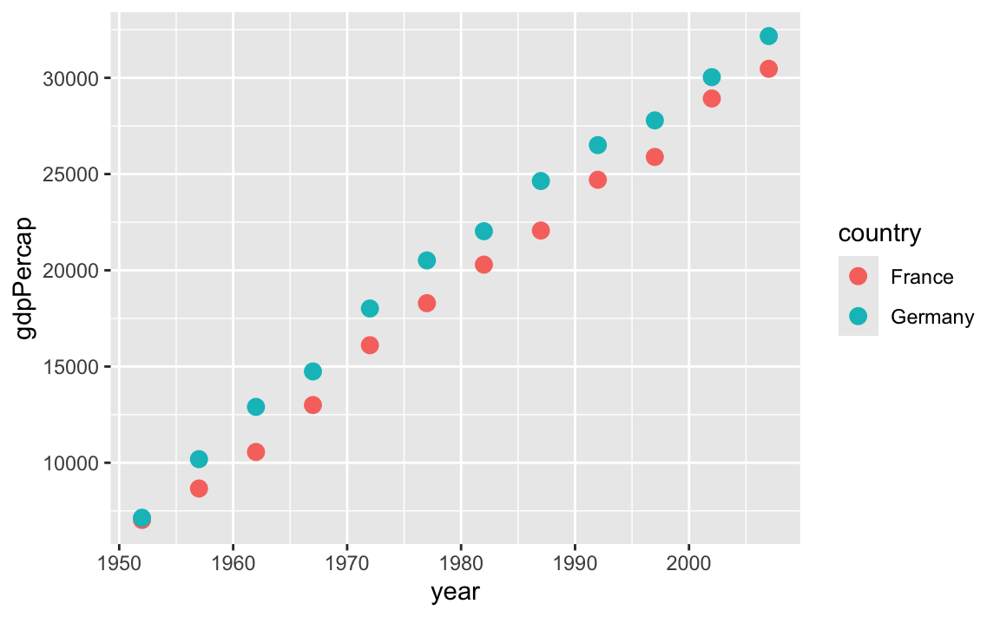
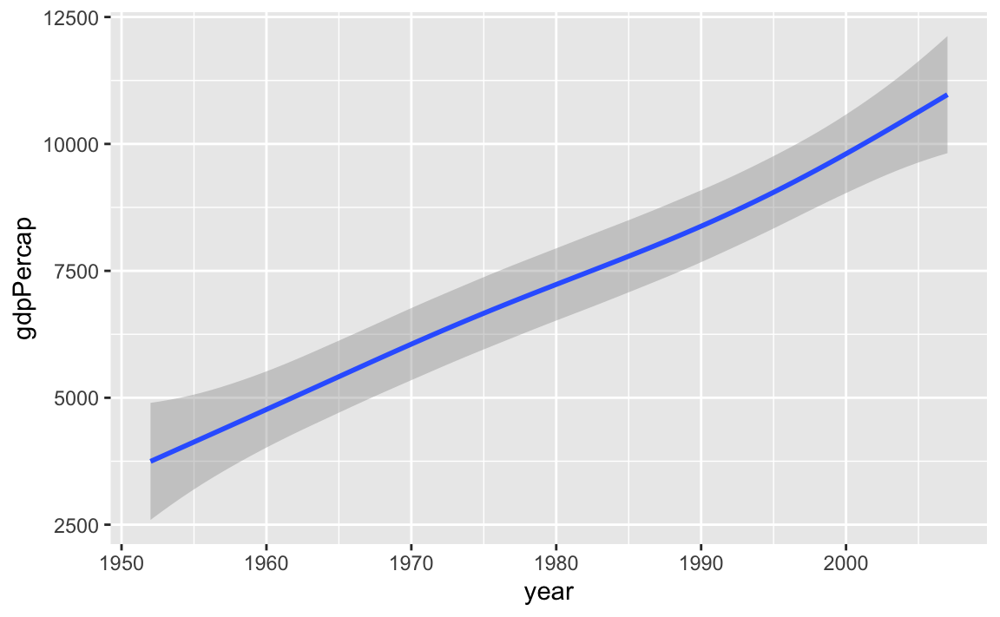
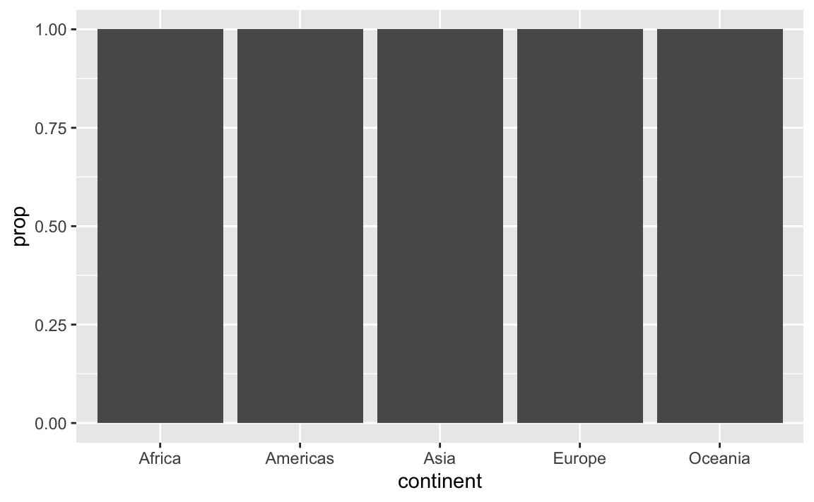
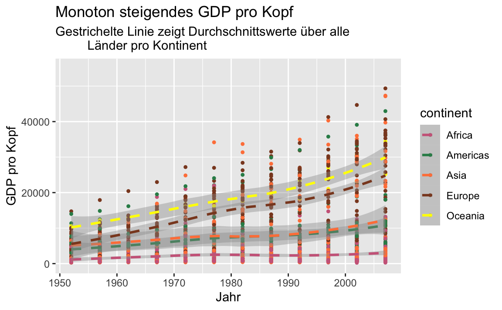
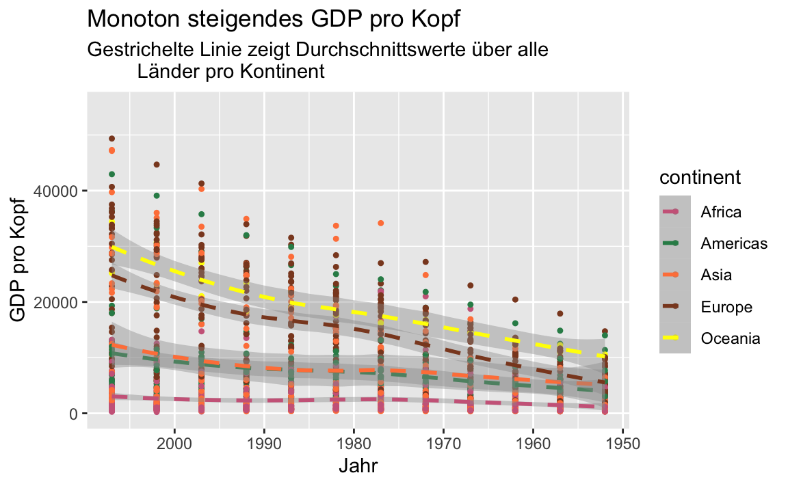
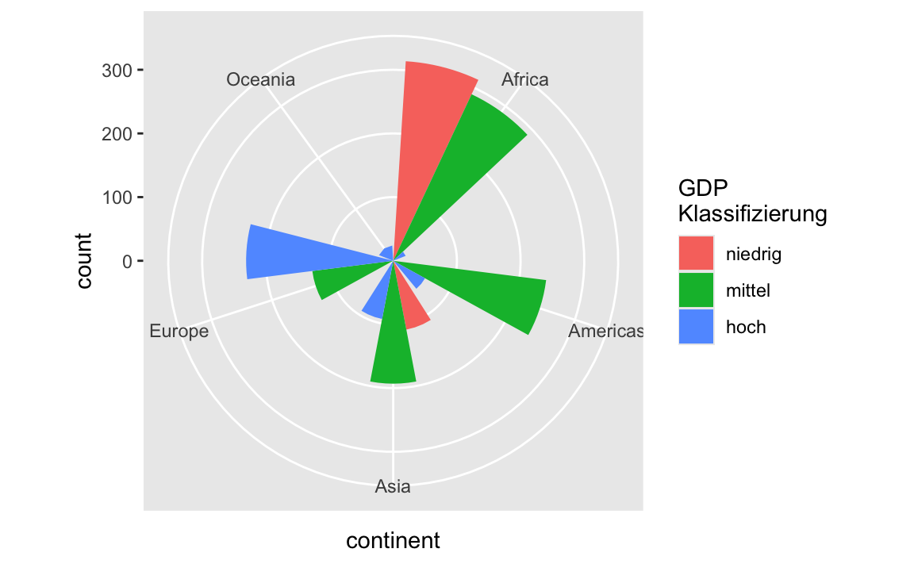
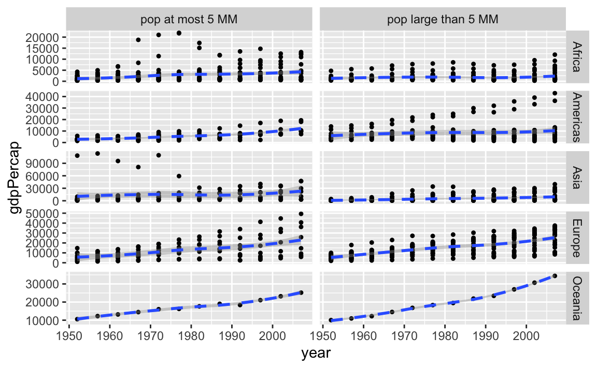

# Bausteine


In den nächsten Abschnitten schauen wir uns die verschiedene Bausteine einer `ggplot2` Grafik genauer an. Dabei sehen wir auch eine Reihe von Beispielen, die uns zeigen, wie man die verschiedenen Bausteine miteinander verknüpft.


##  Aesthetics {#aes}

Mit der Funktion `aes()` lässt sich das __Aussehen__ der Grafik regeln (nicht der Inhalt). Wir können z.B.

- die Position: `x` und `y`
- die Farbe: `color` und `fill`
- die Form: `shape`
- den Linientyp: `linetype`
- die Größe der Symbol: `size`

festlegen. Die jeweiligen Werte dieser aesthetics können entweder fix oder in _Abhängigkeit von Variablen aus dem verwendeten Datensatz_ gewählt werden.
Werden die Werte in Abhängigkeit der Daten gewählt, so definiert die Funktion `aes()` ein __mapping__ zwischen den Daten und den aesthetics der Grafik.


Nicht jedes aesthetic kann allerdings mit allen verfügbaren geoms kombiniert werden. So macht z.B. der `linetype` ja wenig Sinn in `geom_point()`. Eine Übersicht der möglichen aesthetics findet man in der Hilfe jeder geom-Funktion. In der Hilfe von `geom_point()` findet man z.B. 

```
geom_point {ggplot2}	R Documentation
Points
Description
The point geom is used to create scatterplots. The scatterplot is most useful for displaying the relationship between two continuous variables. It can be used to compare one continuous and one categorical variable, or two categorical variables, but a variation like geom_jitter(), geom_count(), or geom_bin2d() is usually more appropriate. A bubblechart is a scatterplot with a third variable mapped to the size of points.

Usage
geom_point(
  mapping = NULL,
  data = NULL,
  stat = "identity",
  position = "identity",
  ...,
  na.rm = FALSE,
  show.legend = NA,
  inherit.aes = TRUE
)

...

Aesthetics
geom_point() understands the following aesthetics (required aesthetics 
are in bold):

x

y

alpha

colour

fill

group

shape

size

stroke

Learn more about setting these aesthetics in vignette("ggplot2-specs").

```

Will man über die Daten Werte für die verschiedenen aesthetics definieren, so muss dies innerhalb der `aes()` Funktion geschehen.  Werden Argumente auf fixe Werte gesetzt, so sind sie außerhalb der `aes()` Funktion zu setzen. 


In einem Plot der `gdpPercap` Daten für Deutschland und Frankreich wollen wir anhand von unterschiedlichen Farben die Daten der beiden Länder unterscheiden. Dazu müssen wir nur `colour` innerhalb von `aes()` den Wert `country` zuweisen. Zusätzlich wollen wir die Größe der zu zeichnenden Punkte etwas erhöhen. Aber die Größe soll für beide Länder gleich sein. Daher definieren wir `size` außerhalb der `aes()` Funktion.


```r
gapminder %>%
  filter(country %in% c("Germany","France")) %>%  
  ggplot(mapping = aes(x = year, y = gdpPercap, colour = country)) +  
  geom_point(size = 3) 
```




## Geoms {#geoms}

Mithilfe der  `geom_xxx()` Funktionen können wir die Daten als geometrische Formen (Punkte, Linien, ...) in einer Grafik darstellen. Jede `ggplot2` Grafik benötigt daher mindestens ein `geom`. Beispiele sind

- `geom_point()`
- `geom_line()`
- `geom_histogram()`

Da wir nicht alle verfügbaren `geoms` auflisten können/wollen, sei an dieser Stelle auf die [ggplot2] Seite verwiesen.


Im nächsten Beispiel stellen wir die gleichen Daten/Variablen über zwei verschiedene `geoms` dar.


```r
gapminder %>%
  ggplot(mapping = aes(x = year, y = gdpPercap)) +  
  geom_point() 


gapminder %>%
  ggplot(mapping = aes(x = year, y = gdpPercap)) +  
  geom_smooth() 
## `geom_smooth()` using method = 'gam' and formula 'y ~ s(x, bs = "cs")'
```




Obwohl die gleichen Daten visualisiert wurden, ist das Ergebnis doch recht unterschiedlich. Der Scatterplot zeigt alle (abgesehen von Overplotting) Daten, wohingegen mit `geom_smooth()` eine geglätteter Zusammenhang dargestellt wird.


Interessant sind hier natürlich die wenigen großen `gdpPercap` Werte in der linken Grafik


```r
gapminder %>%
  filter(gdpPercap > 50000)
## # A tibble: 6 × 6
##   country continent  year lifeExp     pop gdpPercap
##   <fct>   <fct>     <int>   <dbl>   <int>     <dbl>
## 1 Kuwait  Asia       1952    55.6  160000   108382.
## 2 Kuwait  Asia       1957    58.0  212846   113523.
## 3 Kuwait  Asia       1962    60.5  358266    95458.
## 4 Kuwait  Asia       1967    64.6  575003    80895.
## 5 Kuwait  Asia       1972    67.7  841934   109348.
## 6 Kuwait  Asia       1977    69.3 1140357    59265.
```

Kuwait hat über den gesamten Zeitraum sehr hohe GDP Werte. Aber zu Beginn der Aufzeichnungen waren die Werte in Bezug auf die damals noch recht kleine Populationsgröße sogar außergewöhnlich hoch.


Einem `ggplot` Objekt können wir nicht nur __ein__ `geom` zuordnen. Prinzipiell können wir beliebig viele weitere `geoms` hinzufügen. Wir können also die gerade durchgeführte Glättung der Daten auch direkt zum Scatterplot hinzufügen


```r
gapminder %>%
  ggplot(mapping = aes(x = year, y = gdpPercap)) +  
  geom_point() +
  geom_smooth() 
## `geom_smooth()` using method = 'gam' and formula 'y ~ s(x, bs = "cs")'
```


Wählen wir die Farbe eines geometrischen Objekts (oder mehrerer)  anhand einer Faktorvariable, so erhalten wir automatisch eine entsprechende Legende


```r
gapminder %>%
  ggplot(mapping = aes(x = year, y = gdpPercap)) +  
  geom_point(mapping = aes(colour = continent)) +
  geom_smooth() 
## `geom_smooth()` using method = 'gam' and formula 'y ~ s(x, bs = "cs")'
```


Beachtet dabei, dass wir `colour` nur für `geom_point()` gewählt haben. Die Glättung erfolgt weiterhin über alle Daten und nicht separat für jeden Kontinent. In diesem Fall haben wir in `geom_point()` ein lokales `mapping` definiert.

Aber natürlich hätten wir die Glättung auch pro Kontinent durchführen können. Dazu schreiben wir einfach `colour` in das __globale__ `mapping`  und löschen das lokale mapping in `geom_point()` wieder.


```r
gapminder %>%
  ggplot(mapping = aes(x = year, y = gdpPercap, colour = continent)) +  
  geom_point() +
  geom_smooth() 
## `geom_smooth()` using method = 'loess' and formula 'y ~ x'
```


Nehmen wir mal an, dass uns nun aber die Punkte etwas zu groß sind und die Linien sollten nicht durchgezogen sein.  D.h. wir würden gerne andere (aber fixe, nicht von Variablen abhängende) aesthetic Werte setzen.  Das lässt sich schnell ändern.


```r
gapminder %>%
  ggplot(aes(x = year, y = gdpPercap, colour = continent)) +  
  geom_point(size = 0.9) +
  geom_smooth(linetype = 2) 
## `geom_smooth()` using method = 'loess' and formula 'y ~ x'
```


## Statistische Transformationen {#stat-trans}

Jede `geom_xxx()` Funktion besitzt eine _"Standard-Statistik"_, die beim Aufruf der Funktion berechnet wird.


```r
args(geom_point)
## function (mapping = NULL, data = NULL, stat = "identity", position = "identity", 
##     ..., na.rm = FALSE, show.legend = NA, inherit.aes = TRUE) 
## NULL
```

Bei einem Scatterplot ist die Statistik einfach nur die Identität. 

Ein Balkendiagramm verwendet aber z.B. 


```r
args(geom_bar)
## function (mapping = NULL, data = NULL, stat = "count", position = "stack", 
##     ..., width = NULL, na.rm = FALSE, orientation = NA, show.legend = NA, 
##     inherit.aes = TRUE) 
## NULL
```

die Transformation `count`. Das macht durchaus Sinn, da ja gezählt werden muss/soll wie viele Beobachtungen in die jeweilige Kategorie fallen.


Die jeweiligen Statistiken könnten über die entsprechenden `stat_xxx()` Funktionen geplottet werden. Da aber jede `geom_xxx()` Funktion mit mindestens einer dieser `stat_xxx()` Funktionen verbunden ist, ist es oftmals einfacher direkt die entsprechende `geom_xxx()` Funktion zu verwenden. Aber generell könnte die jeweilige `stat_xxx()` Funktion auch direkt aufgerufen werden.


Daher liefern die beiden nachfolgenden Befehle auch die exakt gleiche Grafik


```r
ggplot(gapminder, aes(x = continent)) + 
  geom_bar()

ggplot(gapminder, aes(x = continent)) + 
  stat_count()
```


Jedes `geom` hat zwar ein Standard-Transformation, aber natürlich können oftmals noch weitere Transformationen berechnet/genutzt werden. Im Abschnitt __Computed variables__  der Hilfe zu einem `geom` sieht man alle verfügbaren Transformationen.

Für `geom_bar()` sind dies

```
Computed variables

count
number of points in bin

prop
groupwise proportion


```

Die relativen Häufigkeiten berechnet man also über `prop`. Dazu muss die y-Variable auf `prop` gesetzt werden. Da der Aufruf


```r
ggplot(gapminder, aes(x = continent, y = prop))
```

aber nach einer Variable `prop` suchen würde, muss eine alternative Notation in diesem Fall verwendet werden


```r
ggplot(gapminder, aes(x = continent, y = ..prop..)) + 
  geom_bar()
```



Der Befehl hat jetzt zwar eine Grafik erzeugt, aber die sieht noch nicht so aus, wie wir das erwartet haben. Die 
relativen Häufigkeiten wurden innerhalb der fünf Gruppen berechnet und nicht über alle Beobachtungen. D.h. wir müssen der Funktion noch sagen, dass die relativen Häufigkeiten der fünf verschiedenen Ausprägungen (Kontinente) in eine Gruppe berechnet werden sollen. Dies geschieht über das `group` aesthetic.


```r
ggplot(gapminder, aes(x = continent, y = ..prop..)) + 
  geom_bar(aes(group = 1))
```


## Scales {#scales}


Scales steuern die Zuordnung von Daten zu aesthetics. Sie nehmen die Daten und bestimmen damit Größe, Farbe, Position oder Form von Objekten. Sie erlauben euch auch die Achsen und die Legend nach euren Vorstellungen anzupassen. 

:::: {.content-box-gray}
Man kann sicherlich mit `ggplot2` Grafiken erstellen, ohne zu wissen, wie `scales` funktionieren. Aber wenn ihr versteht wie  `scales` funktionieren und lernt, wie ihr sie einstellen könnt, werdet ihr viel mehr Kontrolle über eure Grafiken bekommen.
::::


Über `scale` Funktionen der Form `scale_"aesthetic"_"type"` können wir aesthetics  wie

- `color` und `fill`
- `position`
- `size` 
- `shape`
- `line type`

modifizieren. Argumente dieser Funktionen sind z.B. `name`, `limits`, `breaks` oder `labels`.


Zuerst spielen wir etwas mit Farben. Dazu plotten wir erneut `year` gegen `gdpPercap` und wählen für jeden Kontinent eine eigene Farbe. Da wir die Farben über `colour` definieren, verwenden wir Funktionen aus der Klasse `scale_colour_xxx()`. Hätten wir beispielsweise Flächen über das aesthetic `fill` mit Farbe gefüllt, so würden wir Funktionen aus der Klasse `scale_fill_xxx()` verwenden um die Farben anzupassen.


```r
(p <- gapminder %>%
  ggplot(aes(x = year, y = gdpPercap, colour = continent)) +  
  geom_point(size = 0.9) +
  geom_smooth(linetype = 2) )
## `geom_smooth()` using method = 'loess' and formula 'y ~ x'

p + scale_colour_brewer(palette = "Set1") 
## `geom_smooth()` using method = 'loess' and formula 'y ~ x'
# Farbpaletten von http://colorbrewer2.org/

p + scale_colour_grey(start = 0.1, end = 0.9) # keine so gute Wahl
## `geom_smooth()` using method = 'loess' and formula 'y ~ x'

p + scale_colour_manual(
  values = c("palevioletred3", "seagreen", "sienna1", "sienna4", "yellow"),
  name = "Kontinent")
## `geom_smooth()` using method = 'loess' and formula 'y ~ x'
```


In diesem Beispiel haben wir also die Farbe nachträglich über eine vorgegebene Palette, in Grau-Stufen bzw. manuell gewählt. Im letzten Beispiel haben wir zusätzlich noch den Titel der Legende geändert über das `name` Argument.


Die Achsenbeschriftung der y-Achse ist nicht wirklich schön, weil nicht unbedingt selbsterklärend. Daher ändern wir im nächsten Schritt die Achsenbeschriftung.


```r
p <- p + 
  scale_colour_manual(
  values = c("palevioletred3", "seagreen", "sienna1", "sienna4", "yellow"))

p + scale_y_continuous("GDP pro Kopf")
## `geom_smooth()` using method = 'loess' and formula 'y ~ x'
```


Da es sich bei `gdpPercap` um eine stetige Variable handelt, haben wir `scale_y_continuous()` verwendet (im Gegensatz zu `scale_y_discrete()`) um die Achsenbeschriftung zu ändern. Über die Hilfsfunktion `labs()` können wir die Beschriftung der Grafik aber auch einfacher/intuitiver ändern.


```r
(p <- p + labs(x = "Jahr", y = "GDP pro Kopf",
         title = "Monoton steigendes GDP pro Kopf",
         subtitle = "Gestrichelte Linie zeigt Durchschnittswerte über alle
         Länder pro Kontinent"))
## `geom_smooth()` using method = 'loess' and formula 'y ~ x'
```


Die frühen Kuwait-Beobachtungen ziehen die y-Achse stark auseinander. Daher könnte man vielleicht etwas in den Plot hinein zoomen wollen. Dazu kann man das Koordinatensystem anpassen über `coord_cartasian()`. Alternativ könnte man auch mit der Funktion `ylim()` arbeiten (analog existiert natürlich auch `xlim()`). 

Verwendet man aber `xlim()` bzw. `ylim()`, so werden alle Datenpunkte, die nicht im zu plottenden Bereich liegen, aber nicht nur nicht gezeichnet, sondern auch aus dem Datensatz (für diesen einen Plot) entfernt. Dies hat dann Auswirkungen auf Teile des Plots, die auf statistische Transformationen basieren, welche mithilfe der vorhanden Daten berechnet werden.


```r
p + ylim(0,55000)
## `geom_smooth()` using method = 'loess' and formula 'y ~ x'
## Warning: Removed 6 rows containing non-finite values
## (stat_smooth).
## Warning: Removed 6 rows containing missing values
## (geom_point).
(p <- p + coord_cartesian(ylim = c(0, 55000)))
## `geom_smooth()` using method = 'loess' and formula 'y ~ x'
```



In der rechten Grafik ist der Verlauf der Kurven unverändert. In der linken Grafik hingegen liegt die Kurve für Asien nun bis Mitte der 80er Jahre deutlich unter der Kurve für Amerika.


Weitere (mögliche) Positionsänderungen ergeben sich durch Skalierungen der Achsen wie `scale_x_log10()`, `scale_y_sqrt()` oder


```r
p + scale_x_reverse()
## `geom_smooth()` using method = 'loess' and formula 'y ~ x'
```




Am Ende von diesem Abschnitt wollen wir nochmal ein Blick auf die Häufigkeitsverteilung bzgl. der verschiedenen Kontinente werfen. Diesmal wollen wir aber zusätzlich noch die GDP pro Kopf Werte berücksichtigen. Dazu teilen wir die GDP Werte in __niedrig__ (kleiner als das 0.25 Quantil aller Beobachtungen), __mittel__ (zwischen dem 0.25 und 0.75 Quantil aller Beobachtungen) und __hoch__ (über dem 0.75 Quantil aller Beobachtungen) ein. Diese Information nutzen wir dann zum Einfärben der Balken


```r
ggplot(gapminder, 
       aes(x = continent,
           fill = cut(gdpPercap, 
                      breaks = c(0, quantile(gdpPercap,0.25),
                                 quantile(gdpPercap, 0.75),
                                 max(gdpPercap))
                      )
           )) + 
  geom_bar()
```


Wir erkennen, dass die notwendige Klassifizierung der GDP Werte im Plot Befehl erfolgen kann. Das produzierte Ergebnis ist aber natürlich nicht so überzeugend. Die Überschrift, wie die Beschriftungen der Legende müssen angepasst werden. Dazu verwenden wir die Funktion `scale_fill_discrete()`.


```r
p <- ggplot(gapminder, 
       aes(x = continent,
           fill = cut(gdpPercap, 
                      breaks = c(0, quantile(gdpPercap,0.25),
                                 quantile(gdpPercap, 0.75),
                                 max(gdpPercap))
                      )
           )) 
p + 
  geom_bar() +
  scale_fill_discrete(name = "GDP\nKlassifizierung",
                      labels = c("niedrig", "mittel", "hoch"))
```


In dieser Darstellung bleibt es bei einem Balken pro Kontinent. Würden wir aber gerne (bis zu) drei Balken pro Kontinent sehen, müssen die Positionierung ändern.


```r
p + 
  geom_bar(position = "dodge") +
  scale_fill_discrete(name = "GDP\nKlassifizierung",
                      labels = c("niedrig", "mittel", "hoch")) 
```


Gefällt einem das kartesische Koordinatensystem nicht, könnte man beispielsweise mit Polarkoordinaten arbeiten.


```r
p + 
  geom_bar(position = "dodge") +
  scale_fill_discrete(name = "GDP\nKlassifizierung",
                      labels = c("niedrig", "mittel", "hoch")) +
  coord_polar()
```




Für weitere Optionen sei hier auf die [online Version](https://ggplot2-book.org/index.html) der neuesten Auflage von [ggplot2] [@wickham2009] verwiesen.


## Facets

Datensätze lassen sich oftmals bzgl. vorhandener Variablen gruppieren. Die zu untersuchenden Zusammenhänge zwischen weiteren Variablen sollten dann innerhalb dieser Gruppen dargestellt werden. Entsteht die Gruppierung basierend auf den Ausprägungen einer Variable, so kann man z.B.  mit `facet_wrap()` arbeiten


```r
gapminder %>%
  ggplot(aes(x = year, y = gdpPercap )) +  
  geom_point(size = 0.9) +
  geom_smooth(linetype = 2) +
  facet_wrap(~ continent, ncol = 5)
## `geom_smooth()` using method = 'loess' and formula 'y ~ x'
```


In der letzten Grafik verwenden alle fünf Plots die gleiche Skala auf der y-Achse um die Vergleichbarkeit der Werte zu erhöhen. In manchen Fällen mag dies aber störend sein. Mit dem Argument `scales` könnt ihr die Skala "befreien".


```r
gapminder %>%
  ggplot(aes(x = year, y = gdpPercap )) +  
  geom_point(size = 0.9) +
  geom_smooth(linetype = 2) +
  facet_wrap(~ continent, ncol = 2, scales = "free")
## `geom_smooth()` using method = 'loess' and formula 'y ~ x'
```


Erfolgt die Gruppierung anhand von zwei Variablen, so bietet `facet_grid()` eine passende Aufteilung des Grafikfensters in Zeilen und Spalten. Neben dem Kontinent berücksichtigen wir jetzt auch noch die Populationsgröße des Landes. Konkret fragen wir ob die Population im entsprechenden Jahr größer als 5000000 ist, oder eben nicht.


```r
gapminder %>%
  group_by(continent) %>%
  ggplot(aes(x = year, y = gdpPercap )) +  
  geom_point(size = 0.9) +
  geom_smooth(linetype = 2) +
  facet_grid(continent ~ pop > 5000000, scales = "free")
## `geom_smooth()` using method = 'loess' and formula 'y ~ x'
```


Für Ozeanien erhalten wir so z.B. eine Unterteilung in Australien (`TRUE`) und Neuseeland (`FALSE`).


Die Beschriftung der Spalten sieht so natürlich nicht besonders schön aus. Ohne den Code ist die Beschriftung auch nicht zu verstehen, "Was ist wahr??".

Daher versuchen wir die Beschriftung über das Argument `labeller` der `facet_grid()` Funktion zu ändern. Zulässige Werte für das Argument `labeller` können über die `labeller()` Funktion definiert werden. Hier hat man neben weiteren Optionen die Möglichkeit für jede Ausprägung der Variable, die eine Spalten- (oder Zeilen-) Aufteilung definiert, ein Label zu setzen. Dazu muss
die Variable über ihren Namen aufgerufen werden. Nun scheint es so, dass ein Aufruf über "Sondernamen" wie ``pop > 5000000`` nicht funktioniert. Um trotzdem die Verwendung von `labeller` zu illustrieren, definieren wir zuerst mit `mutate` eine neue Variable `pop5` und setzen anschließend die Labels über das Argument `labeller`.


```r
gapminder %>%
  mutate(pop5 = pop > 5000000) %>%
  group_by(continent) %>%
  ggplot(aes(x = year, y = gdpPercap )) +  
  geom_point(size = 0.9) +
  geom_smooth(linetype = 2) +
  facet_grid(continent ~ pop5, scales = "free",
             labeller = labeller(
               pop5 = c(`TRUE` = "pop large than 5 MM", 
                        `FALSE` = "pop at most 5 MM")))
## `geom_smooth()` using method = 'loess' and formula 'y ~ x'
```




## Themes

Abschließend wollen wir noch über verschiedene `themes` sprechen. Über `themes` kann man das Aussehen der nicht datenbezogenen Elemente einer Grafik, wie z.B.

- die Beschriftungen
- den Hintergrund
- die Legende
- ....

verändern. Eine Reihe von `themes` sind bereits vorhanden, wobei `theme_gray()` das Default `theme` ist. Siehe auch `?theme_gray()`.


```r
p
p + theme_bw()
p + theme_dark()
p + theme_minimal()
```


Wir möchten nun gerne folgende Änderungen an der Grafik vornehmen:

- die Größe der Achsenbeschriftung ändern
- die Gitterlinien ohne Beschriftung entfernen
- die Legende in die Grafik verschieben
- die Hintergrundfarbe der Grafik und der Legende ändern

Die meisten dieser Änderungen können wir mit `theme()` durchführen.


```r
p <- p + scale_colour_brewer(palette = "Set1") 
p +
  theme(
    axis.text = element_text(size = 14),
    legend.key = element_rect(fill = "gold"),
    legend.background = element_rect(fill = "#0065BD"),
    legend.position = "bottom",
    legend.text = element_text(colour = "white"),
    panel.grid.major = element_line(colour = "grey40"),
    panel.grid.minor = element_blank(),
    panel.background = element_rect(fill = "gold")
  )
```


Ob das nun alles schön aussieht, sei dahingestellt, aber es zeigt durchaus die vorhandenen Möglichkeiten.

Will man gewisse Einstellung öfter verwenden, so kann man diese auch in einem `theme` Objekt speichern und wiederverwenden.


```r
mein_theme <- theme(
    axis.text = element_text(size = 14),
    legend.key = element_rect(fill = "hotpink3"),
    panel.grid.major = element_line(colour = "grey40"),
    panel.grid.minor = element_blank(),
    panel.background = element_rect(fill = "navy")
  )
class(mein_theme)
## [1] "theme" "gg"
```


```r
p + mein_theme
```


## Buch zum Paket

Dieser Abschnitt konnte nur einen kleinen Einblick in die Möglichkeiten des `ggplot2` Pakets geben. Eine ausführliche Beschreibung findet man im [Buch](https://ggplot2-book.org) zum Paket.


Findet man dort noch nicht die Funktionalität, die man sucht, sollte man einen Blick auf die [ggplot2 extensions](https://exts.ggplot2.tidyverse.org/) werfen. Oder vielleicht direkt dort starten.


