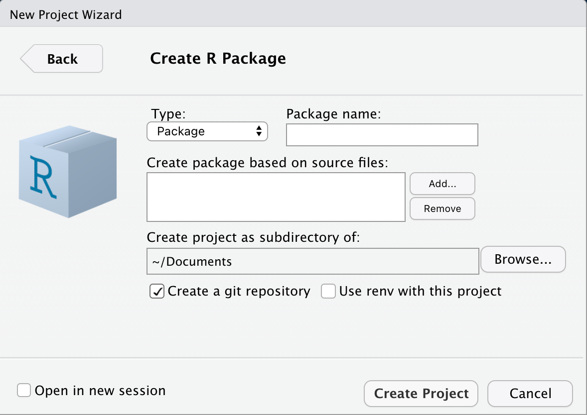

# (PART) Noch viel mehr möglich {-} 

# Pakete {#packages}


Bei einem Paket handelt es sich um

> eine strukturierte, standardisierte Einheit, welche aus R Code, Dokumentation,  Daten und (möglicherweise) externem Quellcode besteht.

Wie man ein Paket installiert und lädt, ist uns mittlerweile bekannt. Jetzt wollen wir eigene Pakete erstellen.


Gute Gründe für die Verwendung von Paketen:

- dynamisches Laden und Entladen des Pakets (Speicherplatz
sparend)
- einfache Installation und Update von lokalen Datenträgern oder über
das Web, innerhalb von R oder über die Kommandozeile des
Betriebssystems

- Validierung: R bietet Befehle zur groben Überprüfung von Code,
Dokumentation und Installierbarkeit, sowie, falls man möchte,
Überprüfung von Berechnungsergebnissen.

- einfache Verteilung der Software an Dritte; Beispieldatensätze können auch ins Paket!

## Struktur

Ein Paket besteht aus einigen Standard–Dateien und Verzeichnissen:

- `DESCRIPTION`: Informationen über das Paket (Autor,
Lizenz, Titel, Abhängigkeiten, ...)
- `R/`: R Code in `.R` Dateien
- `man/`: Dokumentationen (im `*.Rd` Format) der einzelnen Funktionen
- `NAMESPACE`: Information über die zu "exportierenden" Funktionen
- `data/`: Datenbeispiele
- `src/`: kompilierter C, C++ oder Fortran Code
- `tests/`: Testroutinen zur Validierung des Pakets


Bei der Erzeugung der Struktur (wie auch weiteren Schritten bei der Entwicklung) sollte man so viel wie möglich automatisieren. Wir verwenden dazu die von Hadley Wickham bereitgestellten Werkzeuge.

Falls noch nicht geschehen, sollte man


```r
install.packages(c("devtools", "roxygen2", "testthat"))
```
ausführen. Diese Pakete erleichtern in Kombination mit RStudio das Erstellen von Paketen. 

## C Compiler

Um alle Möglichkeiten bei der Erstellung von R-Paketen ausnützen zu können, brauchst du außerdem einen Compiler und noch ein paar andere Werkzeuge. Dies ist aber vermutlich erst dann wirklich nötig, wenn du Pakete bauen willst, die C- oder C++-Code enthalten (nicht Teil des Kurses). RStudio sollte dich auch warnen und dir Unterstützung anbieten, sobald du versuchen solltest, etwas zu tun, das die Einrichtung einer Entwicklungsumgebung erfordert. 


Mit `has_devel()` kannst du aber bereits auch jetzt mal überprüfen ob dein System vielleicht schon bereit ist


```r
library(devtools)
```


```r
has_devel()
## Your system is ready to build packages!
```

Dies scheint bei mir der Fall zu sein.

## R Code

Das Verzeichnis `R/` ist der wichtigste Bestandteil eines Pakets, da dort der komplette R Code liegt. 
Dieses Verzeichnis (wie auch andere Teile) erzeugt man mit der Funktion `devtools::create()`, z.B.


```r
create("Pfad_zum_Paket/Paketname")
```

Dieser Befehl erzeugt das Verzeichnis `Pfad_zum_Paket/Paketname`, welches 

1. eine RStudio Projektdatei, `Paketname.Rproj`
2. ein `R/` Verzeichnis
3. eine `DESCRIPTION` Datei
4. eine `NAMESPACE` Datei

enthält. Allen R Code, der im Paket enthalten sein soll, kopiert man anschließend in das Verzeichnis `Pfad_zum_Paket/Paketname/R`.


Innerhalb eines Pakets ist es nun einfach den kompletten R Code (nach Änderungen) neu zu laden.

- `devtools::load_all()` lädt allen R Code neu. In RStudio auch über **Strg + Shift + L** möglich.
- In RStudio kann man mit **Strg + Shift + B** das Paket installieren, R neu starten und anschließend das Paket über `library()` neu laden.

Dadurch ergibt sich der folgende Arbeitsablauf

1. R Dateien im Editor bearbeiten
2. Strg + Shift + L (oder Strg + Shift + B) ausführen
3. Code in der Konsole überprüfen
4. Das Ganze (falls nötig) wiederholen


## Verschiedene Typen

Man unterscheidet fünf verschiedene Typen: *source, bundled, binary, installed* und *in memory*.

- **source**: Die source Version eines Pakets besteht aus dem Verzeichnis `Paketname`

- **bundled**: Komprimiert man das Verzeichnis in eine `.tar.gz` Datei so spricht man von einem "gebündelten" Paket. Dieser Typ stellt eher einen Zwischenschritt dar. Mit `devtools::build()` kann aber eine solche Version erzeugt werden. Weitere Unterschiede zu einer source Version sind für uns erst mal nicht von Interesse.


- **binary**: Ein gebündeltes Paket kann von anderen R Nutzern nur installiert werden, wenn sie selbst über die entsprechenden "Werkzeuge" (Rtools, ...) verfügen. Binary Pakete bestehen auch nur aus einer Datei, können aber von anderen R Nutzern auch ohne weitere "Werkzeuge" installiert werden. Allerdings sind binary Pakete plattformspezifisch. Ein Windows binary Paket kann also z.B. nicht auf einem Mac installiert werden. Erzeugt wird eine binary Version z.B. mit `devtools::build(binary = TRUE)`.


- **installed**: Ein installiertes Paket ist ein in eine R Library entpacktes binary Paket. Zu diesem Zustand kann man über mehrere Wege gelangen, z.B.
    + `install.packages()`: CRAN binary -> installed
    + `install.packages(type = source)`: CRAN source -> bundled -> installed 
    + `install()`: source -> installed
    
Mit `devtools::install_github()` können source Pakete aus eine [GitHub](https://github.com/) Projekt installiert werden.

- **in memory**: Um mit einem Paket zu arbeiten muss es in den Speicher geladen werden. Dies geschieht mit `library()` (installierte Pakete) oder `load_all()` (beim Entwickeln von Paketen).    


## DESCRIPTION

Die DESCRIPTION Datei enthält Informationen über das Paket und ist ein essentieller Bestandteil jedes Pakets. Der Befehl


```r
usethis::create_package("meinR4EWSpckg")
```
erzeugt die DESCRIPTION Datei


```{}
Package: meinR4EWSpckg
Type: Package
Title: What the Package Does (Title Case)
Version: 0.1.0
Author: Who wrote it
Maintainer: The package maintainer <yourself@somewhere.net>
Description: More about what it does (maybe more than one line)
    Use four spaces when indenting paragraphs within the Description.
License: What license is it under?
Encoding: UTF-8
LazyData: true
```

im Ordner `meinR4EWSpckg`.


Die wichtigsten Felder einer DESCRIPTION Datei sind dadurch vorhanden (und müssen gefüllt werden). Über die Punkte `Imports` und `Suggests` (nicht automatisch vorhanden) kann festgelegt werden welche anderen R Pakete zwingend notwendig bzw. hilfreich sind für das eigene Paket.

Pakete in `Imports` werden beim Installieren des eigenen Pakets ebenfalls installiert, falls diese noch nicht vorhanden sind. Pakete in `Suggests` werden nicht automatisch installiert. 

Über


```r
usethis::use_package("dplyr")
```
kann z.B. das Paket `dplyr` dem Punkt `Imports` hinzugefügt werden. `usethis::use_package(type = "Suggests")` fügt `Suggests` weitere Pakete hinzu.

### Name, Titel, Beschreibung

Der Name (`Package`) eines Pakets darf Buchstaben, Zahlen und `.` enthalten und sollte mit dem Verzeichnisname übereinstimmen.

`Title` und `Description` sollten beschreiben was das Paket genau macht. `Description` ist dabei deutlich ausführlicher und enthält daher i.d.R. mehrere Zeilen. Nach einem Zeilenumbruch sollte 4 Leerzeichen eingerückt werden. Ein Beispiel wäre


```{}
Title: An implementation of the Grammar of Graphics
Description: An implementation of the grammar of graphics in R. 
    It combines the advantages of both base and lattice graphics: 
    conditioning and shared axes are handled automatically, and 
    you can still build up a plot step by step from multiple data 
    sources. It also implements a sophisticated multidimensional 
    conditioning system and a consistent interface to map data 
    to aesthetic attributes. See the ggplot2 website for more 
    information, documentation and examples.
```


### Autoren

Über das Feld `Authors@R` können die Autoren des Pakets angegeben werden. An dieser Stelle kann
in der DESCRIPTION Datei R Code verwendet werden um die nötigen Informationen

* `given, family`: Vor- und Nachname
* `email`: E-Mailadresse
* `role`: Rolle der Person. Wichtige Beispiele sind
    + `cre`: Ersteller oder Maintainer
    + `aut`: hat wichtige Beiträge zum Paket erbracht
    + `ctb`: hat kleinere Beiträge zum Paket erbracht

Mit der Funktion `person()` können diese Informationen nun angegeben werden
```{}
Authors@R: person(given = "Stephan", family = "Haug", 
                  email = "haug@tum.de", 
                  role = c("cre", "aut"))
```

Der Output von `person()` sieht dann folgendermaßen aus


```r
person(given = "Stephan", family = "Haug", 
                  email = "haug@tum.de", 
                  role = c("cre", "aut"))
## [1] "Stephan Haug <haug@tum.de> [cre, aut]"
```


### Version

`devtools::create()` legt die Default-Version auf `0.1.0` fest. Generell sollte die Versionsnummer aber aus drei Teilen bestehen und die Form `x.y.z` haben, wobei `x` die Nummer für größere Updates, `y` die Nummer für kleinere Updates und `z` die Nummer für Korrekturen ist. 

Die aktuelle Version von `ggplot2` ist z.B.


```r
packageVersion("ggplot2")
## [1] '3.3.5'
```

Für Pakete, die sich in der Entwicklung befinden, bietet es sich an noch einen vierten Teil anzufügen und mit der Versionsnummer `0.0.0.9000` zu starten.

Nach diesen Anpassung könnte die DESCRIPTION Datei also so aussehen

```{}
Package: meinR4EWSpckg
Type: Package
Title: Paket zu R4ews, das ...
Version: 0.0.0.9000
Authors@R: person(given = "Stephan", family = "Haug", 
                  email = "haug@tum.de", 
                  role = c("cre", "aut"))
Description: Paket, das im Rahmen des R Projekts R4ews entstanden ist.
    Das Paket bietet ...
License: What license is it under?
Encoding: UTF-8
LazyData: true
Imports: 
    dplyr
```


> Der Punkt Lizenz ist für erstmal nachgeordnet. Wer aber mehr über die Wahl einer passenden Lizenz erfahren möchte, den verweisen wir gerene auf das Kapitel [Licensing](https://r-pkgs.org/license.html) in [R packages](https://r-pkgs.org).


## Pakete: Dokumentation  

Ein wichtiger Teil eines Pakets ist die ausreichende Dokumentation (wichtiger) Funktionen. Dokumentationen werden als `.Rd` (LaTeX ähnliches Format) Dateien im Verzeichnis `man/` abgelegt. Das Paket `roxygen2` bietet eine komfortable Möglichkeit aus Funktionskommentaren (in einem speziellen Format) eine `.Rd` Datei zu erzeugen.

*Ablauf:*

1. roxygen Kommentare in die `.R` Datei einfügen
2. `devtools::document()` ausführen um Kommentare in `.Rd` Datei zu konvertieren
3. Dokumentation mit `?` betrachten
4. gegebenenfalls alles wiederholen

roxygen Kommentare beginnen mit `#'`.


Wir fügen eine Datei `add_2.R` mit Inhalt 

```{}
#' Addiere zwei Zahlen
#' 
#' @param x Eine Zahl.
#' @param y Eine Zahl.
#' @return Die Summe von \code{x} und \code{y}.
#' @examples
#' add_2(1, 1)
#' add_2(10, 1)
add_2 <- function(x, y) {
  x + y
}
```
dem Verzeichnis `meinR4EWSpckg/R` hinzu.


Der Befehl `devtools::document()` (ausgeführt im Verzeichnis `meinR4EWSpckg` - source Paket) erzeugt dann die Datei `meinR4EWSpckg/man/add_2.Rd`


```{}
% Generated by roxygen2 (4.0.2): do not edit by hand
\name{add_2}
\alias{add_2}
\title{Addiere zwei Zahlen}
\usage{
add_2(x, y)
}
\arguments{
\item{x}{Eine Zahl.}

\item{y}{Eine Zahl.}
}
\value{
Die Summe von \code{x} und \code{y}.
}
\description{
Addiere zwei Zahlen
}
\examples{
add_2(1, 1)
add_2(10, 1)
}

```


Alle roxygen Kommentare beginnen mit `#'` und sind unterteilt in verschiedene Tags der Form `@name_tag beschreibung`. Vor dem ersten Tag kommen allerdings

* Titel: erste Zeile des Kommentars
* Beschreibung der Funktion: zweiter Abschnitt des Kommentars (länger als Titel)
* Details zur Funktion: dritter Abschnitt des Kommentars (länger als die Beschreibung) - optional

In unserem Beispiel wurde der Titel auch gleich als Beschreibung (da nicht explizit angegeben) verwendet.

Die drei wichtigsten Tags zum Kommentieren einer Funktion sind: `@param, @examples` und `@return`. 
Weitere Tags sind im Abschnitt [Documenting functions](http://r-pkgs.had.co.nz/man.html#man-functions) des Buchs [R packages](https://r-pkgs.org) beschrieben.


Mit den Befehlen `\emph{}, \strong{}`, `\code{}` und `\pkg{}` (Paketname) kann der Text formatiert werden. 

Ebenso können Links zu anderen Dokumentationen

* `\code{\link{function}}`: Funktion `function` im eigenen Paket
* `\code{\link[devtools]{load_all}}`: Funktionen aus anderen Paketen, hier `devtools::load_all`

oder dem Netz

* `\url{http://rstudio.com}`
* `\href{http://rstudio.com}{RStudio}`
* `\email{haug@@tum.de}` (`@@` ist nötig, da `@` für die Tags reserviert ist)


Weitere Möglichkeiten der Formatierung findest du im Abschnitt [Text formatting](http://r-pkgs.had.co.nz/man.html#text-formatting) des Buch [R packages](https://r-pkgs.org).


## NAMESPACE

Es ist nicht nur für das Erstellen von Paketen hilfreich das Konzept eines `NAMESPACE` verstanden zu haben, sondern auch für das generelle Arbeiten mit R. Man unterscheidet dabei **Import** `NAMESPACES` und **Export** `NAMESPACES`. 

**Import** legt dabei fest wie die Funktion eines Pakets eine Funktion in einem anderen Paket findet. Betrachten wir z.B.


```r
nrow
## function (x) 
## dim(x)[1L]
## <bytecode: 0x7f8b7fedb6c8>
## <environment: namespace:base>
```
Diese Funktion ist definiert in Abhängigkeit von `dim()` aus dem `base` Paket.


Auch wenn wir die Funktion

```r
dim <- function(x) c(1,1)
dim(mtcars)
## [1] 1 1
```

definieren, findet `nrow()` trotzdem die "richtige" Funktion

```r
nrow(mtcars)
## [1] 32
```
da sie den `NAMESPACE` des `base` Pakets verwendet.


**Export** legt fest welche Funktionen eines Pakets außerhalb des Pakets zur Verfügung stehen sollen. Dies müssen/sollten nicht alle Funktionen sein. Ein Paket kann also interne Funktionen haben, die nur intern verwendet werden können.

Über den Operator `::` wird explizit auf den NAMESPACE eines Pakets zugegriffen. Auf diese Art und Weise vermeidet man auch Konflikte zwischen Funktionen aus verschiedenen Paketen, die aber den gleichem Namen haben. In einem solchen Fall kommt es darauf an welches Paket zuletzt geladen wurde. Dieses findet man dann zuerst im Suchpfad


```r
search()
##  [1] ".GlobalEnv"        "package:devtools"  "package:usethis"  
##  [4] "package:stats"     "package:graphics"  "package:grDevices"
##  [7] "package:utils"     "package:datasets"  "package:methods"  
## [10] "Autoloads"         "package:base"
```


In der `NAMESPACE` Datei beschreiben

* `export()`: exportiert Funktionen
* `exportPattern()`: exportiert alle Funktionen, die zu einem bestimmten Schema passen
* `S3method()`: exportiert `S3` Methoden

den Export und

* `import()`: importiert alle Funktionen aus einem Paket
* `importFrom()`: importiert eine bestimmte Funktion aus einem Paket
* `useDynLib()`: importiert eine Funktion aus C

den Import.


Export-Einträge in der `NAMESPACE` Datei können leicht über `roxygen` Kommentare erzeugt werden.
Über einen `@export` Tag wird angegeben welche Funktion exportiert werden soll

```{}
#' @export
export_function <- function(...){
  ... 
}
```

Je nach Objekttyp wird dann `export(), exportPattern()` oder `S3method()` im `NAMESPACE` verwendet. Generell sollte man sich an die Regel halten lieber weniger als mehr Funktionen zu exportieren, wenn man das Paket an Dritte weitergeben will.


Beim Importieren sollte man noch restriktiver sein. Man sollte über `Imports` in der `DESCRIPTION` Datei sicherstellen, dass alle notwendigen Pakete installiert und geladen sind. Danach kann einfach über den `::` Operator in eigenen Funktionen auf Funktionen aus anderen geladenen Paketen zugegriffen werden, also z.B. `pkg_name::funktion_aus_pkg_name()`.

Dies erhöht die spätere Lesbarkeit der eigenen Programme und vermeidet potentielle Konflikte, die beim Importieren mehrerer Pakete - die dann wieder Funktionen mit gleichem Namen besitzen - auftreten können.

Muss eine Funktion häufig verwendet werden - und man will nicht dauernd `::` verwenden - so sollte man über `importFrom()` eher nur die Funktion und nicht das ganze Paket importieren.


## Daten einbinden

Daten, die das Paket enthalten sollte, legt man im Verzeichnis `/data` ab. Als Format sollte man `.rda` wählen (ist aber kein Muss). Der einfachste Weg dies zu berücksichtigen ist die Funktion `usethis::use_data()` zu verwenden.


```r
x <- sample(1:100, 50, replace = TRUE)
usethis::use_data(x, mtcars)
```

Dieser Befehl speichert die Objekte `x` und `mtcars` in den Dateien `data/x.rda` und `data/mtcars.rda` ab. Der Dateiname stimmt also mit dem Objektnamen überein.


Datensätze sollten auf jeden Fall dokumentiert werden. Dazu fügt man einfach in eine der `.R` Dateien im Verzeichnis `/R` einen weiteren `roxygen2` Absatz ein. Für das Dokumentieren von Datensätzen stehen zwei weitere Tags bereit. Über `@format` beschreibt man das genaue Format der Daten, z.B. die einzelnen Spalten eines Data Frames, und mit `@source` gibt man (falls vorhanden) die Datenquelle an. 

Die Beschreibung des Datensatzes `x` könnte also z.B. so aussehen

```{}
#' Mein Datensatz
#' 
#' Ein Datensatz bestehend aus 50 Zahlen gezogen aus den 
#' Zahlen 1 bis 100 mit Zuruecklegen
#' 
#' @format Ein Integer Vektor der Laenge 50
"x"
```

## C++ (Special Topic)

Will man in seinem Paket R Funktionen verwenden, die mithilfe von `Rcpp` aus kompiliertem C++ Code entstanden sind, so sollte man zur Vorbereitung


```r
usethis::use_rcpp()
```
ausführen. Danach ist das das Verzeichnis `/src` angelegt und `Rcpp` zu den Feldern `LinkingTo` und `Imports` in der `DESCRIPTION` Datei hinzugefügt. Außerdem wird man aufgefordert die roxygen Tags

```{}
#' @useDynLib meinR4EWSpckg
#' @importFrom Rcpp sourceCpp
```

in eine der `.R` Dateien einzufügen.


Ebenso wie in die `.R` Dateien kann auch in die `.cpp` Dateien die roxygen Dokumentation eingefügt werden. Allerdings verwendet man `//'` statt `#'`.

```{}
#include <Rcpp.h>
using namespace Rcpp;

//' Multipliziere eine Zahl mit 2
//' 
//' @param x Ein Integer.
//' @export
// [[Rcpp::export]]
int malZwei(int x) {
   return x * 2;
}
```

## Git und GitHub/GitLab

Benutze für jedes deiner Pakete (mag es auch noch so klein sein) Git. Beim Anlegen des Projekts (zur Erstellung des Pakets) über RStudio, kann leicht ein lokales Git repository initialisiert werden



Soll zusätzlich ein remote repository verwendet werden, so kann man (im Standardfall) ein neues repository auf GitLab (oder GitHub) anlegen. Es sollte den gleichen Namen bekommen wie das Paket (lokales Git repository). Danach kannst du im Terminal Befehle der Form

```{}
git remote add origin https://gitlab.lrz.de/vw99xyz/paketName.git
git push -u origin master
```

ausführen. 


Angenommen es existiert bereits ein remote repository und das Paket soll dort "verwaltet" werden. Dann kannst du einfach dieses repository klonen

```{}
git clone https://gitlab.lrz.de/vw99xyz/paketName.git
```

Danach existiert im Verzeichnis, in dem der Befehl ausgeführt wurde, das Unterverzeichnis `paketName`. In R kannst du anschließend den Befehl


```r
devtools::create("paketName")
```

ausführen (im Verzeichnis, welches das Git repository `paketName` enthält). Danach kannst du die Änderungen speichern über einen commit Befehl

```{}
git add -A
git commit -m "paket struktur angelegt"
```

und pushen

```{}
git push
```


## Literatur

Diese Folien haben einen kleinen Einblick in das Erstellen eigener Pakete gegeben. Allerdings wurden viele weitere Aspekte nicht angesprochen. Weitere Informationen zu R Paketen findet man z.B. im Buch [R packages](http://r-pkgs.had.co.nz/) von Hadley Wickham [-@wickham2015b]. 

