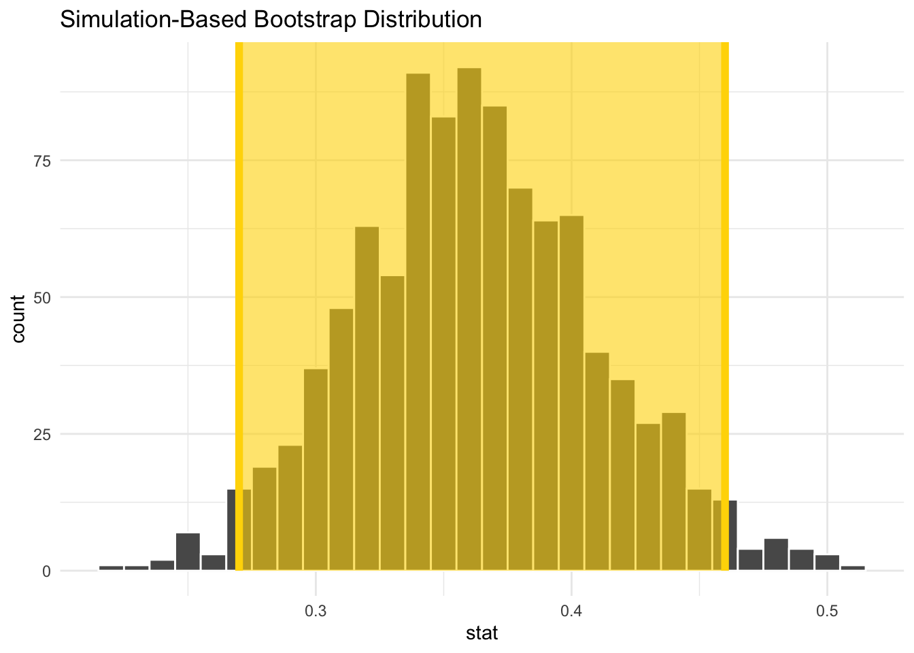

# (PART) Ein bisschen Statistik {-} 


# Sampling

Im Statistikteil der Veranstaltung gehen wir fast immer davon aus, dass eine Stichprobe aus 
einem __statistischen Modell__ vorliegt. Daher wollen wir hier ein bisschen darüber sprechen, was 
es heißt eine Stichprobe aus einer Grundgesamtheit/Population zu ziehen.


Wir betrachten dazu als Beispiel das Ziehen aus einer Urne, wobei die Kugeln in der Urne eben die Population darstellen, die uns interessiert. Da wir die Stichprobe digital erzeugen wollen, genauer gesagt mit R, müssen wir uns nach einer digitalen Urne umschauen.

Eine solche findet man im Paket `moderndive`. Die Autoren des Pakets haben auch gemeinsam das Buch [Statistical Inference via Data Science] [@ismay_kim2019] geschrieben. Das Buch ist Grundlagen für diesen Abschnitt. Wer am Ende also noch mehr zu diesem Thema lesen will, sei an das Buch verwiesen.

Nun aber zurück zur digitalen Urne


```r
library(moderndive)
bowl
```

```
## # A tibble: 2,400 × 2
##    ball_ID color
##      <int> <chr>
##  1       1 white
##  2       2 white
##  3       3 white
##  4       4 red  
##  5       5 white
##  6       6 white
##  7       7 red  
##  8       8 white
##  9       9 red  
## 10      10 white
## # … with 2,390 more rows
```

Nach einem ersten Blick auf die Urne, entstehen eine Reihe von Fragen


> 1. Wie viele Farben gibt es in der Urne?


```r
unique(bowl$color)
```

```
## [1] "white" "red"
```

> 2. Wie hoch ist der Anteil roter Kugeln?

Da es sich um eine digitale Urne handelt, ist das Zählen schnell geschehen und daher kein Problem für uns. Wir können also leicht eine __Vollerhebung__ der Population durchführen. Den Anteil roter Kugeln berechnen wir mithilfe der Funktion `summarise()` (wir fassen den Inhalt der Urne zusammen, indem wir dir relative Häufigkeit roter Kugeln berechnen). Daher laden wir zunächst `tidyverse`


```r
library(tidyverse)
```

und berechnen anschließend den Anteil


```r
(n <- nrow(bowl))
```

```
## [1] 2400
```

```r
bowl %>%
  summarise(prop = sum(color == "red") / n)
```

```
## # A tibble: 1 × 1
##    prop
##   <dbl>
## 1 0.375
```


In Realität würde aber wohl niemand gerne alle 2400 Kugeln bzgl. ihrer Farbe überprüfen. Daher ist vermutlich nur eine _Stichprobe_ eine realistische Option. Mithilfe dieser Stichprobe wollen wir aber weiterhin eine sinnvolle Antwort auf die 
Frage

> 2. Wie hoch ist der Anteil roter Kugeln?

geben. 


Daher ist es nötig, dass wir den Anteil als Parameter eines  __statistisches (Produkt-)Modell__ definieren und die Stichprobe dann als Stichprobe aus diesem Modell betrachten. Ein geeignetes statistischen Modell wäre


$$ (\{0,1\}^n, \mathcal{P}(\{0,1\})^n, Binomial(1,\theta)^{\otimes n}_{\theta\in(0,1)})$$


Nun ziehen wir eine Stichprobe. Allerdings machen wir das gleich für verschiedene Stichprobenlängen  $n\in\{25, 50, 100\}$, um etwas den Einfluss der Stichprobenlänge analysieren zu können. Für jede der drei Stichproben berechnen wir anschließend die relative Häufigkeit roter Kugeln. Zum Ziehen der Stichprobe verwenden wir die Funktion `infer::rep_sample_n()`. Es ist nicht unbedingt nötig hier ein weiteres Paket zu laden, aber das `infer` Paket ist an dieser Stelle (auch noch später) sehr hilfreich und die enthaltenen Funktionen sind intutiv in der Handhabung.


```r
library(infer)
bowl %>%
  rep_sample_n(size = 25) %>%
  summarise(prop = sum(color == "red") / 25)
```

```
## # A tibble: 1 × 2
##   replicate  prop
##       <int> <dbl>
## 1         1  0.64
```

```r
bowl %>%
  rep_sample_n(size = 50) %>%
  summarise(prop = sum(color == "red") / 50)
```

```
## # A tibble: 1 × 2
##   replicate  prop
##       <int> <dbl>
## 1         1   0.4
```

```r
bowl %>%
  rep_sample_n(size = 100) %>%
  summarise(prop = sum(color == "red") / 100)
```

```
## # A tibble: 1 × 2
##   replicate  prop
##       <int> <dbl>
## 1         1  0.36
```


Wir erkennen, dass alle drei Werte unterschiedlich zum wahren Wert sind. In der Praxis würden wir den wahren Wert nicht kennen. Daher überlegen wir weiter, wie wir die Qualität der berechneten Anteilswerte (unsere Schätzwerte) bewerten/einschätzen können.

Eine Frage die wir uns diesbzgl. stellen sollten ist:

::: {.content-box-gray}
Wie stark streut der berechnete Schätzwert um das Zentrum (idealerweise der unbekannte Anteil $\theta$) der Verteilung des Schätzers?
::: 


Wenn wir in der Lage wären, dass wir nicht nur einen Schätzwert berechnen können, sondern _viele_, so könnten wir einfach die empirische Standardabweichung als Streuungsmaß berechnen. In der Realität ist das i.d.R. nicht möglich, da mit Kosten und/oder Zeit verbunden.

Aber da wir ja nur am Computer unsere Stichproben erheben, ist es für uns kein Problem 1000 Stichproben der Länge $n\in\{25, 50, 100\}$ zu ziehen.


```r
stp_25 <- bowl %>%
  rep_sample_n(size = 25, reps = 1000) 

stp_50 <- bowl %>%
  rep_sample_n(size = 50, reps = 1000) 

stp_100<- bowl %>%
  rep_sample_n(size = 100, reps = 1000) 
```

Nun sind wir in der Lage für jede der 1000 Stichproben den  empirischen Schätzwert


$$\hat \theta = \overline x_n = \frac{1}{n}\sum_{i=1}^n x_i,$$

mit $x_i =\begin{cases} 1, \text{Kugel ist rot}\\0, \text{sonst}\end{cases}$, zu berechnen. Anschließend können in jedem der drei Fälle (unterschiedleich Stichprobenlänge) die empirische Standardabweichung der 1000 berechneten Schätzwerte
berechnen


```r
stp_25 %>%
  summarise(prop = sum(color == "red") / 25) %>%
  summarise(sd_prop = sd(prop))
```

```
## # A tibble: 1 × 1
##   sd_prop
##     <dbl>
## 1  0.0964
```

```r
stp_50 %>%
  summarise(prop = sum(color == "red") / 50) %>%
  summarise(sd_prop = sd(prop))
```

```
## # A tibble: 1 × 1
##   sd_prop
##     <dbl>
## 1  0.0674
```

```r
stp_100 %>%
  summarise(prop = sum(color == "red") / 100) %>%
  summarise(sd_prop = sd(prop))
```

```
## # A tibble: 1 × 1
##   sd_prop
##     <dbl>
## 1  0.0487
```


sowie ein Histogramm von $\overline x_n^1, \dots, \overline x_n^{1000}$


```r
stp_25 %>%
  summarise(prop = sum(color == "red") / 25) %>%
  ggplot(aes(x = prop)) + 
  geom_histogram(binwidth = 0.05, color = "white") +
  xlim(0.01, 0.8) +
  geom_vline(xintercept = 0.375, color = "red",
             size = 2)

  
stp_50 %>%
  summarise(prop = sum(color == "red") / 50) %>%
  ggplot(aes(x = prop)) + 
  geom_histogram(binwidth = 0.05, color = "white")+
  xlim(0.01, 0.8) +
  geom_vline(xintercept = 0.375, color = "red",
             size = 2)


stp_100 %>%
  summarise(prop = sum(color == "red") / 100) %>%
  ggplot(aes(x = prop)) + 
  geom_histogram(binwidth = 0.05, color = "white")+
  xlim(0.01, 0.8) +
  geom_vline(xintercept = 0.375, color = "red",
             size = 2)
```


Wir erkennen eine Reduktion der Streuung mit wachsendem Stichproben Umfang. Zudem sehen wir, dass wir die empirischen Verteilung symmetrisch um den wahren Parameter 0.375 verteilt sind, wobei die Verteilung umso konzentrierter ist, je hoher der Stichprobenumfang ist. 

Diese empirischen Verteilungen sind eine Annährung an die Verteilung des Schätzers

$$\overline X_n = \frac{1}{n} \sum_{i=1}^n X_i\,,$$

wobei $X_1,\dots, X_n$ eine Stichprobe aus unserem statistischen Modell

$$ (\{0,1\}^n, \mathcal{P}(\{0,1\})^n, Binomial(1,\theta)^{\otimes n}_{\theta\in(0,1)})$$

ist.


> Wie gesagt, in Realität werden wir i.d.R. nicht in der Lage sein  mehr als eine Stichprobe zu erheben. Trotzdem würden wir gerne etwas über die Verteilung unseres Schätzers (hier $\overline X_n$) aussagen. Wir müssen uns also andere Strategien überlegen.


Um weiterführende statistische Methoden anwenden zu können, braucht man (fast immer) eine exakte oder zumindest approximative Verteilung der Statistik (hier $\overline X_n$), für die man sich interessiert.


::: {.content-box-black}
Beispielsweise könnten wir daran interessiert sein, nicht nur einen Schätzwert für die
unbekannte Wahrscheinlichkeit $\theta$ zu bekommen. Schließlich wäre es deutlich informativer ein Intervall zu haben, welches $\theta$ __mit hoher Wahrscheinlichkeit überdeckt__ und dabei möglichst kurz ist.


Dazu benötigen wir aber sicherlich die Verteilung - wir wollen ja eine Aussage mit hoher Wahrscheinlichkeit machen - der Statistik, die wir zur Berechnung des Schätzwerts verwendet haben.
:::


In der Vorlesung werden wir uns mit Statistik beschäftigen, deren exakte Verteilung wir bestimmen können. In den nächsten zwei Abschnitten werden wir approximative Verteilungen betrachten. Zunächst in einem theoretischen Ansatz basierend auf dem zentralen Grenzwertsatz und anschließend über ein computerintensives Verfahren.


## Approximative Verteilung

> Was wissen wir über die Verteilung von $\overline X_n$?

Wir wissen auf jeden Fall, dass die Summe der $X_i$ binomialverteilt ist, d.h. es gilt

$$S_n =\sum_{i=1}^n X_i \sim Binomial(n, \theta)\,.$$
Mit dieser exakten Verteilung könnten wir arbeiten und würden bei unserem Testproblem dann zum exakten Binomaltest (siehe Kapitel 7 im EWS Skript) kommen.


Wir wissen aber zudem noch etwas über Verteilung von $S_n =\sum_{i=1}^n X_i$ bzw.

$$\frac{S_n - n\theta}{\sqrt{\theta(1-\theta)n }}$$

für große $n$. Hier sagt uns der Zentrale Grenzwertsatz, dass


$$P\left(\frac{S_n - n\theta}{\sqrt{\theta(1-\theta)n }} \leq x\right) \approx \Phi(x)$$
wobei $\Phi$ die Verteilungsfunktion der N(0,1) Verteilung bezeichnet.


Für $\overline X_n$ ergibt sich daraus folgende approximative Verteilung

$$P\left(n \frac{\overline X_n - \theta}{\sqrt{\theta(1-\theta)n }} \leq x\right)  = P\left(\frac{\overline X_n - \theta}{\sqrt{\frac{\theta(1-\theta)}{n} }} \leq x\right) \approx \Phi(x)$$

$$P\left(\overline X_n  \leq x\right) \approx \Phi_{\widehat \theta,\frac{\widehat \theta(1-\widehat \theta)}{n}}(x)$$

Für die Stichprobenlänge 100 versuchen wir diesen Zusammenhang mal noch zu visualisieren


```r
sample <- stp_100 %>%
  summarise(prop = sum(color == "red") / 100) 
theta_hat <- mean(sample$prop)


stp_100 %>%
  summarise(prop = sum(color == "red") / 100) %>%
  ggplot() + 
  geom_histogram(aes(x = prop, y = ..density..), binwidth = 0.05, color = "white") +
  xlim(0.01, 0.8) +
  stat_function(fun = "dnorm", 
                args = list(mean = theta_hat, 
                            sd = sqrt(theta_hat * (1-theta_hat) / 100)),
                colour = "blue", size = 1.3) +
  theme_minimal()
```

```
## Warning: Removed 2 rows containing missing values (geom_bar).
```


Wir erkennen eine rechte gute Übereinstimmung zwischen der __Sampling Verteilung__ und der approximativen Normalverteilung.


## Resampling

Nun wollen wir die Verteilung der Statistik (immer noch das empirische Mittel $\overline X_n$) über ein resampling Verfahren approximieren. Dabei ist es allerdings nicht entscheidend, dass es sich bei der betrachteten Statistik um das empirische Mittel handelt. Das Verfahren funktioniert auch für weitere Statistik.


Wir starten mit __einer__ Stichprobe der Länge 100


```r
set.seed(123) # zur reproduzierbarkeit
x <- bowl %>%
  rep_sample_n(size = 100) 
```


Unser Ziel ist es nun, basierend auf diesen 100 Beobachtungen, die Verteilung von $\overline X_n$ zu approximieren. Dazu benötigen wir sicherlich mehrere berechnete Werte des empirischen Mittels. Natürlich könnten wir die ursprüngliche Stichprobe in 50 Paare zerlege und so 50 empirische Mittelwerte $\overline x_2^1,\dots,\overline x_2^{50}$ berechnen. Damit könnten wir dann aber nur die Verteilung von $\overline X_2$ approximieren und nicht von $\overline X_{100}$. D.h. wir wollen mehrere empirische Mittelwerte basierend auf 100 Inputwerten berechnen. 

Dieses Ziel werden wir nur erreichen, wenn wir die ursprünglichen 100 Werte $x_1,\dots, x_n$ in "schlauer" Form mehrfach nutzen. Wir stellen uns auf den Standpunkt, dass die 100 Werte Realisierungen von unabhängigen und identisch verteilten Zufallsvariablen sind (das ist auch die Annahme in unserem statistischen Modell). Unsere Stichprobe ist somit eine gute Approximation der Gesamtpopulation - auf jeden Fall die beste, die wir haben - und daher würde es Sinn machen wiederholt aus dieser Näherung zu ziehen und dabei die Aufteilung in rote und weiße Kugeln nicht zu verändern. Wir ziehen somit __mit Zurücklegen__ und erzeugen so $B$ Stichprobenwiederholungen

$$x_1^b,\dots,x_n^b,\qquad b = 1,\dots, B\,,$$
wobei $x_i^b\in\{x_1,\dots, x_n\}$. 


```r
B <- 1000
x_B <- x %>%
  rep_sample_n(size = 100, replace = TRUE, reps = B) 

x_B
```

```
## # A tibble: 100,000 × 3
## # Groups:   replicate [1,000]
##    replicate ball_ID color
##        <int>   <int> <chr>
##  1         1    2260 white
##  2         1     983 white
##  3         1    1599 white
##  4         1    2082 white
##  5         1     619 red  
##  6         1     665 white
##  7         1    1501 white
##  8         1    1029 white
##  9         1     316 white
## 10         1     165 white
## # … with 99,990 more rows
```


Für jede dieser $B$ Stichprobenwiederholungen berechnen wir nun das empirische Mittel


$$\overline x_n^b = \frac{1}{n}\sum_{i=1}^n x_i^b\,,\qquad b=1, \dots, B$$


```r
mean_x_B <- x_B %>%
  summarise(prop = mean(color == "red"))
mean_x_B
```

```
## # A tibble: 1,000 × 2
##    replicate  prop
##        <int> <dbl>
##  1         1  0.32
##  2         2  0.37
##  3         3  0.39
##  4         4  0.34
##  5         5  0.37
##  6         6  0.4 
##  7         7  0.37
##  8         8  0.32
##  9         9  0.31
## 10        10  0.31
## # … with 990 more rows
```


::: {.content-box-orange}
Das beschriebene Verfahren kennt man in der Literatur unter dem Namen [__Bootstrap-Verfahren__](https://de.wikipedia.org/wiki/Bootstrapping-Verfahren). Konkret handelt es sich hierbei um die einfachste Form, einen i.i.d. (_independent identically distributed_) Bootstrap. Die daraus resultierende Approximation der Verteilung der Statistik, nennt man __Bootstrap Verteilung__.

:::


```r
mean_x_B %>%
  ggplot(aes(x = prop)) + 
  geom_histogram(binwidth = 0.01, color = "white")
```


Wir erkennen erneut eine symmetrische Verteilung, die um den empirischen Mittelwert der Stichprobe $x$


```r
x %>%
  summarise(prop = mean(color == "red"))
```

```
## # A tibble: 1 × 2
##   replicate  prop
##       <int> <dbl>
## 1         1  0.36
```


konzentriert ist.


Um nun (leicht) ein Intervall anzugeben, dass die unbekannte Wahrscheinlichkeit $\theta$ überdeckt, nutzen wir erneut das `infer` Paket. 

Dazu erzeugen wir zunächst erneut die Bootstrap Verteilung und nutzen dazu die Funktionen

- `specify()`: definiert die interessante Variable im Datensatz
- `generate()`: definiert die Anzahl an Stichprobenwiederholungen und ihren Typ
- `calculate()`: definiert welche Statistik zu berechnen ist
- `visualise()`: visualisiert die Bootstrap Verteilung der in `calculate()` berechneten Statistik


```r
boot_vert <- x %>% 
  specify(response = color, success = "red") %>%
  generate(reps = 1000, type = "bootstrap") %>%
  calculate(stat = "prop") 

boot_vert %>%
  visualise()
```


Um nun beispielsweise ein Intervall zu konstruieren, welches die unbekannte Wahrscheinlichkeit $\theta$ näherungsweise mit einer Wahrscheinlichkeit von $0.95$ überdeckt, betrachten wir einfach die __mittleren 95%__, der berechneten empirischen Mittelwerte. Das entsprechende Intervall bezeichnen wir dann als approximatives 95% Konfidenzintervall für $\theta$ - mehr zu Konfidenzintervallen in Kapitel 6.8 der Vorlesung.


```r
boot_ki <- boot_vert %>%
  get_confidence_interval(level = 0.95, type = "percentile")

boot_ki
```

```
## # A tibble: 1 × 2
##   lower_ci upper_ci
##      <dbl>    <dbl>
## 1     0.27     0.45
```


Das Intervall können wir dann noch zusammen mit der Bootstrap Verteilung visualisieren


```r
visualise(boot_vert, fill = "red") +
  shade_confidence_interval(endpoints = boot_ki, color = "gold", fill = "gold") + 
  theme_minimal()
```




__Literatur:__

Wer mehr über Bootstrap Verfahren lernen will, kann einen Blick in die Bücher  [@ismay_kim2019] (Web-Version: [Statistical Inference via Data Science] [@ismay_kim2019]), [@davison_hinkley1997] oder [@dikta_scheer2021].

