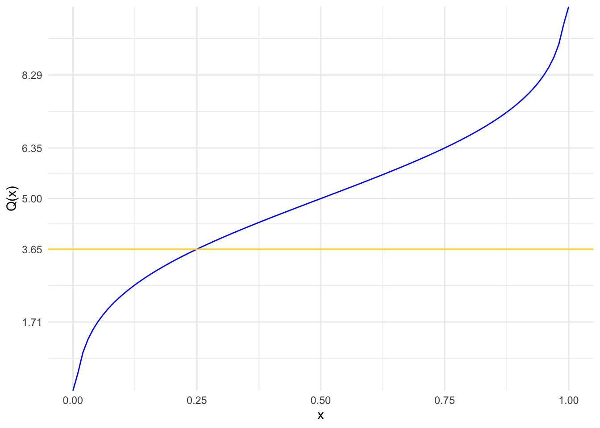
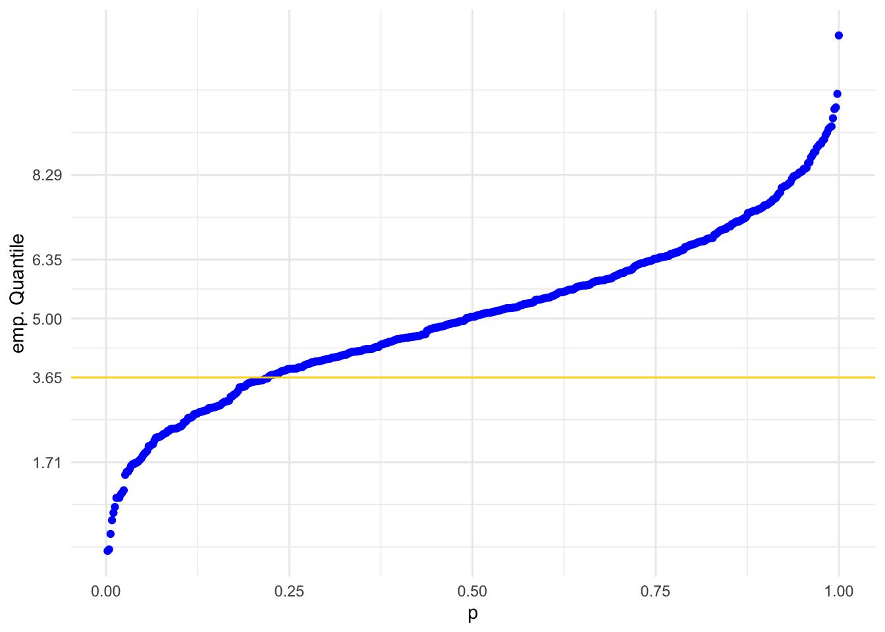
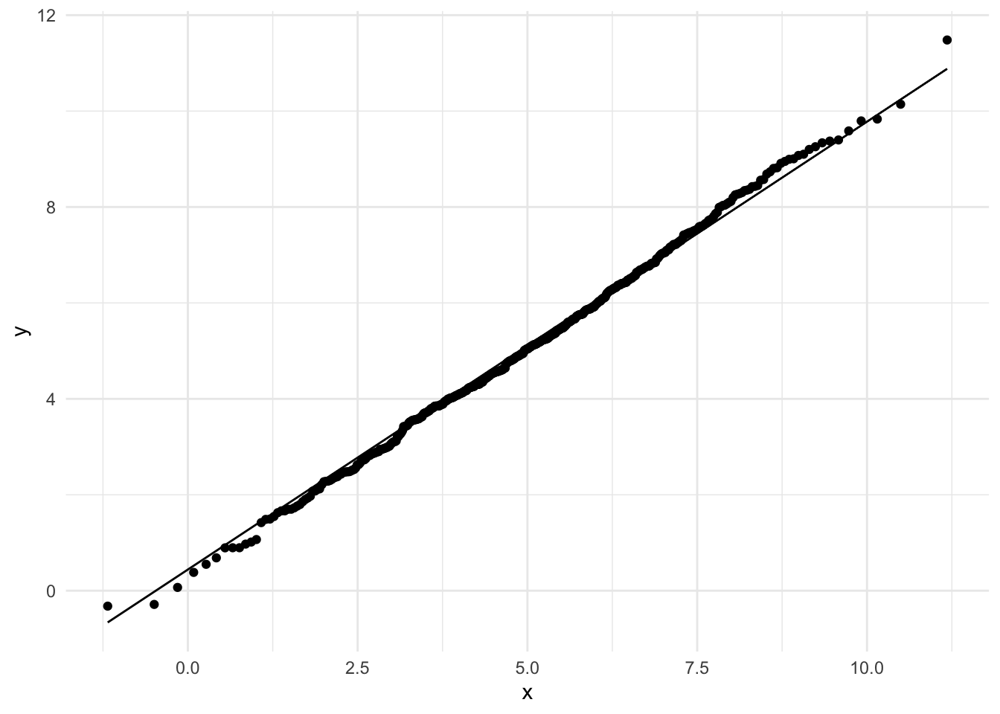

# Fragen aus der Übung {#fragen}


::: {.content-box-yellow}
1. Wie sieht die Quantilsfunktion einer Normalverteilung aus und was genau ist ein QQ Plot?
:::

Als Beispiel betrachten wir die Quantilsfunktion

$$Q: (0,1) \to \mathbb{R}, y \mapsto \text{inf}\{x\in \mathbb{R}: F(x)\geq y\}$$

der $N(5,4)$ Verteilung. Diese Funktion können wir mit `qnorm()` berechnen und mithilfe von `stat_function()`  plotten


```r
library(tidyverse)
ggplot(data.frame(x=c(0,1)), aes(x)) +
  stat_function(fun = "qnorm", args = list(mean = 5, sd = 2),
                colour = "blue") + ylab("Q(x)") +
  geom_hline(yintercept = qnorm(0.25, mean = 5, sd = 2), 
             colour = "gold") +
  scale_y_continuous(breaks = round(
    qnorm(c(0.05, 0.25, 0.5, 0.75, 0.95), mean = 5, sd = 2), 2)) +
  theme_minimal()
```




Der Grafik können wir nun z.B. entnehmen, dass das 0.25 Quantil $q_{0.25}$ der $N(5,4)$ ungefähr den Wert 3.65 hat. Der genaue Wert lautet


```r
(q_025 <- qnorm(0.25, mean = 5, sd = 2))
```

```
## [1] 3.65102
```


$q_{0.25}$ ist also der Wert, sodass die Wahrscheinlichkeit Werte kleiner oder gleich $q_{0.25}$ anzunehmen

$$P(X \leq q_{0.25})\,,$$ 
mit $X\sim N(5,4)$, gleich 0.25 ist, wie man hier sieht


```r
pnorm(q_025, mean = 5, sd = 2)
```

```
## [1] 0.25
```


Nun erzeugen wir 500 Pseudo-Zufallszahlen gemäß der $N(5,4)$ Verteilung.


```r
set.seed(123)
df <- tibble(x = rnorm(500, mean = 5, sd = 2))
```


Für diese Pseudo-Zufallszahlen berechnen wir nun die geordnete Stichprobe `sort(x)` sowie die relativen Häufigkeiten. Dazu verwenden wir die Funktion `ecdf()`, die zunächst die empirische Verteilungsfunktion der Stichprobe `x` berechnet


```r
class(ecdf(df$x))
```

```
## [1] "ecdf"     "stepfun"  "function"
```

Das Ergebnis ist eine Funktion, die wir nun für die verschiedenen Stichprobenwerte auswerten können und erhalten so die gesuchten relativen Häufigkeiten. Diese definieren dann das x Aesthetic. Auf die y Achse plotten wir die geordnete Stichprobe.


```r
df %>%
  mutate(ord_x = sort(x), p = ecdf(x)(ord_x)) %>%
  ggplot(aes(x = p, y = ord_x)) + geom_point(colour = "blue") + 
  geom_hline(yintercept = qnorm(0.25, mean = 5, sd = 2), colour = "gold") +
  scale_y_continuous(breaks=round(qnorm(c(0.05, 0.25, 0.5, 0.75, 0.95), mean = 5, sd = 2), 2) ) +
  ylab("emp. Quantile") + theme_minimal()
```




Die beiden Grafiken sehen ähnlich aus. Aber ein Vergleich von zwei getrennten Grafiken ist natürlich nicht so einfach. Da die Werte auf der jeweiligen x-Achse nicht von großem Interesse sind, plottet man daher einfach die empirischen und theoretischen Quantile gegeneinander.


```r
ggplot(df, aes(sample = x)) + 
  stat_qq(distribution = qnorm, dparams = list(mean = 5, sd = 2)) +
  stat_qq_line(distribution = qnorm, dparams = list(mean = 5, sd = 2)) +
  theme_minimal()
```




Zeigen die theoretischen wie empirischen Quantile einen ähnlichen funktionalen Verlauf, so liegen die Punkte im QQ Plot entlang der eingezeichneten Gerade, wie das hier der Fall ist.

